# L4 Safety Island for Autoware — Software Design

**Part 1 — Node Allocation between the Safety Island and the High-Performance Computer**

Reference Design WG · draft for WG review · **Version 20260912**

> **Document version.** The version is a date-code, `YYYYMMDD`. The four artefacts of this
> deliverable — this Markdown source, the slide deck, the review edition and the discussion
> document — carry the *same* code on their title page. A set that does not share one code is not
> a coherent revision and should not be reviewed as one.

**Revision history — major revisions only.**

| Version | Issued | Status and scope |
| :-- | :-- | :-- |
| **20260912** | 2026-09-12 | **Editorial revision**, superseding version 20260903. Adds to [§4](#4-autoware-nodes-allocated-to-the-safety-island) a five-phase figure series elaborating the node allocation — Autoware as it stands, the same graph abstracted, the same boxes after the island, what changed at node level, and the island alone. No normative change: no behaviour, node, interface row or open decision is added, removed or altered |
| 20260903 | 2026-09-03 | **Major revision**, superseding version 20260827. *(1)* Adds **[B4](#b4--emergency-stop-when-the-island-is-blind)** as the fourth declared behaviour: what the island does when it has lost the sensing that [B2](#b2--keep-the-vehicle-in-its-lane-after-loss-of-the-hpc) and [B3](#b3--pull-over-if-the-odd-continues-to-fail) both depend on. Emergency stop was previously only step 3b of the §5.3 graded reaction and the bottom rung of the §6.3 abort ladder; it is now *declared*, with its own trigger, deadline, sensor rung and traceability row. *(2)* Admits the **first optional HPC-produced input** — the object list of [§3.5](#35-optional-enrichment-the-hpc-object-list) — which all four behaviours may use under the new **monotone-conservatism** rule, through the optional node [`N20`](#62-island-safety-sensing). *(3)* **Corrects a misconception about termination:** [B3](#b3--pull-over-if-the-odd-continues-to-fail) was written as *the* terminal behaviour. Both [B3](#b3--pull-over-if-the-odd-continues-to-fail) and [B4](#b4--emergency-stop-when-the-island-is-blind) end the drive cycle and neither gives it back; they differ in *where* the vehicle stops and on what evidence, not in whether the drive continues (§3.2). *(4)* **Both terminal behaviours now raise the hazard lamps at entry**, not at standstill, and the indicator conflict this creates for [B3](#b3--pull-over-if-the-odd-continues-to-fail) is recorded for the WG. *(5)* Corrects the claim that [B4](#b4--emergency-stop-when-the-island-is-blind) has no edge out: its one successor is `SAFE_STOP`, and what it has no edge to is any behaviour above it. *(6)* Adds the §6.3 **abort-ladder illustration** — each rung down removes a requirement and never adds one. Adds open decisions 15 and 16. Material new since 20260827 is marked in **marker yellow** throughout this document and the three artefacts built from it. |
| 20260827 | distributed 2026-08-28 | First WG review draft. Three declared behaviours ([B1](#b1--degrade-the-ads-when-the-odd-cannot-be-held)–[B3](#b3--pull-over-if-the-odd-continues-to-fail)), node allocation, interface contract, fourteen open decisions. |

---

## 0. Scope of this part

The project deliverable is a design document covering computing devices, communication, and
software architecture for an L4 Safety Island for Autoware, with the software design as the focus.
This part answers the first question:

> Which existing Autoware ROS nodes execute on the Safety Island, which remain on the HPC, and
> which **new** nodes must be created on each side?

It first **declares the four behaviours the island must exhibit** (§3), because the allocation is
only defensible as a means of delivering them. It then defines the interface contract between the two
domains, because the allocation cannot be justified without that either: a node's placement is only defensible once the messages it must still receive
after the other domain has failed are enumerated.

Out of scope for Part 1 (planned as Parts 2–4): FTTI budget derivation and timing analysis, HARA /
ASIL allocation evidence, fault-injection test plan, and the ISO 26262 work-product mapping.

---

## 1. Inputs already fixed by the WG

These are taken as given from `SafetyIsland_RefDesignWG.pdf` (p.18–20) and
`SaftyIsland_ReferenceDesign.md`, and constrain the allocation:

| # | Decision | Source |
| :-- | :-- | :-- |
| D1 | The L4 Safety Island is a **standalone, safety-certified ECU**, not an on-SoC partition | Deck p.18; RFC §"Hardware devices" |
| D2 | HPC hosts perception / planning / VLM; the island hosts **status monitoring, the control module, and MRM** | Deck p.18 |
| D3 | HPC ↔ island link is **TSN / Vehicle Ethernet**; island → actuators is CAN FD / FlexRay | Deck p.20 |
| D4 | Island middleware is **nano-ros** (zenoh-pico core, ROS-message compatible, RTOS-portable) | CLAUDE.md; deck p.12 |
| D5 | Island OS and nodes must be **real-time compliant**: predictable execution time, memory safe | Deck p.18 |
| D6 | Every safety-relevant payload carries **end-to-end protection** — CRC, sequence counter, data ID, age; gPTP provides the time base. **AUTOSAR is out of scope: this is an Autoware in-house design** | RFC §"Communication protocol stack"; WG, 2026-08-27 |
| **D7** | **Low-resolution, high-robustness sensors are connected directly to the island** — 2D lidar, forward camera, ultrasonic, radar — so that the MRM nodes execute without the HPC | WG, 2026-08-27 |

Two further facts come from work already completed at NEWSLab and are treated as the engineering
baseline rather than as assumptions:

- **The Autoware trajectory follower already runs on an island.** `autoware-safety-island` (branch
  `nano-ros`) runs the vendored Autoware MPC lateral + PID longitudinal controllers as standalone
  firmware on Zephyr/FreeRTOS, subscribing to trajectory, odometry, steering report, acceleration and
  operation-mode state, and publishing `control_cmd` — wire-compatible with unmodified ROS 2 Humble
  Autoware, closed loop at ≥ 19 Hz against a 10 Hz trajectory, with a 250-point trajectory bound and
  `KEEP_LAST` depth 1 on every input.
- **Failover cadence has been measured.** On the RT-evaluation island (six nodes drawn from the
  Autoware vehicle-interface subsystem, FreeRTOS/zenoh-pico), control cadence held through a Linux
  outage at a mean period of 9.96 ms, the 500 ms watchdog tripped in 0.49–0.67 s, and MRM ramped the
  vehicle to standstill.

The allocation below is designed so that this existing island grows into the target island by
addition, not by rewrite.

---

## 2. Allocation method

### 2.1 Partitioning rules

Each rule is a test applied to every candidate node. [R1](#21-partitioning-rules) is the decisive one.

| Rule | Statement | Consequence |
| :-- | :-- | :-- |
| **[R1](#21-partitioning-rules) — Survivability** | If the function must still work *after the HPC is gone*, it executes on the island. | Forces the whole final-command path onto the island. |
| **[R2](#21-partitioning-rules) — No orphan inputs** | A node on the island must not depend on a topic that only the HPC can produce, unless it has a defined safe behaviour when that topic goes silent. | Forces new island-local state estimation and fault sources. |
| **[R3](#21-partitioning-rules) — Monitor independence** | A monitor must not share a failure mode with what it monitors. | HPC liveness/deadline supervision is island-resident, not HPC-resident. |
| **[R4](#21-partitioning-rules) — Bounded resources** | Island nodes must have statically bounded memory, bounded worst-case execution time, and no dynamic discovery. | Excludes map-dependent, learning-based, and solver-unbounded nodes from the ASIL tiers. |
| **[R5](#21-partitioning-rules) — Narrow interface** | The HPC→island interface is typed, fixed-rate, rate-limited and E2E-protected. Anything that would widen it materially stays on the HPC. | Keeps HD map, point clouds and images off the link. The one object list admitted ([§3.5](#35-optional-enrichment-the-hpc-object-list)) crosses only as a **bounded digest** — fixed object count, fixed horizon, fixed fields — and only as an option. |
| **[R6](#21-partitioning-rules) — Single actuation authority** | Exactly one component owns the final command to the actuator gateway, and it is on the island. | The gate is the arbitration point and the ASIL-D anchor. |
| **[R7](#21-partitioning-rules) — Diversity over duplication** | Where the island needs an independent view, prefer a *different* sensing/algorithmic channel over a copy of the HPC's. | Per [D7](#1-inputs-already-fixed-by-the-wg): a physically separate low-resolution sensor set on the island, not a second copy of the HPC's high-resolution pipeline. |
| **[R8](#21-partitioning-rules) — Certifiability of the critical set** | The ASIL-D set must be small enough to argue about. Complexity is permitted only below a monitoring layer. | Two-tier controller (§4.2). |

### 2.2 Criticality tiers on the island

The island is not uniformly ASIL-D. It is layered, and the safety argument is ASIL decomposition by
monitoring: a lower-integrity nominal controller is admissible because a higher-integrity arbiter
bounds its output.

| Tier | Target integrity | Contents | Cadence |
| :-- | :-- | :-- | :-- |
| **[T0](#22-criticality-tiers-on-the-island) — Safety core** | ASIL-D | Command gate, safety state machine, watchdog, emergency-stop MRM, actuator TX, E2E gateway, island vehicle-state estimator | 100 Hz |
| **[T1](#22-criticality-tiers-on-the-island) — Supervision** | ASIL-B(D) | Control validator, fallback controller, safety-envelope monitor, corridor monitor, actuator-feedback supervisor | 50 Hz |
| **[T1s](#22-criticality-tiers-on-the-island) — Safety sensing** | ASIL-B(D) | Island sensor ingest, safety world model, AEB, near-field collision detection | 20–50 Hz |
| **[T2](#22-criticality-tiers-on-the-island) — Nominal control** | QM, monitored by [T0](#22-criticality-tiers-on-the-island)/[T1](#22-criticality-tiers-on-the-island) | MPC lateral + PID longitudinal trajectory follower, raw vehicle command converter, shift decider | 33–50 Hz |
| **[T3](#22-criticality-tiers-on-the-island) — Non-real-time** | QM | Event recorder, UDS/DTC diagnostics, telemetry egress | 1–10 Hz |

This is what makes the design tractable: **the MPC and its OSQP solver never need to be ASIL-D**,
because [T0](#22-criticality-tiers-on-the-island) bounds every command it produces and can replace it within one control period.

**The staleness rule for sensing.** [T1s](#22-criticality-tiers-on-the-island) runs slower than [T0](#22-criticality-tiers-on-the-island) and has a heavier, more variable execution
profile, so [T0](#22-criticality-tiers-on-the-island) must never block on it. The island sensing chain publishes a small, bounded
**safety world state** — nearest in-path obstacle, its range and range-rate, time-to-collision,
free-space distance ahead, perceived corridor bounds, per-sensor validity — which [T0](#22-criticality-tiers-on-the-island) consumes with an
explicit age check. **If that state is stale or invalid, [T0](#22-criticality-tiers-on-the-island) does not wait and does not guess: it
substitutes the most conservative assumption and executes a blind deceleration MRM.** Island perception
therefore *improves* the fallback; it is never a precondition for it. This is the property that keeps
the ASIL-D argument independent of the perception chain.

---

## 3. Expected behaviours and functional allocation

This section is **normative**. Everything after it — the node allocation, the interface contract, the
partitioning — exists to deliver these four behaviours, and each allocation decision must be
traceable to one of them.

### 3.1 The four declared behaviours

| ID | Behaviour | One-line statement |
| :-- | :-- | :-- |
| **B1** | **Degrade the ADS when the ODD cannot be held** | When the operating envelope is no longer satisfied, progressively constrain the ADS — and demand that it constrain itself — before any authority is taken. |
| **B2** | **Keep the vehicle in its lane after loss of the HPC** | When the HPC is unavailable and [B1](#b1--degrade-the-ads-when-the-odd-cannot-be-held) therefore cannot be used, take authority and hold the vehicle in its current lane — for a bounded window — while the lane is still observable, pending the HPC's return or escalation. |
| **B3** | **Pull over if the ODD continues to fail** | When degradation does not restore the envelope within a declared deadline, bring the vehicle out of the running lane to a standstill in a nominated refuge. |
| <mark>**B4**</mark> | <mark>**Emergency stop when the island is blind**</mark> | <mark>When the island has lost the sensing that [B2](#b2--keep-the-vehicle-in-its-lane-after-loss-of-the-hpc) and [B3](#b3--pull-over-if-the-odd-continues-to-fail) both depend on, decelerate to a standstill where the vehicle already is — no lane keeping, no refuge, no lateral manoeuvre.</mark> |

---

#### B1 — Degrade the ADS when the ODD cannot be held

| | |
| :-- | :-- |
| **Trigger** | [`N19`](#64-odd-degradation-on-weather-and-visibility) ODD margin falls below threshold (visibility, friction, precipitation, ambient light); or [`N17`](#62-island-safety-sensing) reports sensor degradation; or [`H4`](#7-new-nodes-to-add-on-the-hpc) reports the HPC's own ODD exit; or [`N18`](#63-pull-over-mrm-after-hpc-loss) reports `pull_over_available = false` while margin is already marginal |
| **Precondition** | **The HPC is alive and responsive.** [B1](#b1--degrade-the-ads-when-the-odd-cannot-be-held) is cooperative by construction: every rung of it is executed by the HPC. If the HPC is unavailable there is nothing to constrain, and the island enters [**B2**](#b2--keep-the-vehicle-in-its-lane-after-loss-of-the-hpc) instead |
| **Authority** | **The island constrains; the HPC executes.** The island does not take control under [B1](#b1--degrade-the-ads-when-the-odd-cannot-be-held). |
| **Response** | Graded, in order: *notify* → *restrict* (hard speed cap from the speed law, §6.4) → *request MRM* from the HPC |
| **Deadlines** | Comply with a restriction within **3 s**; begin a requested MRM within **10 s**; complete it within **60 s** |
| **Observable output** | `/si/out/odd_verdict`, `/si/out/constraints` (mode `ALLOW` → `CONSTRAIN` → `MRM`). `MrmState` remains `NORMAL` throughout: **[B1](#b1--degrade-the-ads-when-the-odd-cannot-be-held) is not an MRM** |
| **Success criterion** | Measured vehicle speed converges to `v_max` within the deadline, and the ODD margin is restored |
| **Failure** | Non-compliance within any deadline is raised to [`N8`](#61-supervision-state-and-fallback) as a fault and **escalates to [B3](#b3--pull-over-if-the-odd-continues-to-fail)** |
| **Hysteresis** | Degrade on ~2 s of consistent evidence; recover only after ~30 s of clear evidence **and** agreement from [`H4`](#7-new-nodes-to-add-on-the-hpc) |
| **Optional enrichment** ([§3.5](#35-optional-enrichment-the-hpc-object-list)) | The HPC object list, while it is fresh. Feeds the **self-consistency veto** and adds a conservative term to [`N10`](#61-supervision-state-and-fallback)'s envelope. Never relaxes a bound and never satisfies a deadline |
| **Minimum sensor rung** (§9.4) | **C** — visibility estimation needs both the radar/lidar divergence test and the camera contrast test |

---

#### B2 — Keep the vehicle in its lane after loss of the HPC

[B2](#b2--keep-the-vehicle-in-its-lane-after-loss-of-the-hpc) is the island's **autonomous holding behaviour**, and it exists for exactly one situation: the HPC
is unavailable, so [B1](#b1--degrade-the-ads-when-the-odd-cannot-be-held) cannot be used — every rung of [B1](#b1--degrade-the-ads-when-the-odd-cannot-be-held) is executed by the HPC — while [B3](#b3--pull-over-if-the-odd-continues-to-fail) is not yet
warranted, because the loss may still be transient and a pull-over is the more dangerous manoeuvre.
Rather than commit immediately to a terminal manoeuvre, the island takes lateral and longitudinal
authority, holds the vehicle in its current lane at a constrained speed, and waits, for a bounded
window, to see whether the HPC comes back.

The behaviour is only enterable while the **lane is still observable** — either the buffered map
corridor is still fresh, or the island's own camera still sees the boundaries. That precondition is
what distinguishes [B2](#b2--keep-the-vehicle-in-its-lane-after-loss-of-the-hpc) from a blind stop, and it is checked continuously, not only on entry.

| | |
| :-- | :-- |
| **Trigger** | [`N2`](#61-supervision-state-and-fallback) declares the HPC unavailable — heartbeat timeout, per-topic rate violation, or latency beyond the declared budget — and [`N8`](#61-supervision-state-and-fallback) raises `HPC_LIVENESS_LOST` (or `HPC_COMMAND_INVALID`) while the ADS is engaged. Stated behaviourally: **[B1](#b1--degrade-the-ads-when-the-odd-cannot-be-held) is unavailable because its executor is gone** |
| **Precondition** | A **valid corridor** exists — [`H3`](#7-new-nodes-to-add-on-the-hpc)'s buffered map corridor is still within its age limit, or [`N14`](#62-island-safety-sensing) reports lane boundaries with sufficient confidence. Without one, [B2](#b2--keep-the-vehicle-in-its-lane-after-loss-of-the-hpc) is not entered: the island goes directly to an in-lane stop on the heading tube |
| **Corridor source, in priority order** | 1. [`H3`](#7-new-nodes-to-add-on-the-hpc) map-derived corridor while fresh · 2. [`N14`](#62-island-safety-sensing) perceived lane boundaries · 3. heading / yaw-rate tube |
| **Authority** | **The island steers and brakes.** [`I9`](#41-migration-list)–[`I11`](#41-migration-list) are deselected; no HPC command is in the loop |
| **Response** | Take authority → `I13 pure_pursuit` tracks the corridor centreline → decelerate to the island's constrained hold speed `v_hold` (§6.4 speed law, island ODD) → maintain lane, obstacle-aware against [`N16`](#62-island-safety-sensing) → hazard lamps on → hold for at most `T_hold` |
| **Deadlines** | Authority transfer complete within the §9.2 fault-reaction budget (≤ 70 ms from first heartbeat miss); `v_hold` reached within the declared deceleration profile; `T_hold` is declared and finite — the hold is never open-ended (open decision 14) |
| **Observable output** | `MrmState` = `MRM_OPERATING`; [`N3`](#61-supervision-state-and-fallback) mode = `LANE_KEEP_HOLD`; `/si/out/state` carries the authority holder, the corridor source in use, lateral deviation and the remaining hold budget |
| **Bound** | Lateral deviation from corridor centre within the declared threshold; corridor validity age-checked per source; [`N7`](#61-supervision-state-and-fallback) bounds lateral acceleration, steering rate and jerk |
| **Success criterion** | Lateral deviation stays inside the threshold for the whole episode, **and** the episode ends in one of the two authorised exits below — never by `T_hold` simply lapsing into an undefined state |
| **Exit — upward: the HPC resumes** | [`N2`](#61-supervision-state-and-fallback) observes the heartbeat restored **and** valid, in-envelope trajectories for a declared confirmation window. [`N3`](#61-supervision-state-and-fallback) then hands authority back through [`I3`](#41-migration-list)'s smooth-transition path and the island returns to supervision under [**B1**](#b1--degrade-the-ads-when-the-odd-cannot-be-held) — entering at `CONSTRAIN`, not `ALLOW`, and releasing only under the §6.4 hysteresis. **This is the only reversible transition in the ladder** |
| **Exit — downward: the HPC stays lost** | `T_hold` expires with no confirmed recovery → escalate to [**B3**](#b3--pull-over-if-the-odd-continues-to-fail). If [`N18`](#63-pull-over-mrm-after-hpc-loss) reports `pull_over_available = false`, [B3](#b3--pull-over-if-the-odd-continues-to-fail) degenerates to an in-lane stop, executed under [B2](#b2--keep-the-vehicle-in-its-lane-after-loss-of-the-hpc)'s own authority and control law |
| **Failure** | Corridor lost mid-episode — all three sources invalid or expired → immediate in-lane stop on the heading tube, no waiting for `T_hold`. [`I19`](#41-migration-list) AEB fires, or [`N9`](#61-supervision-state-and-fallback) reports the actuators not tracking → <mark>emergency stop ([B4](#b4--emergency-stop-when-the-island-is-blind))</mark> |
| **Optional enrichment** ([§3.5](#35-optional-enrichment-the-hpc-object-list)) | The last HPC object digest inside its carry-over budget, to lower `v_hold` or shorten [`N7`](#61-supervision-state-and-fallback)'s ramp. Never extends `T_hold` and never substitutes for the corridor |
| **Minimum sensor rung** (§9.4) | **A** — 2D lidar plus island IMU and wheel speed. [B2](#b2--keep-the-vehicle-in-its-lane-after-loss-of-the-hpc) is the behaviour that must survive on the smallest sensor set |

The three sources degrade in capability as well as in confidence, and [B2](#b2--keep-the-vehicle-in-its-lane-after-loss-of-the-hpc)'s admissible duration
degrades with them: the buffered map corridor is exact but ages out, perceived boundaries hold as long
as the markings are visible, and the heading tube is a stopping aid rather than a lane-keeping one. A
`T_hold` granted on a map corridor is not transferable to a heading tube.

**Lateral containment supervision is not [B2](#b2--keep-the-vehicle-in-its-lane-after-loss-of-the-hpc).** The continuous check — [`N5`](#61-supervision-state-and-fallback) against the corridor, with
[`I8`](#41-migration-list) and [`N10`](#61-supervision-state-and-fallback) bounding commanded curvature and steering rate *while the HPC steers* — runs whenever the
ADS is engaged, including throughout [B1](#b1--degrade-the-ads-when-the-odd-cannot-be-held) and [B3](#b3--pull-over-if-the-odd-continues-to-fail). It is a **supervisory function**, the *Validate* block
of §3.4, and its output is a veto and a fault, not a behaviour. [B2](#b2--keep-the-vehicle-in-its-lane-after-loss-of-the-hpc) is what the island does when it must
produce the steering itself. The distinction is worth holding because the two differ in every property
that matters for the safety argument:

| | Containment supervision (always on) | [B2](#b2--keep-the-vehicle-in-its-lane-after-loss-of-the-hpc) (episode) |
| :-- | :-- | :-- |
| **When** | Whenever the ADS is engaged, HPC steering | HPC lost, corridor still valid |
| **Authority** | Island **vetoes**; the HPC steers | Island **steers** |
| **Mechanism** | [`N5`](#61-supervision-state-and-fallback) corridor check; [`I8`](#41-migration-list) + [`N10`](#61-supervision-state-and-fallback) bound commanded curvature and steering rate | `I13 pure_pursuit` on the corridor centreline; [`N7`](#61-supervision-state-and-fallback) bounds lateral acceleration, steering rate and jerk |
| **Failure response** | Constrain → fault to [`N8`](#61-supervision-state-and-fallback) → [B1](#b1--degrade-the-ads-when-the-odd-cannot-be-held), then [B3](#b3--pull-over-if-the-odd-continues-to-fail) | In-lane stop, <mark>then emergency stop ([B4](#b4--emergency-stop-when-the-island-is-blind))</mark> |

**Explicit non-goals.** [B2](#b2--keep-the-vehicle-in-its-lane-after-loss-of-the-hpc) is lane *keeping*, not lane *choosing*. The island does not change lane,
negotiate a merge, handle an intersection, or select a route. Those need map and planner semantics
that are deliberately not on the island ([R4](#21-partitioning-rules), [R5](#21-partitioning-rules)). Nor is [B2](#b2--keep-the-vehicle-in-its-lane-after-loss-of-the-hpc) a *continuation of the mission*: it holds
position in the current lane, it does not resume route following, and a returning HPC re-acquires the
mission only through the authority hand-back above.

---

#### B3 — Pull over if the ODD continues to fail

| | |
| :-- | :-- |
| **Trigger** | [B1](#b1--degrade-the-ads-when-the-odd-cannot-be-held) escalation exhausted — the HPC did not comply, or the ODD was not restored within the deadline; **or** [B2](#b2--keep-the-vehicle-in-its-lane-after-loss-of-the-hpc)'s hold window `T_hold` expired with the HPC still lost, while a valid refuge is buffered |
| **Precondition** | [`N18`](#63-pull-over-mrm-after-hpc-loss) reports `pull_over_available = true`, and the nominated refuge is verified free against [`N16`](#62-island-safety-sensing)'s live free space |
| **Authority** | **The island steers, brakes and signals.** [B2](#b2--keep-the-vehicle-in-its-lane-after-loss-of-the-hpc) steers to stay where the vehicle already is; [B3](#b3--pull-over-if-the-odd-continues-to-fail) is the only behaviour in which the island initiates lateral *displacement* — deliberately leaving the running lane. |
| **Response** | <mark>**Hazard lamps on the moment the manoeuvre is commanded**</mark> → indicator on → bounded lateral displacement to the refuge → deceleration → standstill → secure (gear P, <mark>lamps stay on</mark>) |
| **Observable output** | `MrmState` = `MRM_OPERATING`, behaviour = `PULL_OVER` (see open decision 10); [`N18`](#63-pull-over-mrm-after-hpc-loss) `MrmBehaviorStatus` |
| **Success criterion** | Standstill within the refuge, near field clear, `MrmState` = `MRM_SUCCEEDED` |
| **Abort** | Per the ladder in §6.3 — every rung degrades to an **in-lane stop under [B2](#b2--keep-the-vehicle-in-its-lane-after-loss-of-the-hpc)'s authority and control law**, <mark>then to emergency stop ([B4](#b4--emergency-stop-when-the-island-is-blind))</mark> |
| <mark>**Exit**</mark> | <mark>**`SAFE_STOP`, as [B4](#b4--emergency-stop-when-the-island-is-blind)'s is.** [B3](#b3--pull-over-if-the-odd-continues-to-fail) is terminal for the drive cycle: one successor, the secured standstill, and no edge back up. The two behaviours differ in *where* they leave the vehicle and in what they needed in order to get there, not in whether the drive continues afterwards (§3.2)</mark> |
| **Optional enrichment** ([§3.5](#35-optional-enrichment-the-hpc-object-list)) | The last HPC object digest, to **disqualify** a refuge. It may never qualify one |
| **Minimum sensor rung** (§9.4) | **B** — rung A plus forward and rear-corner radar above ~30 km/h |

<mark>**Both terminal behaviours raise the hazard lamps on entry, not on arrival.**</mark> <mark>[B3](#b3--pull-over-if-the-odd-continues-to-fail) raises them when
the pull-over is commanded and [B4](#b4--emergency-stop-when-the-island-is-blind) when the blackout is declared, and in both cases they stay on
through the manoeuvre, the standstill and the secure. The lamps exist for the traffic behind, and the
traffic behind needs the warning *while* the vehicle is decelerating — and, under [B3](#b3--pull-over-if-the-odd-continues-to-fail), moving
laterally — not once it has already stopped. [B2](#b2--keep-the-vehicle-in-its-lane-after-loss-of-the-hpc) already behaves this way, so with this the whole of
the island's authority becomes legible from outside within one lamp period of its being taken.</mark>

<mark>One integration conflict has to be decided rather than discovered.</mark> <mark>On most production wiring the
hazard circuit overrides both direction indicators, so a [B3](#b3--pull-over-if-the-odd-continues-to-fail) that raises hazards at entry can no longer
signal *which way* it is leaving the running lane — and the indicator is what the §6.3 ladder leans on
below ~30 km/h, where a long indicator dwell is what buys back the rear-corner radar. The two
candidate resolutions — indicator alone for a fixed dwell with hazards from the start of lateral
motion, or hazards throughout and no directional signal at all — are a vehicle-integration question
rather than a software one, and the WG should settle which. Nothing else in this design depends on
the answer.</mark>

---

#### B4 — Emergency stop when the island is blind

<mark>[B4](#b4--emergency-stop-when-the-island-is-blind) is the **floor of the ladder**, and it exists because [B2](#b2--keep-the-vehicle-in-its-lane-after-loss-of-the-hpc) and [B3](#b3--pull-over-if-the-odd-continues-to-fail) are both
conditional behaviours. [B2](#b2--keep-the-vehicle-in-its-lane-after-loss-of-the-hpc) requires an observable lane; [B3](#b3--pull-over-if-the-odd-continues-to-fail) requires a refuge that can be
verified free. Both are served by the same island sensing chain, so both are lost together when that
chain is lost. When every exteroceptive source has gone — blocked, failed, saturated, or disagreeing</mark>
beyond what [`N16`](#62-island-safety-sensing)'s arbitration can resolve — neither behaviour has a defensible precondition
left, and the island must not attempt either one on stale evidence. It stops instead, where it is.

<mark>Emergency stop is not new machinery. It is already step 3b of the §5.3 graded reaction and the
bottom rung of the §6.3 abort ladder. What [B4](#b4--emergency-stop-when-the-island-is-blind) adds is **declaration**: the rung acquires a
trigger, a deadline, a sensor rung and a traceability row like the other three, instead of being
reached only as the residue of something else failing. A fallback that is only ever arrived at by
accident cannot be argued for in a safety case.</mark>

| | |
| :-- | :-- |
| <mark>**Trigger**</mark> | <mark>[`N17`](#62-island-safety-sensing) declares **sensing blackout** — every exteroceptive island source (2D lidar, forward radar, forward camera, ultrasonic) is simultaneously invalid, blocked or stale, so [`N16`](#62-island-safety-sensing) can publish neither a valid corridor nor valid free space. Stated in behavioural terms, which is how [`N3`](#61-supervision-state-and-fallback) evaluates it: **[B2](#b2--keep-the-vehicle-in-its-lane-after-loss-of-the-hpc) has no corridor from any of its three sources *and* [B3](#b3--pull-over-if-the-odd-continues-to-fail) has no verifiable refuge.** Also entered directly on [`N9`](#61-supervision-state-and-fallback) (actuators not tracking) or [`I19`](#41-migration-list) (AEB fires), per the §6.3 ladder</mark> |
| <mark>**Precondition**</mark> | <mark>**None, and deliberately none.** A fallback whose entry can be blocked is not a fallback. [B4](#b4--emergency-stop-when-the-island-is-blind) needs only the proprioceptive channels [`N4`](#61-supervision-state-and-fallback) already requires — wheel speed, IMU, steering report — and the actuation path to [`I16`](#41-migration-list)</mark> |
| <mark>**Authority**</mark> | <mark>**The island brakes, and declines to steer.** Lateral authority is *surrendered, not exercised*: with no corridor there is nothing to steer against, so the steering command is held at its current angle under [`N7`](#61-supervision-state-and-fallback)'s rate limit and allowed to relax toward straight. [B4](#b4--emergency-stop-when-the-island-is-blind) is the only behaviour in which the island deliberately does not steer</mark> |
| <mark>**Response**</mark> | <mark>**Hazard lamps on the moment the blackout is declared** → [`I6`](#41-migration-list) `mrm_emergency_stop_operator` publishes the control command directly → deceleration at the emergency rate `a_emg` → standstill → [`I5`](#41-migration-list) secures (gear P). No trajectory is planned, and none could be: planning needs a world model</mark> |
| <mark>**Deadlines**</mark> | <mark>Authority transfer within the §9.2 fault-reaction budget (≤ 70 ms from the declaring fault). `a_emg` and the steering-relaxation rate are open decision 15</mark> |
| <mark>**Observable output**</mark> | <mark>`MrmState` = `MRM_OPERATING`, behaviour = `EMERGENCY_STOP` — the one MRM behaviour the existing `MrmState` message can already name without extension (contrast open decision 10). [`N3`](#61-supervision-state-and-fallback) mode = `EMERGENCY_STOP`; `/si/out/state` carries the blackout fault code and which sources were lost</mark> |
| <mark>**Success criterion**</mark> | <mark>Standstill, secured, hazard lamps on. **Nothing is claimed about *where*.** [B4](#b4--emergency-stop-when-the-island-is-blind) stops the vehicle in the running lane, and that is the honest statement of what a blind island can promise</mark> |
| <mark>**Failure**</mark> | <mark>[`N9`](#61-supervision-state-and-fallback) reports the actuators still not tracking → the gate's built-in stop (§5.3 step 3c) and the FSI hardware fault line (§8.5), both of which sit outside the ROS-node path by construction</mark> |
| <mark>**Exit**</mark> | <mark>**`SAFE_STOP`, and nothing else.** [B4](#b4--emergency-stop-when-the-island-is-blind) has exactly one successor — the secured standstill — and no edge back up the ladder. It stays terminal for the drive cycle even if sensing returns mid-stop: a source that has just been declared invalid has not earned authority back inside a stop that is already under way</mark> |
| <mark>**Optional enrichment** ([§3.5](#35-optional-enrichment-the-hpc-object-list))</mark> | <mark>The last HPC object digest, to shape the ramp only. It may not delay entry, offer an exit, or count as a valid source — [`N20`](#62-island-safety-sensing) never contributes to the blackout determination</mark> |
| <mark>**Minimum sensor rung** (§9.4)</mark> | <mark>**0 — none.** [B4](#b4--emergency-stop-when-the-island-is-blind) is the behaviour that must survive the loss of the entire sensor set. It is what makes rung A a *design* choice rather than a *safety* floor</mark> |

<mark>**Why stopping in the lane is accepted.** Stopping in a running lane is dangerous, and no design
should reach for it casually. The argument for [B4](#b4--emergency-stop-when-the-island-is-blind) is comparative rather than absolute: the only
other things a blind island can do are continue on stale evidence, or attempt a lateral manoeuvre it
cannot verify. Both are worse, and both fail *unboundedly* — the error grows with every metre
travelled. A stop is bounded: the vehicle's own kinetic energy is the whole of it, and the manoeuvre
is legible to everything around the vehicle through brake lights and hazard lamps. The residual risk
is real, and it belongs in the Part-4 HARA as a **named accepted risk**, not as a gap.</mark>

<mark>**[B4](#b4--emergency-stop-when-the-island-is-blind) is not "AEB fired".** [`I19`](#41-migration-list) autonomous emergency braking is a *reflex* against a specific
detected obstacle, and it presupposes a working forward sensor. [B4](#b4--emergency-stop-when-the-island-is-blind) is a *state*: the island no
longer knows what is ahead of it at all. The two share the actuator path ([`I6`](#41-migration-list)) and nothing else.
An AEB event escalates *into* [B4](#b4--emergency-stop-when-the-island-is-blind) — the §6.3 ladder already says so — but the reverse is
impossible, because a blind island cannot detect the obstacle that would trigger AEB.</mark>

<mark>**[B4](#b4--emergency-stop-when-the-island-is-blind) is not the in-lane stop either.** The in-lane stop that [B2](#b2--keep-the-vehicle-in-its-lane-after-loss-of-the-hpc) and [B3](#b3--pull-over-if-the-odd-continues-to-fail) degrade to is
*obstacle-aware*: it decelerates along a perceived corridor or a heading tube, shortening the ramp
against [`N16`](#62-island-safety-sensing)'s free-space distance. It is a reduced behaviour, not a blind one. [B4](#b4--emergency-stop-when-the-island-is-blind) is what
remains when even the heading tube has nothing to check against, and [`N8`](#61-supervision-state-and-fallback) distinguishes the two by
fault code so the event recorder and the HARA can tell them apart.</mark>

### 3.2 Precedence: four episodes, one reversible edge

The four are episodes on a ladder, and what distinguishes them is **who holds authority** and
**whether the situation is still recoverable**.

- **[B1](#b1--degrade-the-ads-when-the-odd-cannot-be-held) is the first response** to a degrading ODD, and it is cooperative: the HPC stays in control and
  the island only constrains it. [B1](#b1--degrade-the-ads-when-the-odd-cannot-be-held) therefore *requires a working HPC*.
- **[B2](#b2--keep-the-vehicle-in-its-lane-after-loss-of-the-hpc) is what replaces [B1](#b1--degrade-the-ads-when-the-odd-cannot-be-held) when that requirement fails.** The intent is the same — buy time in a safe
  state rather than commit to a terminal manoeuvre — but the authority is inverted: the island now
  steers. [B2](#b2--keep-the-vehicle-in-its-lane-after-loss-of-the-hpc) is admissible only while the lane remains observable.
- **[B3](#b3--pull-over-if-the-odd-continues-to-fail) is the terminal response to a worsening *situation***, taken when the envelope cannot be
  restored: either [B1](#b1--degrade-the-ads-when-the-odd-cannot-be-held) exhausted its deadlines with the HPC alive but non-compliant, or [B2](#b2--keep-the-vehicle-in-its-lane-after-loss-of-the-hpc)'s hold
  window expired with the HPC still gone. <mark>It brings the vehicle to a standstill and does not give
  it back.</mark>
- **[B4](#b4--emergency-stop-when-the-island-is-blind) is the floor**, taken when the island can no longer *see*. [B2](#b2--keep-the-vehicle-in-its-lane-after-loss-of-the-hpc) needs a lane and [B3](#b3--pull-over-if-the-odd-continues-to-fail)
  needs a verifiable refuge; both are served by the same sensing chain, so both are lost together when
  it fails. [B4](#b4--emergency-stop-when-the-island-is-blind) is what is left, <mark>and it too brings the vehicle to a standstill and does not give it
  back</mark>; it claims nothing about where the vehicle comes to rest.

<mark>**Two behaviours end the drive, not one.**</mark> <mark>[B3](#b3--pull-over-if-the-odd-continues-to-fail) and [B4](#b4--emergency-stop-when-the-island-is-blind) are *both* terminal. Neither has an edge
back up, and in the state diagram below each has exactly one successor, `SAFE_STOP`. What separates
them is not *whether* the vehicle stops but **where it stops, and on what evidence it chose the
place**:</mark>

- <mark>[B3](#b3--pull-over-if-the-odd-continues-to-fail) is a **placed** stop. The island can still see, so it nominates a refuge, verifies it free
  against [`N16`](#62-island-safety-sensing)'s live free space, leaves the running lane, and stops there. `MRM_SUCCEEDED` under [B3](#b3--pull-over-if-the-odd-continues-to-fail)
  therefore asserts a *location*, and the claim is defensible because a sensor confirmed it.</mark>
- <mark>[B4](#b4--emergency-stop-when-the-island-is-blind) is an **unplaced** stop. The island cannot see, so the only thing it is entitled to promise is
  a standstill — in whichever lane the vehicle already occupies. §3.1's success criterion says exactly
  that, and says nothing more.</mark>

<mark>Reading [B3](#b3--pull-over-if-the-odd-continues-to-fail) as "the" terminal behaviour, and [B4](#b4--emergency-stop-when-the-island-is-blind) as an abort path that merely fell out of it, is the
misreading this subsection exists to prevent. The island has **two** ways to end a drive, and they
differ in precondition (a verified refuge against none), in minimum sensor rung (§9.4: **B** against
**0**), and in residual risk — a stop in a refuge and a stop in a running lane are not the same event,
and the Part-4 HARA must carry them as two.</mark>

**The ladder is one-way, with a single exception.** [B1](#b1--degrade-the-ads-when-the-odd-cannot-be-held) → [B2](#b2--keep-the-vehicle-in-its-lane-after-loss-of-the-hpc) → [B3](#b3--pull-over-if-the-odd-continues-to-fail) are entered on worsening evidence and
are not undone by wishful thinking. The one reversible edge is **[B2](#b2--keep-the-vehicle-in-its-lane-after-loss-of-the-hpc) → [B1](#b1--degrade-the-ads-when-the-odd-cannot-be-held)**: if the HPC comes back and
proves itself over a confirmation window, the island hands authority back and returns to supervising
rather than driving. Nothing else climbs back up — in particular, [B3](#b3--pull-over-if-the-odd-continues-to-fail) never returns to [B2](#b2--keep-the-vehicle-in-its-lane-after-loss-of-the-hpc) or [B1](#b1--degrade-the-ads-when-the-odd-cannot-be-held), because
a pull-over commits the vehicle to leaving the running lane.

<mark>**[B4](#b4--emergency-stop-when-the-island-is-blind) is not a fourth rung of that ladder; it is underneath all of them.** [B1](#b1--degrade-the-ads-when-the-odd-cannot-be-held)–[B3](#b3--pull-over-if-the-odd-continues-to-fail) escalate on a
worsening *situation* — the envelope is not held, the HPC is gone, the deadline has run out. [B4](#b4--emergency-stop-when-the-island-is-blind) is
entered on a loss of *capability*, and capability can be lost at any rung. The two axes are
independent, and the design is easier to argue once they are drawn that way: every state in the
island has an edge into [B4](#b4--emergency-stop-when-the-island-is-blind), including the in-lane stop, and [B4](#b4--emergency-stop-when-the-island-is-blind)'s **only** edge out is to
`SAFE_STOP` — the secured standstill, which is a terminal *state*, not another behaviour. Nothing
climbs back up out of it. That is why it carries no precondition. A floor with an entry condition is
a trapdoor.</mark>

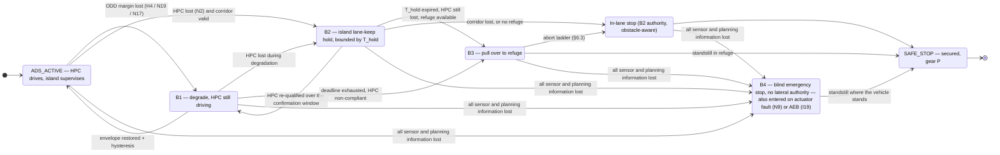

Two consequences must be written down rather than discovered during integration.

> **[B2](#b2--keep-the-vehicle-in-its-lane-after-loss-of-the-hpc) must be able to give authority back.** A behaviour that can only be entered is not a hold, it is
> a one-way MRM with extra steps. The hand-back path is [`I3`](#41-migration-list)'s smooth-transition mechanism, it re-enters
> [B1](#b1--degrade-the-ads-when-the-odd-cannot-be-held) at `CONSTRAIN` rather than `ALLOW`, and it is gated on evidence of the HPC's health, not merely on
> its heartbeat returning. The confirmation window and the acceptance criteria are open decision 14.

> **[B3](#b3--pull-over-if-the-odd-continues-to-fail) deliberately and temporarily violates lateral containment.** A pull-over leaves the running lane
> on purpose. The containment check ([`N5`](#61-supervision-state-and-fallback)) must therefore be *suspended under authorisation* for the
> duration of the manoeuvre, and re-armed against the refuge boundary instead. An unsuppressed
> containment check would abort every pull-over it was asked to protect.

Authorisation for that suspension is granted by [`N3`](#61-supervision-state-and-fallback) and by nothing else, is bounded in time and in
lateral extent by [`N7`](#61-supervision-state-and-fallback), and is recorded by [`N11`](#61-supervision-state-and-fallback).

### 3.3 Behaviour-to-node traceability

Every island node exists to serve at least one declared behaviour. Nodes that serve none do not
belong on the island.

| Behaviour | Detect | Decide | Act | Assure |
| :-- | :-- | :-- | :-- | :-- |
| **B1** | [`N19`](#64-odd-degradation-on-weather-and-visibility) ODD monitor · [`N17`](#62-island-safety-sensing) sensor health · [`N6`](#61-supervision-state-and-fallback)/[`N13`](#62-island-safety-sensing)/[`N14`](#62-island-safety-sensing) ingest · [`N16`](#62-island-safety-sensing) world model | [`N10`](#61-supervision-state-and-fallback) envelope · [`N3`](#61-supervision-state-and-fallback) state machine · [`N8`](#61-supervision-state-and-fallback) fault manager | [`N1`](#61-supervision-state-and-fallback)/[`H1`](#7-new-nodes-to-add-on-the-hpc) constraint egress → HPC re-plans | Compliance supervision in [`N2`](#61-supervision-state-and-fallback); [`N11`](#61-supervision-state-and-fallback) records the SOTIF event |
| **B2** | [`N2`](#61-supervision-state-and-fallback) HPC supervisor (entry and recovery) · [`N13`](#62-island-safety-sensing) scan · [`N14`](#62-island-safety-sensing) vision · [`N16`](#62-island-safety-sensing) world model · [`H3`](#7-new-nodes-to-add-on-the-hpc) corridor | [`N3`](#61-supervision-state-and-fallback) state machine (hold budget, hand-back) · [`N5`](#61-supervision-state-and-fallback) corridor monitor · [`I8`](#41-migration-list) validator · [`N10`](#61-supervision-state-and-fallback) envelope | [`I13`](#41-migration-list) pure_pursuit + [`N7`](#61-supervision-state-and-fallback) planner → [`I1`](#41-migration-list) gate → [`I16`](#41-migration-list); [`I3`](#41-migration-list) switcher for hand-back | [`N9`](#61-supervision-state-and-fallback) actuator supervisor; [`I19`](#41-migration-list)/[`I20`](#41-migration-list) as independent last line |
| **B3** | [`N16`](#62-island-safety-sensing) free space · [`N6`](#61-supervision-state-and-fallback) rear-corner radar · [`H8`](#7-new-nodes-to-add-on-the-hpc) refuge | [`N18`](#63-pull-over-mrm-after-hpc-loss) pull-over manager · [`I7`](#41-migration-list) mrm_handler · [`N3`](#61-supervision-state-and-fallback) | [`N7`](#61-supervision-state-and-fallback) trajectory → [`I13`](#41-migration-list) → [`I1`](#41-migration-list) → [`I16`](#41-migration-list); [`I5`](#41-migration-list) secures at standstill | [`N9`](#61-supervision-state-and-fallback); abort ladder to [B2](#b2--keep-the-vehicle-in-its-lane-after-loss-of-the-hpc) then [`I6`](#41-migration-list) |
| <mark>**B4**</mark> | <mark>[`N17`](#62-island-safety-sensing) blackout declaration · [`N16`](#62-island-safety-sensing) all source-validity flags false · [`N9`](#61-supervision-state-and-fallback) actuator supervisor · [`I19`](#41-migration-list) AEB</mark> | <mark>[`N3`](#61-supervision-state-and-fallback) state machine (`EMERGENCY_STOP`, no exit) · [`N8`](#61-supervision-state-and-fallback) fault manager · [`I7`](#41-migration-list) mrm_handler</mark> | <mark>[`I6`](#41-migration-list) emergency stop → [`I1`](#41-migration-list) gate → [`I16`](#41-migration-list); [`I5`](#41-migration-list) secures</mark> | <mark>[`N4`](#61-supervision-state-and-fallback) proprioceptive ego state — the only assurance left; below the node path, the gate's built-in stop and the §8.5 FSI fault line</mark> |

Every **Detect** cell above may additionally carry the optional [§3.5](#35-optional-enrichment-the-hpc-object-list) object digest from [`N20`](#62-island-safety-sensing).
It is left out of the table deliberately: a table that traces behaviours to the nodes they *require*
must not list a node that no behaviour requires.

### 3.4 The four internal functions

[B1](#b1--degrade-the-ads-when-the-odd-cannot-be-held)–[B4](#b4--emergency-stop-when-the-island-is-blind) are what the island does as seen from outside. Internally, deck p.19's features expand into
four functional blocks:

1. **Supervise** — is the HPC alive, on time, in-ODD, and internally healthy?
2. **Validate** — is the command it just sent physically plausible and inside the safety envelope?
3. **Control** — turn the accepted trajectory into actuator commands, at cadence, without the HPC in
   the loop for a single control period.
4. **Fall back** — when 1 or 2 fail, take authority and execute a minimal risk manoeuvre.

Everything else — how the trajectory was produced, what the world looks like, where the vehicle is on
the map — belongs to the HPC.

---

### 3.5 Optional enrichment: the HPC object list

Everything above is written so that the island delivers [B1](#b1--degrade-the-ads-when-the-odd-cannot-be-held)–[B4](#b4--emergency-stop-when-the-island-is-blind) with no help from the HPC. That is the
floor, and it does not move. Above the floor there is one HPC-produced input worth taking, because it
is the only one that tells the island what the HPC *believes about the world* rather than what it
*intends to do*: `/perception/object_recognition/objects`, the output of the HPC's object-recognition
and prediction stack.

**While the HPC is functioning the island may subscribe to it, and when the message is available all
four behaviours may use it. It is an option, never a dependency.**

#### The rule that makes it admissible

> **Monotone conservatism.** An optional input may only *narrow* what the island permits. It may
> shorten a deadline, lower a speed ceiling, tighten an envelope, disqualify a refuge or steepen a
> deceleration ramp. It may never widen a bound, extend a hold, qualify a manoeuvre, hand back
> authority, or serve as the precondition of any behaviour. **Remove the input entirely and every
> behaviour must remain reachable and correct — only less well informed.**

Three consequences follow at once, and they are what keep the rest of this document true:

1. **No behaviour acquires a precondition.** [B4](#b4--emergency-stop-when-the-island-is-blind) in particular keeps its defining property — no
   precondition, no guard, no exit. A fresh object list may not delay it, and no object list is ever
   consulted to decide whether the island is blind (§6.2).
2. **No integrity is inherited.** The list comes from a QM-to-ASIL-B pipeline on the far side of the
   link. It cannot raise the integrity of an island decision; it can only add a conservative term to a
   decision the island was already entitled to make on its own evidence.
3. **Its failure mode is nuisance, not collision.** Because the input can only make the island *more*
   cautious, a corrupted, phantom or persistent object list produces unnecessary braking — an
   availability problem, to be argued as such in the Part-4 HARA — rather than a missed hazard. That
   is the whole reason a QM-sourced input is admissible at all.

#### Why this input, when R5 excludes the others

[R5](#21-partitioning-rules) keeps HD maps, point clouds and images off the link, and the reasoning applies to a *raw* object
list as well: `PredictedObjects` is variable-length, and a variable-length message on the safety link
offends [R4](#21-partitioning-rules) as surely as it offends [R5](#21-partitioning-rules). So the island does not consume it raw.
[`N20`](#62-island-safety-sensing) `si_object_digest` truncates it at the boundary into a **bounded digest** — a fixed maximum
object count ordered by threat, a fixed prediction horizon, a fixed field set — and everything
downstream sees only the digest. What crosses the link is an Autoware topic; what enters the island is
a bounded one. [R5](#21-partitioning-rules)'s consequence line is amended accordingly in §2.1.

The reason to take it at all is that it is **diverse in the useful direction**. [R7](#21-partitioning-rules) prefers a different
channel to a copy of the HPC's, and this is not a copy: it is the HPC's own conclusion, which lets the
island check the HPC *against itself*. The island does not have to out-perceive the HPC in order to
catch it planning through an object it has just published.

#### What each behaviour may do with it

| Behaviour | What the digest may do | What it may never do |
| :-- | :-- | :-- |
| **[B1](#b1--degrade-the-ads-when-the-odd-cannot-be-held)** | **The self-consistency veto** — [`N10`](#61-supervision-state-and-fallback) and [`I8`](#41-migration-list) may raise `CONSTRAIN`, or escalate to `MRM`, when the HPC's trajectory is inconsistent with the HPC's *own* object list: the planned path passes through a published object, or the commanded speed leaves no safe following distance to one. Separately, [`N10`](#61-supervision-state-and-fallback)'s RSS longitudinal envelope takes the *smaller* of the island-perceived and digest-derived safe speeds | Relax any envelope, raise `v_max`, or satisfy a compliance deadline. **A quiet object list is never evidence that the road is clear** |
| **[B2](#b2--keep-the-vehicle-in-its-lane-after-loss-of-the-hpc)** | Within the carry-over budget below, lower `v_hold` or shorten [`N7`](#61-supervision-state-and-fallback)'s deceleration ramp when a digest object was predicted to enter the corridor | Extend `T_hold`, substitute for a lost corridor, or keep the hold alive when [`N5`](#61-supervision-state-and-fallback) has no corridor source. [B2](#b2--keep-the-vehicle-in-its-lane-after-loss-of-the-hpc)'s corridor precondition is unchanged |
| **[B3](#b3--pull-over-if-the-odd-continues-to-fail)** | **Disqualify** a refuge — an object predicted to occupy it, or a vehicle predicted to close on the pull-over side — and abort to the in-lane stop | Qualify a refuge. `pull_over_available` remains a function of [`N16`](#62-island-safety-sensing) free space, rear-corner radar and [`N18`](#63-pull-over-mrm-after-hpc-loss) alone |
| **[B4](#b4--emergency-stop-when-the-island-is-blind)** | Shape the ramp only: permit deceleration up to the upper bound of `a_emg` when a digest object was last seen in path | Delay entry, offer an exit, or count as a valid source. [B4](#b4--emergency-stop-when-the-island-is-blind) keeps no precondition |

#### Freshness, and what survives the HPC

Two budgets, not one. **While the HPC is alive** the digest is age-checked like every other §8.1 row
(300 ms). **After the HPC goes silent** the last valid digest is carried forward under a **carry-over
budget bounded in both time and distance**; past either bound [`N20`](#62-island-safety-sensing) marks it invalid and it leaves the
fusion entirely. Both numbers are open decision 16.

The carry-over is deliberately short and deliberately double-bounded, for the same reason decision 15
bounds blindness by distance as well as by time: at 60 km/h a "small" 500 ms is 8 m of road, and a
predicted path that was right when it was published is not right after the vehicle has travelled past
the geometry it was predicted against.

**Where the digest matters least is exactly where one might hope for most.** [B2](#b2--keep-the-vehicle-in-its-lane-after-loss-of-the-hpc), [B3](#b3--pull-over-if-the-odd-continues-to-fail) and [B4](#b4--emergency-stop-when-the-island-is-blind) are all
entered *after* the HPC has failed, so in the ordinary case the digest is already stale or gone by the
time they execute. Its real value is in [B1](#b1--degrade-the-ads-when-the-odd-cannot-be-held), where the HPC is alive by definition and the list is
fresh. The [B2](#b2--keep-the-vehicle-in-its-lane-after-loss-of-the-hpc)–[B4](#b4--emergency-stop-when-the-island-is-blind) uses are worth specifying anyway, because the boundary case — the HPC has just
gone silent and the last digest is 200 ms old — is exactly the moment the island is deciding how hard
to brake, and a 200 ms-old prediction is genuinely informative about the next two seconds. What it is
not, ever, is a reason to wait.

---

## 4. Autoware nodes allocated to the Safety Island

**The allocation, in five phases.** The tables in this section answer *which* nodes move and *why*.
The five figures below answer *what the graph looks like while it happens*: the same picture, redrawn
five times, each step one further than the last. They are worth reading before §4.1, because a
migration list is far easier to check against a picture than against a table alone.

| Phase | What it shows | What to take from it |
| :-- | :-- | :-- |
| **1** | Autoware today, every node | The starting point. Nothing on it is changed by this design |
| **2** | The same graph, one box per stack | The picture the island modifies, with the detail folded away |
| **3** | The same boxes, after the island | **The change itself**: Control and the Vehicle Interface migrate bodily; the island grows reduced versions of the other stacks; one narrow link joins the two |
| **4** | Only what changed, at node level | The delta, opened up: removed, re-sourced and new on the HPC; migrated on the island |
| **5** | The Safety Island alone | All 37 island nodes — the 18 of §4.1 and the 19 of §6 — each tagged **▶ B1–B4** with the behaviours it enables, per the §3.3 traceability table — **▶ SHARED** where every behaviour runs through it, **⊘** where none uses it. `layers/` also redraws it once per behaviour (B1–B4) |

The progression is the argument of this section in visual form. Phase 3 is where the allocation is
decided; phase 4 is where it is justified node by node; phase 5 is what the island then contains.

Each phase is reproduced **whole, sideways, on its own page**, so that nothing is cropped and each
step of the argument is a single picture rather than a pair to be assembled by eye. Every phase is
also available at full size in `layers/L4SafetyIsland-Layers.pdf`.

Colour is the **Autoware stack** a node belongs to, taken from the legend of `ArchitectureMain.pdf`,
and it means the same thing on all five. What changes between phases is only how far the picture is
zoomed and — from phase 3 onward — which ECU each box runs on. The five diagrams follow in the order
of the table above.

```mermaid
flowchart LR
    SENSORS["Sensors<br/>lidar · camera · radar · GNSS · IMU"]

    subgraph SEN["Sensing"]
        direction TB
        s1["lidar_driver"]
        s2["packets_to_pointcloud"]
        s3["crop_box_filter_self"]
        s4["crop_box_filter_mirror"]
        s5["fix_distortion"]
        s6["ring_outlier_filter"]
        s7["concat_filter"]
        s8["imu_driver"]
        s9["imu_corrector"]
        s10["gnss_driver"]
        s11["gnss_poser"]
        s12["camera_driver"]
        s13["image_transport"]
    end

    subgraph MAP["Map"]
        direction TB
        m1["lanelet2_map_loader"]
        m2["pointcloud_map_loader"]
    end

    subgraph LOC["Localization"]
        direction TB
        l1["voxel_grid_filter"]
        l2["random_filter"]
        l3["ndt_scan_matcher"]
        l4["gyro_odometer"]
        l5["ekf_localizer"]
        l6["pose_initializer"]
    end

    subgraph PER["Perception"]
        direction TB
        p1["lidar_centerpoint"]
        p2["yolov4"]
        p3["roi_cluster_fusion"]
        p4["shape_estimation"]
        p5["object_merger"]
        p6["multi_object_tracker"]
        p7["map_based_prediction"]
        p8["traffic_light_ssd_fine_detector"]
        p9["traffic_light_classifier"]
        p10["laserscan_to_occupancy_grid_map"]
        p11["occupancy_grid_map"]
    end

    subgraph PLN["Planning"]
        direction TB
        q0["mission_planner"]
        q1["behavior_path_planner<br/>lane_following · lane_change<br/>obstacle_avoidance · pull_over · side_shift"]
        q2["behavior_velocity_planner<br/>detection_area · blind_spot · crosswalk<br/>traffic_light · intersection · stop_line"]
        q3["obstacle_avoidance_planner"]
        q4["surround_obstacle_checker"]
        q5["obstacle_stop_planner"]
        q6["turn_signal_decider"]
        q7["freespace_planner"]
        q8["costmap_generator"]
        q9["scenario_selector"]
        q10["motion_velocity_optimizer"]
    end

    subgraph CTL["Control"]
        direction TB
        c1["mpc_follower"]
        c2["velocity_controller"]
        c3["latlon_muxer"]
        c4["shift_decider"]
        c5["lane_departure_checker"]
        c6["external_cmd_selector"]
        c7["remote_cmd_converter"]
        c8["vehicle_cmd_gate — the arbitration point today"]
        c9["raw_vehicle_cmd_converter"]
    end

    subgraph SYS["System"]
        direction TB
        y1["autoware_state_monitor"]
        y2["state_timeout_checker"]
        y3["autoware_error_monitor"]
        y4["emergency_handler"]
        y5["system_monitor<br/>process · gpu · mem · hdd · net · ntp"]
    end

    subgraph VIF["VehicleInterface"]
        direction TB
        v1["vehicle_interface<br/>pacmod_interface · g30_interface"]
    end

    VEH["Vehicle<br/>pacmod3 · CAN — JapanTaxi · YMC GolfCart"]

    SENSORS --> s1
    SENSORS --> s8
    SENSORS --> s10
    SENSORS --> s12
    s1 --> s2
    s2 --> s3
    s3 --> s4
    s4 --> s5
    s5 --> s6
    s6 --> s7
    s8 --> s9
    s10 --> s11
    s12 --> s13
    s7 --> l1
    s9 --> l4
    s11 --> l6
    l1 --> l2
    l2 -->|"downsample/pointcloud"| l3
    l3 --> l4
    l4 -->|"twist_with_covariance"| l5
    l6 --> l3
    m2 --> l3
    s7 --> p1
    s13 --> p2
    p1 --> p3
    p2 --> p3
    p3 --> p4
    p4 --> p5
    p5 -->|"detection/objects"| p6
    p6 -->|"tracking/objects"| p7
    m1 --> p8
    p8 --> p9
    p10 --> p11
    m1 -->|"vector_map · route"| q0
    p7 --> q1
    p9 --> q2
    p11 --> q3
    q0 -->|"route"| q1
    q1 -->|"path_with_lane_id"| q2
    q2 -->|"path"| q3
    q3 --> q4
    q4 --> q5
    q5 --> q9
    q1 -->|"path_with_lane_id"| q6
    q8 -->|"occupancy_grid"| q7
    q7 --> q9
    l5 -->|"kinematic state"| q9
    q9 -->|"trajectory"| q10
    q10 --> c1
    q10 --> c2
    c1 --> c2
    c2 -->|"control_cmd"| c3
    c3 -->|"shift_cmd"| c4
    c1 --> c5
    c6 --> c7
    c4 --> c8
    c7 --> c8
    c5 --> c8
    c8 --> c9
    c9 --> v1
    c8 --> v1
    v1 -->|"/pacmod/**"| VEH
    v1 -.->|"vehicle status"| y5
    y1 --> y2
    y2 -->|"is_state_timeout"| y3
    y3 -->|"driving_capacity"| y4
    y5 --> y4
    y4 -->|"emergency"| c8

    classDef sensing fill:#E8DFF0,stroke:#8E6FAF,stroke-width:2px,color:#101010;
    classDef locz fill:#D9E8FA,stroke:#5B9BD5,stroke-width:2px,color:#101010;
    classDef percep fill:#D6E8D5,stroke:#6AA84F,stroke-width:2px,color:#101010;
    classDef mapc fill:#E7E9D0,stroke:#8A9A3E,stroke-width:2px,color:#101010;
    classDef planc fill:#FDF0C6,stroke:#D6A000,stroke-width:2px,color:#101010;
    classDef ctrlc fill:#FBE2C4,stroke:#E08A1E,stroke-width:2px,color:#101010;
    classDef sysc fill:#F6D2CE,stroke:#C1453C,stroke-width:2px,color:#101010;
    classDef vifc fill:#A9DCD8,stroke:#2E9E96,stroke-width:2px,color:#101010;
    classDef vehc fill:#F4F4F4,stroke:#999999,stroke-width:1px,color:#101010;

    class s1,s2,s3,s4,s5,s6,s7,s8,s9,s10,s11,s12,s13 sensing;
    class m1,m2 mapc;
    class l1,l2,l3,l4,l5,l6 locz;
    class p1,p2,p3,p4,p5,p6,p7,p8,p9,p10,p11 percep;
    class q0,q1,q2,q3,q4,q5,q6,q7,q8,q9,q10 planc;
    class c1,c2,c3,c4,c5,c6,c7,c8,c9 ctrlc;
    class y1,y2,y3,y4,y5 sysc;
    class v1 vifc;
    class SENSORS,VEH vehc;
```

```mermaid
flowchart LR
    SEN0["Sensors<br/>lidar · camera · radar · GNSS · IMU"]
    SENSING["Sensing<br/>13 nodes"]
    MAPB["Map<br/>2 nodes"]
    LOCB["Localization<br/>6 nodes"]
    PERB["Perception<br/>11 nodes"]
    PLNB["Planning<br/>11 nodes"]
    CTLB["Control<br/>9 nodes"]
    VIFB["VehicleInterface"]
    VEHB["Vehicle"]
    SYSB["System<br/>5 nodes"]
    ACTOR["Operator / mission"]

    SEN0 -->|"raw sensor data"| SENSING
    SENSING --> LOCB
    SENSING --> PERB
    MAPB -->|"point cloud map"| LOCB
    MAPB --> PERB
    MAPB -->|"vector map"| PLNB
    LOCB -->|"ego pose"| PERB
    LOCB -->|"kinematic state"| PLNB
    PERB -->|"objects · occupancy"| PLNB
    PLNB -->|"trajectory"| CTLB
    CTLB -->|"control command"| VIFB
    VIFB -->|"CAN / drive-by-wire"| VEHB
    VEHB -.->|"vehicle status"| VIFB
    VIFB -.->|"status"| SENSING
    SYSB -->|"MRM · mode · emergency"| CTLB
    SENSING -.->|"/diagnostics — every stack publishes to this bus"| SYSB
    ACTOR -->|"goal · route"| PLNB
    ACTOR --> SYSB

    classDef sensing fill:#E8DFF0,stroke:#8E6FAF,stroke-width:2px,color:#101010;
    classDef locz fill:#D9E8FA,stroke:#5B9BD5,stroke-width:2px,color:#101010;
    classDef percep fill:#D6E8D5,stroke:#6AA84F,stroke-width:2px,color:#101010;
    classDef mapc fill:#E7E9D0,stroke:#8A9A3E,stroke-width:2px,color:#101010;
    classDef planc fill:#FDF0C6,stroke:#D6A000,stroke-width:2px,color:#101010;
    classDef ctrlc fill:#FBE2C4,stroke:#E08A1E,stroke-width:2px,color:#101010;
    classDef sysc fill:#F6D2CE,stroke:#C1453C,stroke-width:2px,color:#101010;
    classDef vifc fill:#A9DCD8,stroke:#2E9E96,stroke-width:2px,color:#101010;
    classDef vehc fill:#F4F4F4,stroke:#999999,stroke-width:1px,color:#101010;

    class SENSING sensing;
    class MAPB mapc;
    class LOCB locz;
    class PERB percep;
    class PLNB planc;
    class CTLB ctrlc;
    class SYSB sysc;
    class VIFB vifc;
    class SEN0,VEHB,ACTOR vehc;
```

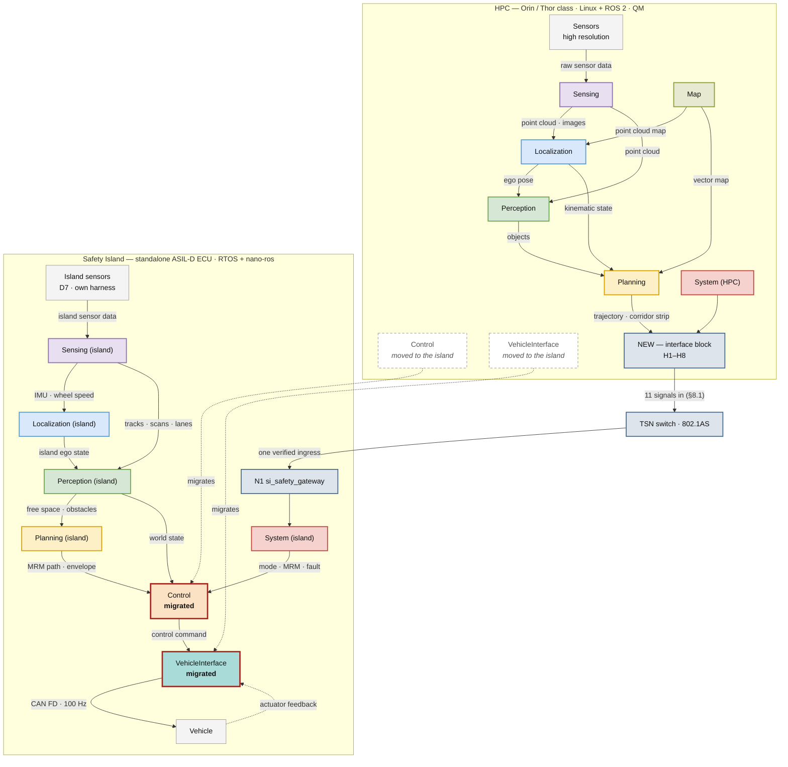

```mermaid
flowchart TB
    subgraph HPCD["HPC — Orin / Thor class · Linux + ROS 2 · QM"]
        direction LR
        HSEN["Sensors"]
        BSENS["Sensing<br/><i>unchanged</i>"]
        BLOC["Localization<br/><i>unchanged</i>"]
        BPERC["Perception<br/><i>unchanged</i>"]
        BMAP["Map<br/><i>unchanged</i>"]
        BPLAN["Planning<br/><i>unchanged</i>"]
        BSYS["System<br/><i>unchanged</i>"]
        HQ9["motion_velocity_optimizer<br/><b>re-sourced</b> — trajectory now via H5"]
        HC1["external_cmd_selector<br/><b>re-sourced</b>"]
        HK5["mrm_comfortable_stop_operator"]
        HY1["diagnostic_graph_aggregator"]
        HY5["default_adapi_universe"]
        GHO["REMOVED FROM THE HPC<br/>the whole control stack and the vehicle interface<br/><i>they run on the island below</i>"]
        H1N["H1 si_bridge_hpc<br/><b>new</b>"]
        H2N["H2 hpc_capability_reporter<br/><b>new</b>"]
        H3N["H3 hpc_corridor_publisher<br/><b>new</b>"]
        H4N["H4 hpc_odd_reporter<br/><b>new</b>"]
        H5N["H5 hpc_trajectory_conditioner<br/><b>new</b>"]
        H6N["H6 hpc_island_state_client<br/><b>new</b>"]
        H7N["H7 hpc_heartbeat<br/><b>new</b>"]
        H8N["H8 hpc_refuge_publisher<br/><b>new</b>"]
    end

    FSI["On-SoC FSI<br/>Cortex-R52 lockstep"]
    TSN2["TSN switch · 802.1AS"]

    subgraph ISLD["SAFETY ISLAND — standalone ASIL-D ECU · RTOS + nano-ros"]
        direction LR
        N1C["N1 si_safety_gateway<br/><b>new</b> — one verified ingress"]
        ISEN2["Island sensors — D7"]
        BISENS["Sensing (island)<br/><i>new stack, phase 5 opens it</i>"]
        BILOC["Localization (island)<br/><i>new stack</i>"]
        BIPERC["Perception (island)<br/><i>new stack</i>"]
        BIPLAN["Planning (island)<br/><i>new stack</i>"]
        BISYS["System (island)<br/><i>new stack</i>"]
        I19M["I19 autonomous_emergency_braking<br/><b>migrated</b>"]
        I20M["I20 collision_detector<br/><b>migrated</b>"]
        I9M["I9 trajectory_follower_node<br/><b>migrated</b>"]
        I10M["I10 mpc_lateral_controller"]
        I11M["I11 pid_longitudinal_controller"]
        I12M["I12 trajectory_follower_base"]
        I8M["I8 control_validator<br/><b>migrated</b>"]
        I14M["I14 shift_decider<br/><b>migrated</b>"]
        I13M["I13 pure_pursuit<br/><b>migrated</b> — fallback tier"]
        I2M["I2 command_mode_decider<br/><b>migrated</b>"]
        I3M["I3 command_mode_switcher<br/><b>migrated</b>"]
        I7M["I7 mrm_handler<br/><b>migrated</b>"]
        I6M["I6 mrm_emergency_stop_operator<br/><b>migrated</b>"]
        I5M["I5 stop_mode_operator<br/><b>migrated</b>"]
        I1M["I1 control_command_gate — the arbiter<br/><b>migrated</b>"]
        I15M["I15 raw_vehicle_cmd_converter<br/><b>migrated</b>"]
        I16M["I16 vehicle interface — pacmod / project equivalent<br/><b>migrated</b>"]
        ACT2["Actuator gateway<br/>brake · steer · propulsion · lamps"]
    end

    HSEN --> BSENS
    BSENS --> BLOC
    BSENS --> BPERC
    BMAP -->|"pointcloud_map"| BLOC
    BMAP -->|"vector_map"| BPLAN
    BLOC --> BPLAN
    BPERC -->|"objects"| BPLAN
    BPLAN -->|"trajectory"| HQ9
    HK5 -->|"VelocityLimit"| HQ9
    BSYS -->|"/diagnostics"| HY1
    HY1 -->|"capability"| H2N
    HQ9 --> H5N
    H6N -->|"island state → AD API"| HY5
    H1N --> TSN2
    H2N --> H1N
    H3N --> H1N
    H4N --> H1N
    H5N --> H1N
    H7N --> H1N
    H8N --> H1N
    GHO -.->|"no longer runs here"| ISLD
    TSN2 -->|"11 signals in (§8.1)"| N1C
    N1C -->|"/api/operation_mode/state"| I7M
    BISYS -->|"OperationModeAvailability (N2)"| I7M
    N1C --> BISYS
    FSI -.->|"SPI + SOC_ERROR · bypasses Linux"| BISYS
    ISEN2 --> BISENS
    BISENS --> I19M
    BISENS --> I20M
    BISENS --> BIPERC
    BISENS -->|"IMU · wheel speed"| BILOC
    BILOC --> BIPERC
    BIPERC --> BIPLAN
    BIPLAN -->|"MRM Trajectory"| I13M
    BIPLAN -->|"envelope limits"| I1M
    I9M --> I10M
    I9M --> I11M
    I10M --> I12M
    I11M --> I12M
    I12M --> I14M
    I12M -->|"nominal control_cmd"| I1M
    I13M -->|"fallback control_cmd"| I1M
    I14M --> I1M
    I6M -->|"emergency stop"| I1M
    I5M -->|"stop · gear P"| I1M
    I19M -.->|"/diagnostics ERROR"| BISYS
    I20M -.-> BISYS
    I8M -.-> BISYS
    BISYS -->|"island mode"| I2M
    I2M -->|"command mode"| I3M
    I3M -->|"source selection"| I1M
    I7M --> BIPLAN
    BISYS --> N1C
    I1M --> I15M
    I15M --> I16M
    I16M -->|"CAN FD · 100 Hz"| ACT2
    ACT2 -.->|"actuator feedback"| I16M
    I16M -.-> BISYS

    classDef sensing fill:#E8DFF0,stroke:#8E6FAF,stroke-width:3px,color:#101010;
    classDef locz fill:#D9E8FA,stroke:#5B9BD5,stroke-width:3px,color:#101010;
    classDef percep fill:#D6E8D5,stroke:#6AA84F,stroke-width:3px,color:#101010;
    classDef mapc fill:#E7E9D0,stroke:#8A9A3E,stroke-width:3px,color:#101010;
    classDef planc fill:#FDF0C6,stroke:#D6A000,stroke-width:3px,color:#101010;
    classDef sysc fill:#F6D2CE,stroke:#C1453C,stroke-width:3px,color:#101010;
    classDef resrc fill:#FDF0C6,stroke:#9A5B00,stroke-width:1.5px,color:#101010;
    classDef sysnode fill:#F6D2CE,stroke:#C1453C,stroke-width:1.5px,color:#101010;
    classDef newn fill:#DDE4EC,stroke:#1F5FAE,stroke-width:1.5px,color:#101010;
    classDef ghost fill:#FFFFFF,stroke:#8A8A8A,stroke-width:1px,stroke-dasharray: 5 4,color:#555555;
    classDef movedp fill:#D6E8D5,stroke:#A8231C,stroke-width:1.5px,color:#101010;
    classDef movedc fill:#FBE2C4,stroke:#A8231C,stroke-width:1.5px,color:#101010;
    classDef plainc fill:#FBE2C4,stroke:#E08A1E,stroke-width:1.5px,color:#101010;
    classDef movedv fill:#A9DCD8,stroke:#A8231C,stroke-width:1.5px,color:#101010;
    classDef vehc fill:#F4F4F4,stroke:#999999,stroke-width:1px,color:#101010;
    classDef linkc fill:#DDE4EC,stroke:#4A6B8A,stroke-width:2px,color:#101010;

    class BSENS,BISENS sensing;
    class BLOC,BILOC locz;
    class BPERC,BIPERC percep;
    class BMAP mapc;
    class BPLAN,BIPLAN planc;
    class BSYS,BISYS sysc;
    class HQ9,HC1 resrc;
    class HK5,HY1,HY5 sysnode;
    class H1N,H2N,H3N,H4N,H5N,H6N,H7N,H8N newn;
    class GHO ghost;
    class I19M,I20M movedp;
    class I9M,I8M,I14M,I13M,I2M,I3M,I7M,I6M,I5M,I1M,I15M movedc;
    class I10M,I11M,I12M plainc;
    class I16M movedv;
    class N1C,TSN2 linkc;
    class HSEN,ISEN2,ACT2,FSI vehc;
```

```mermaid
flowchart LR
    HPCOFF["HPC — off the page<br/>via N1 only · 11 signals in (§8.1)"]
    FSI2["On-SoC FSI<br/>SPI + SOC_ERROR"]
    ISEN3["ISLAND SENSOR SET — D7<br/>2D lidar · radar · forward camera<br/>ultrasonic · IMU + wheel speed<br/><i>own harness and power rail</i>"]

    subgraph JSEN["Sensing (island)"]
        direction TB
        N13["N13 si_scan_guard<br/>2D lidar · free space<br/><b>▶ B1 · B2</b>"]
        N6["N6 si_radar_guard<br/>range · range-rate · TTC<br/><b>▶ B1 · B3</b>"]
        N14["N14 si_vision_guard<br/>lane boundaries<br/><b>▶ B1 · B2</b>"]
        N15["N15 si_proximity_guard<br/>near-field clearance<br/><b>▷ B2 · B3 (§3.1, not in §3.3)</b>"]
        N17["N17 si_sensor_health<br/>blockage · degradation<br/><b>▶ B1 · B4</b>"]
    end

    subgraph JLOC["Localization (island)"]
        direction TB
        N4["N4 si_vehicle_state_estimator<br/>dead reckoning from wheel speed,<br/>steering and the island IMU<br/><b>▶ B4</b>"]
    end

    subgraph JPER["Perception (island)"]
        direction TB
        N16["N16 si_safety_world_model<br/>the island's one world<br/><b>▶ B1 · B2 · B3 · B4</b>"]
        I19B["I19 autonomous_emergency_braking<br/><b>migrated</b><br/><b>▶ B2 · B4</b>"]
        I20B["I20 collision_detector<br/><b>migrated</b><br/><b>▶ B2</b>"]
        N19["N19 si_odd_monitor<br/>visibility · v_max<br/><b>▶ B1</b>"]
        N20["N20 si_object_digest<br/><i>optional (§3.5), via N1</i><br/><b>⊘ no behaviour</b>"]
    end

    subgraph JPLN["Planning (island)"]
        direction TB
        N5["N5 si_corridor_monitor<br/>lateral containment<br/><b>▶ B2</b>"]
        N7["N7 si_mrm_planner<br/>bounded Trajectory ≤ 50 pts<br/><b>▶ B2 · B3</b>"]
        N18["N18 si_pull_over_manager<br/>OperateMrm server<br/><b>▶ B3</b>"]
        N10["N10 si_envelope_monitor<br/>RSS · accel · jerk · curvature<br/><b>▶ B1 · B2</b>"]
    end

    subgraph JCTL["Control (island) — the Autoware control stack, relocated whole"]
        direction TB
        I9B["I9 trajectory_follower_node<br/><b>migrated</b><br/><b>⊘ no behaviour</b>"]
        I10B["I10 mpc_lateral_controller<br/><b>⊘ no behaviour</b>"]
        I11B["I11 pid_longitudinal_controller<br/><b>⊘ no behaviour</b>"]
        I12B["I12 trajectory_follower_base<br/><b>⊘ no behaviour</b>"]
        I8B["I8 control_validator<br/><b>migrated</b><br/><b>▶ B2</b>"]
        I14B["I14 shift_decider<br/><b>migrated</b><br/><b>⊘ no behaviour</b>"]
        I13B["I13 pure_pursuit<br/><b>migrated</b> — fallback tier, ASIL-B(D)<br/><b>▶ B2 · B3</b>"]
        I2B["I2 command_mode_decider<br/><b>migrated</b><br/><b>▶ SHARED</b>"]
        I3B["I3 command_mode_switcher<br/><b>migrated</b><br/><b>▶ B2</b>"]
        I7B["I7 mrm_handler<br/><b>migrated</b><br/><b>▶ B3 · B4</b>"]
        I6B["I6 mrm_emergency_stop_operator<br/><b>migrated</b><br/><b>▶ B3 · B4</b>"]
        I5B["I5 stop_mode_operator<br/><b>migrated</b><br/><b>▶ B3 · B4</b>"]
        I1B["I1 control_command_gate — ranks the command sources,<br/>filters, limits, and hands the one winner to the interface<br/><b>migrated</b><br/><b>▶ B2 · B3 · B4</b>"]
        I15B["I15 raw_vehicle_cmd_converter<br/><b>migrated</b><br/><b>▶ SHARED</b>"]
    end

    subgraph JVI["VehicleInterface (island)"]
        direction TB
        I16B["I16 vehicle interface — pacmod / project equivalent<br/><b>migrated</b><br/><b>▶ B2 · B3 · B4</b>"]
    end

    subgraph JSYS["System (island)"]
        direction TB
        N2["N2 si_hpc_supervisor<br/>liveness · deadlines<br/><b>▶ B1 · B2</b>"]
        N3["N3 si_state_machine<br/>the island's mode<br/><b>▶ B1 · B2 · B3 · B4</b>"]
        N8["N8 si_fault_manager<br/>static fault tree · DTC<br/><b>▶ B1 · B4</b>"]
        N9["N9 si_actuator_supervisor<br/><b>▶ B2 · B3 · B4</b>"]
        N12["N12 si_time_quality_monitor<br/><b>▶ SHARED</b>"]
        N11["N11 si_event_recorder<br/>UDS / DTC export<br/><b>▶ B1</b>"]
    end

    N1D["N1 si_safety_gateway<br/>verifies Data ID · sequence · CRC · length<br/>and age on every HPC message before any island node sees it<br/><b>▶ B1</b>"]
    ACT3["Actuator gateway — brake · steer · propulsion · lamps<br/>CAN FD / FlexRay · 100 Hz · SI-E2E/B"]

    HPCOFF --> N1D
    N1D --> N4
    N1D --> N19
    N1D --> N5
    N1D --> N18
    N1D --> I9B
    N1D --> I8B
    N1D -->|"H5 trajectory · MPC overrun"| I13B
    N1D -->|"/api/operation_mode/state"| I7B
    N2 -->|"OperationModeAvailability"| I7B
    N1D --> N2
    N1D -.->|"optional digest (§3.5)"| N20
    N1D -.->|"external / remote command"| I1B
    ISEN3 --> N13
    ISEN3 --> N6
    ISEN3 --> N14
    ISEN3 --> N15
    ISEN3 --> N17
    N13 --> N16
    N6 --> N16
    N14 --> N16
    N15 --> N16
    N13 --> I19B
    N15 --> I20B
    N17 -->|"degradation cause"| N19
    N16 -->|"perceived corridor"| N5
    N16 --> N7
    N16 --> N18
    N16 --> N10
    N19 -->|"v_max"| N10
    N17 -.-> N8
    I19B -.-> N8
    I20B -.-> N8
    I8B -.-> N8
    N9 -->|"actuator fault"| N8
    N8 -->|"fault verdict"| N3
    N2 -->|"liveness verdict"| N3
    N3 -->|"island mode"| I2B
    I2B -->|"command mode"| I3B
    I3B -->|"source selection"| I1B
    I7B --> N7
    N8 -->|"DTCs"| N11
    N12 --> N1D
    I9B --> I10B
    I9B --> I11B
    I10B --> I12B
    I11B --> I12B
    I12B -->|"nominal control_cmd"| I1B
    I12B --> I14B
    I14B --> I1B
    I13B -->|"fallback control_cmd"| I1B
    I6B -->|"emergency stop"| I1B
    I5B -->|"stop · gear P"| I1B
    N7 --> I13B
    N10 -->|"envelope limits"| I1B
    I1B --> I15B
    I15B --> I16B
    I16B --> ACT3
    ACT3 -.->|"actuator feedback"| I16B
    I16B -.-> N9
    N3 --> N1D
    FSI2 -.->|"hardware fault line"| N8

    classDef sensing fill:#E8DFF0,stroke:#8E6FAF,stroke-width:2px,color:#101010;
    classDef locz fill:#D9E8FA,stroke:#5B9BD5,stroke-width:2px,color:#101010;
    classDef percep fill:#D6E8D5,stroke:#6AA84F,stroke-width:2px,color:#101010;
    classDef planc fill:#FDF0C6,stroke:#D6A000,stroke-width:2px,color:#101010;
    classDef ctrlc fill:#FBE2C4,stroke:#E08A1E,stroke-width:2px,color:#101010;
    classDef sysc fill:#F6D2CE,stroke:#C1453C,stroke-width:2px,color:#101010;
    classDef vifc fill:#A9DCD8,stroke:#A8231C,stroke-width:2px,color:#101010;
    classDef movedp fill:#D6E8D5,stroke:#A8231C,stroke-width:2px,color:#101010;
    classDef movedc fill:#FBE2C4,stroke:#A8231C,stroke-width:2px,color:#101010;
    classDef optn fill:#D6E8D5,stroke:#2A5DA8,stroke-width:2px,stroke-dasharray: 5 4,color:#101010;
    classDef linkc fill:#DDE4EC,stroke:#4A6B8A,stroke-width:2px,color:#101010;
    classDef vehc fill:#F4F4F4,stroke:#999999,stroke-width:1px,color:#101010;

    class N13,N6,N14,N15,N17 sensing;
    class N4 locz;
    class N16,N19 percep;
    class I19B,I20B movedp;
    class N20 optn;
    class N5,N7,N18,N10 planc;
    class I10B,I11B,I12B ctrlc;
    class I9B,I8B,I14B,I13B,I2B,I3B,I7B,I6B,I5B,I1B,I15B movedc;
    class I16B vifc;
    class N2,N3,N8,N9,N12,N11 sysc;
    class N1D linkc;
    class HPCOFF,FSI2,ISEN3,ACT3 vehc;
```

All five are built from `layers/` (`make` there, or `latexmk -pdf` per file); `layers/L4SafetyIsland-Layers.pdf`
collects them onto uniform landscape pages for presentation, and `layers/L4SafetyIsland-Layers.md`
records the drawing conventions.

### 4.1 Migration list

Package names are as of `autoware_universe` `main`, August 2026.

| # | Package | Function on the island | Tier | Notes / migration effort |
| :-- | :-- | :-- | :-- | :-- |
| I1 | `autoware_control_command_gate` | **The arbiter.** Selects among command sources, applies nominal filtering, generates the built-in stop when the selected source times out | [T0](#22-criticality-tiers-on-the-island) | The single most important migration. Its built-in stop is the last-resort MRM. |
| I2 | `autoware_command_mode_decider` (+ `_plugins`) | Decides the command mode: which source has authority (autonomous / MRM / stop) | [T0](#22-criticality-tiers-on-the-island) | Plugin logic must be replaced with a static, table-driven decider for certifiability. |
| I3 | `autoware_command_mode_switcher` (+ `_plugins`) | Applies the decided mode; drives transitions | [T0](#22-criticality-tiers-on-the-island) | Same static-configuration requirement. |
| I4 | `autoware_command_mode_types` | Shared type/constant library | — | Header-only; shared with HPC. |
| I5 | `autoware_stop_mode_operator` | Publishes stop commands; optional auto-park at standstill | [T0](#22-criticality-tiers-on-the-island) | Explicitly **does not depend on localization** — reads vehicle status telemetry only. Ideal island resident. |
| I6 | `autoware_mrm_emergency_stop_operator` | Emergency-stop MRM: publishes control commands directly | [T0](#22-criticality-tiers-on-the-island) | Independent of planning; survives HPC loss. |
| I7 | `autoware_mrm_handler` | Selects the MRM behaviour from the availability state | [T0](#22-criticality-tiers-on-the-island) | Must be island-resident ([R1](#21-partitioning-rules)/[R3](#21-partitioning-rules)): its *reason to act* is HPC loss. Availability input is re-sourced — see §6, [N2](#61-supervision-state-and-fallback). |
| I8 | `autoware_control_validator` | Checks the control command against the trajectory and vehicle limits | [T1](#22-criticality-tiers-on-the-island) | Small, deterministic, no map dependency. |
| I9 | `autoware_trajectory_follower_node` | Host node for the two controller plugins | [T2](#22-criticality-tiers-on-the-island) | **Already ported and closed-loop-validated on nano-ros.** |
| I10 | `autoware_mpc_lateral_controller` | Nominal lateral control | [T2](#22-criticality-tiers-on-the-island) | Already ported. OSQP iteration cap + time budget required (§4.2). |
| I11 | `autoware_pid_longitudinal_controller` | Nominal longitudinal control | [T2](#22-criticality-tiers-on-the-island) | Already ported. |
| I12 | `autoware_trajectory_follower_base` | Controller plugin base / utilities | [T2](#22-criticality-tiers-on-the-island) | Already ported. |
| I13 | `autoware_pure_pursuit` | **Fallback lateral control** — deterministic, closed-form, bounded time | [T1](#22-criticality-tiers-on-the-island) | *New to the island.* This is the [T1](#22-criticality-tiers-on-the-island) controller that replaces MPC when the MPC misses its budget. |
| I14 | `autoware_shift_decider` | Derives the gear command | [T2](#22-criticality-tiers-on-the-island) | Small; keeps gear in the island's command set. |
| I15 | `autoware_raw_vehicle_cmd_converter` | Converts generic accel/steer to vehicle-specific pedal/torque | [T2](#22-criticality-tiers-on-the-island) | Must be **downstream of the gate**, therefore island-side. |
| I16 | *vehicle interface* (`pacmod_interface` or project equivalent) | CAN FD / FlexRay TX/RX to the actuator gateway | [T0](#22-criticality-tiers-on-the-island) | Vehicle-specific; not in `autoware_universe`. E2E-protected. |
| I19 | `autoware_autonomous_emergency_braking` | **Island AEB.** Collision check against the ego predicted path; raises an ERROR diagnostic that escalates to emergency stop | [T1s](#22-criticality-tiers-on-the-island) | *Moved from the HPC by [D7](#1-inputs-already-fixed-by-the-wg).* Runs on the island's own point cloud with `use_pointcloud_data=true`, `use_predicted_object_data=false`, `use_imu_path=true`. May additionally consume `use_predicted_trajectory` — the MPC predicted path is on the island ([I10](#41-migration-list)). See §4.4. |
| I20 | `autoware_collision_detector` | **Near-field guard.** Geometric collision check against the current ego footprint within ~5 m | [T1s](#22-criticality-tiers-on-the-island) | *Moved from the HPC by [D7](#1-inputs-already-fixed-by-the-wg).* Runs point-cloud-only with `use_dynamic_object=false`. Fed by ultrasonic + 2D lidar. Governs standstill, creep and low-speed MRM. See §4.4. |
| I17 | `autoware_operation_mode_transition_manager` | Engage/disengage transition management | [T0](#22-criticality-tiers-on-the-island) | Required only on the **legacy** path (§4.3). Superseded by [I2](#41-migration-list)/[I3](#41-migration-list). |
| I18 | `autoware_vehicle_cmd_gate` | Legacy gate | [T0](#22-criticality-tiers-on-the-island) | **Alternative to [I1](#41-migration-list)** on the legacy path only. Do not deploy both. |

**Count: 18 nodes on the target path** ([I1](#41-migration-list)–[I16](#41-migration-list), [I19](#41-migration-list)–[I20](#41-migration-list)), or 17 on the legacy path ([I17](#41-migration-list)+[I18](#41-migration-list) replacing
[I1](#41-migration-list)–[I3](#41-migration-list)). This is a realistic figure for a Cortex-R52-class MCU when grouped as in §9.

### 4.2 Why a two-tier controller

[D2](#1-inputs-already-fixed-by-the-wg) puts "the control module" on the island. Taken literally, that places the full MPC — with an
iterative QP solver — inside the safety-critical ECU, and the certification argument then has to cover
OSQP's worst-case execution time. That argument is expensive and fragile.

The recommendation is therefore to migrate the control module as **two tiers under one gate**:

| | Nominal tier ([T2](#22-criticality-tiers-on-the-island)) | Fallback tier ([T1](#22-criticality-tiers-on-the-island)) |
| :-- | :-- | :-- |
| Lateral | `autoware_mpc_lateral_controller` | `autoware_pure_pursuit` |
| Longitudinal | `autoware_pid_longitudinal_controller` | Fixed deceleration profile (`si_mrm_profile`, §6 [N7](#61-supervision-state-and-fallback)) |
| Integrity | QM, monitored | ASIL-B(D) |
| Time budget | Soft — may be dropped | Hard — always meets deadline |
| Trigger to switch | MPC budget overrun, validator reject, solver non-convergence, tracking error above bound | — |

Switching is a [T0](#22-criticality-tiers-on-the-island) decision made by the gate ([I1](#41-migration-list)) via the decider ([I2](#41-migration-list)), inside one control period. The
behaviour is already demonstrated in the existing port: the MPC commands an emergency stop on
excessive tracking error, so the escalation path is live today — this proposal formalises it and adds
a graceful intermediate step instead of going straight to a stop.

This satisfies [R8](#21-partitioning-rules) and directly answers open question 3 in `SaftyIsland_ReferenceDesign.md`
("real-time ROS 2 nodes on Cortex-R52 for MRM trajectory selection"): the MRM tier is closed-form and
bounded; only the comfort tier is iterative.

### 4.3 Target architecture vs. legacy architecture

Autoware is mid-transition. Two consistent sets exist; the island must pick one.

| | **Target (recommended)** | **Legacy** |
| :-- | :-- | :-- |
| Gate | `autoware_control_command_gate` | `autoware_vehicle_cmd_gate` |
| Mode decision | `autoware_command_mode_decider` | `autoware_operation_mode_transition_manager` |
| Mode application | `autoware_command_mode_switcher` | (in gate) |
| Stop source | `autoware_stop_mode_operator` | (in gate) |

The target set is recommended because it separates *decide* / *switch* / *gate* into three nodes, and
that separation is exactly the decomposition a safety argument needs — the decider can be a static
table, the switcher a state machine, the gate a filter, each independently reviewable. The legacy
`vehicle_cmd_gate` fuses all three and is correspondingly harder to certify.

### 4.4 Why AEB and the collision detector can now migrate

In the previous revision both stayed on the HPC because they were assumed to need perception object
lists. Checking their actual interfaces shows otherwise, and [D7](#1-inputs-already-fixed-by-the-wg) removes the remaining obstacle.

| | `autoware_autonomous_emergency_braking` | `autoware_collision_detector` |
| :-- | :-- | :-- |
| Perception objects | **Optional** — `use_predicted_object_data=false` | **Optional** — `use_dynamic_object=false` |
| Point cloud | `use_pointcloud_data=true` | `use_pointcloud=true` |
| Ego path source | IMU-based kinematic prediction (velocity + yaw rate), *or* the MPC predicted trajectory | none — current footprint only |
| Map dependency | none | none |
| Output | ERROR on `/diagnostics` | ERROR on `/diagnostics` |
| Island sensor that feeds it | 2D lidar scan → `PointCloud2`; radar tracks | 2D lidar + ultrasonic → `PointCloud2` |

Both are therefore **island-viable without any HPC input at all**: AEB's IMU path comes from [`N4`](#61-supervision-state-and-fallback), its
point cloud from [`N13`](#62-island-safety-sensing), and — usefully — its optional MPC path from [`I10`](#41-migration-list), which is already on the
island. Neither node needs the planner, the map, or the perception stack.

This is the concrete payoff of [D7](#1-inputs-already-fixed-by-the-wg). Migrating them means the island's emergency braking is not a
bespoke reimplementation but **the same Autoware node, with the same tuning parameters and the same
validation history**, running on a diverse sensor channel. `autoware_spheric_collision_detector` stays
on the HPC — it is object-list based.

Their `/diagnostics` ERROR is consumed by [`N8`](#61-supervision-state-and-fallback) (fault manager) and escalated through [`N3`](#61-supervision-state-and-fallback) to the gate,
exactly like any other island fault source. Neither node commands the actuators directly.

---

## 5. Autoware nodes that remain on the HPC

### 5.1 Whole stacks — HPC only

`sensing`, `perception`, `localization`, `map`, `planning` execute entirely on the HPC. Every node in
`AutowareSW.md` §1–§5 stays: `ndt_scan_matcher`, `ekf_localizer`, `bevfusion`, `multi_object_tracker`,
`lanelet2_map_loader`, `behavior_path_planner`, `behavior_velocity_planner`, `mission_planner`,
`freespace_planner`, and the rest. They fail [R4](#21-partitioning-rules) (unbounded memory, learning-based, map-sized state)
and [R5](#21-partitioning-rules) (their inputs and outputs would flood the link).

**Consequence that must be handled, not assumed away:** the island's controllers currently subscribe
to `/localization/kinematic_state` and `/localization/acceleration`, both HPC-produced. Under [R2](#21-partitioning-rules) the
island cannot depend on them after HPC loss. This is resolved by [N4](#61-supervision-state-and-fallback) in §6.

### 5.2 Control and system packages that stay

| Package | Decision | Reason |
| :-- | :-- | :-- |
| `autoware_spheric_collision_detector` | **HPC** | Object-list based. Its point-cloud siblings moved to the island — see §4.4. |
| `autoware_obstacle_collision_checker`, `autoware_predicted_path_checker` | **HPC** | Depend on predicted paths and map. |
| `autoware_lane_departure_checker` | **HPC** | Requires the Lanelet2 vector map ([R4](#21-partitioning-rules)). Island equivalent is the corridor monitor [N5](#61-supervision-state-and-fallback) — now dual-sourced from [H3](#7-new-nodes-to-add-on-the-hpc)'s map corridor *and* the island's own camera lane detection ([N14](#62-island-safety-sensing)). |
| `autoware_external_cmd_selector`, `autoware_joy_controller`, `autoware_external_cmd_converter` | **HPC** | Remote/manual sources. They reach the island as one E2E-protected command source into the gate, not as island nodes. |
| `autoware_control_performance_analysis`, `autoware_smart_mpc_trajectory_follower` | **HPC** | Development and analysis only; not in the operational path. |
| `autoware_mrm_comfortable_stop_operator` | **HPC** | It publishes an `autoware_internal_planning_msgs/VelocityLimit` to the **planner** — it cannot function without planning. It is therefore an *HPC-dependent MRM*, valid only while the HPC is degraded-but-alive. See §5.3. |
| `autoware_diagnostic_graph_aggregator`, `autoware_diagnostic_graph_utils`, `autoware_hazard_status_converter` | **HPC** | Large, config-driven fault trees over HPC-internal diagnostics. Island runs its own static fault manager ([N8](#61-supervision-state-and-fallback)). |
| `autoware_system_monitor`, `autoware_component_monitor`, `autoware_component_state_monitor`, `autoware_topic_state_monitor`, `autoware_duplicated_node_checker`, `autoware_processing_time_checker`, `autoware_pipeline_latency_monitor`, `autoware_bluetooth_monitor`, `autoware_velodyne_monitor` | **HPC** | They monitor HPC resources. Under [R3](#21-partitioning-rules) they are *evidence sources*, not the safety monitor — their verdict is condensed by [H2](#7-new-nodes-to-add-on-the-hpc) and shipped to the island, and the island never relies on them being alive. |
| `autoware_default_adapi_universe`, `autoware_default_adapi_helpers`, `autoware_topic_relay_controller` | **HPC** | API and orchestration surface. |
| `autoware_accel_brake_map_calibrator`, `autoware_steer_offset_estimator` | **HPC** | Offline/estimation tooling; produce parameters consumed by [I15](#41-migration-list). |
| `autoware_dummy_diag_publisher`, `autoware_dummy_infrastructure` | **HPC** | Test only. |

### 5.3 The two-class MRM split

This is a design consequence worth stating explicitly, because it changes the graded-reaction ladder
in `SaftyIsland_ReferenceDesign.md`:

| Graded reaction | Implemented by | Requires HPC alive? |
| :-- | :-- | :-- |
| 1. Notify & request self-recovery | Island → HPC constraint/veto message; HPC re-plans | **Yes** |
| 2. Restrict speed / enlarge margins | `autoware_mrm_comfortable_stop_operator` (HPC) + island envelope limits | **Yes** |
| 3a₀. Take authority — **lane-keep hold** ([B2](#b2--keep-the-vehicle-in-its-lane-after-loss-of-the-hpc)) | Island: fallback tier + `I13 pure_pursuit` on the corridor, held at `v_hold` for at most `T_hold` while awaiting HPC recovery | No |
| 3a. Take authority — **obstacle-aware** in-lane stop | Island: fallback tier + `si_mrm_profile`, decelerating along the perceived corridor to a free-space target | No |
| 3b′. Emergency braking on imminent collision | Island: `autoware_autonomous_emergency_braking` ([I19](#41-migration-list)) on island sensors | No |
| <mark>3b. Take authority — **emergency stop** ([B4](#b4--emergency-stop-when-the-island-is-blind))</mark> | <mark>Island: `autoware_mrm_emergency_stop_operator` ([I6](#41-migration-list)), steering surrendered, no world model required</mark> | <mark>No</mark> |
| 3c. Last resort | Island: gate built-in stop (`autoware_control_command_gate`) | No |
| 4. Audit | Island `si_event_recorder` + HPC log store | No |

Steps 1 and 2 are cooperative degradation; 3a₀–3c are island-autonomous. **The island must never depend
on step 2 succeeding before it can reach step 3.** Step 3a₀ is the only rung that can be *left upward*:
if the HPC recovers and is confirmed healthy during the hold, authority returns to it and the ladder
resets to step 1. Every rung below 3a₀ is terminal for the drive cycle.

<mark>**Step 3b is [B4](#b4--emergency-stop-when-the-island-is-blind), and it is not only reached by falling through 3a.** Every rung from 1 to 3a has a
direct edge into it, because the condition that declares it — the island can no longer see — is
independent of which rung the vehicle happens to be on (§3.2). Reading the table as a strict descent
is the one misreading that matters: it would let an implementation guard 3b behind 3a, and a guarded
floor is not a floor.</mark>

That ladder is for *HPC failure*. §6.4 defines a second, slower ladder for *ODD exit*, where the HPC is
healthy and the correct first move is to constrain it rather than replace it.

---

## 6. New nodes to add on the Safety Island

These do not exist in Autoware today. They are what turns a ported trajectory follower into a safety
island.

### 6.1 Supervision, state and fallback

| # | Node | Purpose | Tier | Rate |
| :-- | :-- | :-- | :-- | :-- |
| **N1** | `si_safety_gateway` | In-house E2E ingress/egress (§8.4). Verifies Data ID, sequence counter, CRC, length and age on every message from the HPC before it reaches any island node; publishes island state outward. Rejects become **safety events**, not transport errors. | [T0](#22-criticality-tiers-on-the-island) | per-message |
| **N2** | `si_hpc_supervisor` | HPC liveness and deadline supervision: heartbeat timeout, per-topic minimum rate, end-to-end latency against the declared budget. **Produces the island-local `OperationModeAvailability` that feeds [I7](#41-migration-list)** — this is what makes `mrm_handler` work when the HPC is silent. Also owns the **recovery verdict**: during a [B2](#b2--keep-the-vehicle-in-its-lane-after-loss-of-the-hpc) hold it re-qualifies a returning HPC over the declared confirmation window — heartbeat restored *and* trajectories valid, fresh and in-envelope — and only then permits hand-back. | [T0](#22-criticality-tiers-on-the-island) | 100 Hz |
| **N3** | `si_state_machine` | The island safety state machine: `BOOT → SELF_TEST → STANDBY → ADS_ACTIVE → {DEGRADED, LANE_KEEP_HOLD, MRM_PREPARE, MRM_EXECUTE, MRM_COMPLETE, EMERGENCY_STOP} → SAFE_STOP`. Single owner of island mode. `LANE_KEEP_HOLD` is [B2](#b2--keep-the-vehicle-in-its-lane-after-loss-of-the-hpc) (§3.1): N3 owns its hold budget `T_hold`, is the only node that may authorise the hand-back edge `LANE_KEEP_HOLD → ADS_ACTIVE` on [N2](#61-supervision-state-and-fallback)'s recovery verdict, and escalates to `MRM_PREPARE` when the budget expires. <mark>`EMERGENCY_STOP` is [B4](#b4--emergency-stop-when-the-island-is-blind): it is entered from **every** other state including `LANE_KEEP_HOLD` and `MRM_EXECUTE`, it is the one transition with no guard and no precondition, and its only successor is `SAFE_STOP`.</mark> Every other transition remains one-way. | [T0](#22-criticality-tiers-on-the-island) | 100 Hz |
| **N4** | `si_vehicle_state_estimator` | **Island-local odometry.** Dead-reckons pose, twist and acceleration from wheel speed, steering angle and an island-attached IMU. Publishes island-domain `Odometry` and `AccelWithCovarianceStamped`. Resolves the [R2](#21-partitioning-rules) orphan-input problem for [I9](#41-migration-list)–[I13](#41-migration-list). | [T0](#22-criticality-tiers-on-the-island) | 100 Hz |
| **N5** | `si_corridor_monitor` | Lateral containment. **Dual-sourced:** prefers the compact map-derived corridor from [H3](#7-new-nodes-to-add-on-the-hpc) while it is fresh, degrades to the island's own perceived lane boundaries from [N14](#62-island-safety-sensing) when it is not, and falls back to a heading/yaw-rate tube when neither is valid. Island-side equivalent of `lane_departure_checker`. | [T1](#22-criticality-tiers-on-the-island) | 50 Hz |
| **N6** | `si_radar_guard` | Radar track ingest: range, range-rate, closing speed, conservative stopping-distance check. Weather-robust longitudinal channel; see §6.2. | [T1s](#22-criticality-tiers-on-the-island) | 20–50 Hz |
| **N7** | `si_mrm_profile` | Generates the MRM motion profile when planning is unavailable: deceleration to the [B2](#b2--keep-the-vehicle-in-its-lane-after-loss-of-the-hpc) hold speed `v_hold` or to standstill, target standstill point, hazard-lamp and gear sequencing — <mark>the lamps are raised when the manoeuvre is commanded, not when it completes (§3.1)</mark>. **Obstacle-aware** — shortens the ramp against [N16](#62-island-safety-sensing)'s free-space distance and nearest-obstacle range, and reverts to a fixed conservative ramp when [N16](#62-island-safety-sensing) is stale (§2.2 staleness rule). Feeds the fallback tier. | [T1](#22-criticality-tiers-on-the-island) | 50 Hz |
| **N8** | `si_fault_manager` | Static fault tree + DTC store + fault reaction table. Aggregates [N2](#61-supervision-state-and-fallback), [N5](#61-supervision-state-and-fallback), [N17](#62-island-safety-sensing), [I8](#41-migration-list), the [I19](#41-migration-list)/[I20](#41-migration-list) `/diagnostics` ERRORs, actuator faults, and the FSI hardware fault line into a single fault verdict for [N3](#61-supervision-state-and-fallback). <mark>Holds the distinct fault codes for **sensing blackout** ([B4](#b4--emergency-stop-when-the-island-is-blind)) and for a merely reduced corridor (in-lane stop under [B2](#b2--keep-the-vehicle-in-its-lane-after-loss-of-the-hpc)), so the two are separable in the DTC store and in the HARA.</mark> | [T0](#22-criticality-tiers-on-the-island) | 100 Hz |
| **N9** | `si_actuator_supervisor` | Actuator-feedback plausibility: commanded vs. achieved steering/brake/torque, response-time check, brake-pressure and EPS availability. Confirms MRM is actually being executed; <mark>non-response is a direct [B4](#b4--emergency-stop-when-the-island-is-blind) trigger, and non-response *during* [B4](#b4--emergency-stop-when-the-island-is-blind) escalates below the node path to the gate's built-in stop and the §8.5 fault line.</mark> | [T1](#22-criticality-tiers-on-the-island) | 100 Hz |
| **N10** | `si_envelope_monitor` | Kinematic/RSS safety envelope: bounds on acceleration, jerk, curvature, curvature rate, yaw rate, and **speed against [N16](#62-island-safety-sensing)'s stopping-distance result** — the island can now enforce a true RSS longitudinal envelope rather than a kinematic-only one. Emits the constraint/veto vector. | [T1](#22-criticality-tiers-on-the-island) | 50 Hz |
| **N11** | `si_event_recorder` | Protected ring buffer of the pre/post-event window; UDS/DTC export (ISO 14229). Non-real-time, physically separated from the control path. | [T3](#22-criticality-tiers-on-the-island) | 1–10 Hz |
| **N12** | `si_time_quality_monitor` | gPTP sync state and offset; declares message-freshness checking valid or invalid. A lost time base invalidates every age check in [N1](#61-supervision-state-and-fallback). | [T1](#22-criticality-tiers-on-the-island) | 1 Hz |

**Optional / phase 2:** `si_odd_monitor` (island-side geofence and ODD validity from a dedicated GNSS
receiver). Merged into [N10](#61-supervision-state-and-fallback) in phase 1, because the HPC's ODD verdict ([H4](#7-new-nodes-to-add-on-the-hpc)) is sufficient while the HPC
is alive, and after HPC loss the island's response is [B2](#b2--keep-the-vehicle-in-its-lane-after-loss-of-the-hpc) and then a bounded MRM regardless of ODD — the
island's own ODD sets `v_hold` and the admissible hold duration, not whether the response happens.

### 6.2 Island safety sensing

[D7](#1-inputs-already-fixed-by-the-wg) attaches a low-resolution, high-robustness sensor set directly to the island. The selection
principle is **robustness and boundedness over resolution**: every sensor must degrade gracefully, emit
a small fixed-size payload, and be processable without a neural network.

| Sensor | Physical link to island | Data class | Rate | What it gives the MRM |
| :-- | :-- | :-- | :-- | :-- |
| **Forward radar** | CAN FD (native track output) | Object tracks — range, range-rate, azimuth | 20 Hz | Longitudinal obstacle range and closing speed. Works in rain, fog, darkness, low sun. |
| **2D lidar** (single-plane scanner) | 100BASE-T1 or RS-422, direct | Planar scan, ~1080 points | 10–40 Hz | Free-space distance ahead, in-path occupancy, lateral clearance. Deterministic, classical processing, no learning. |
| **Forward camera** (low resolution, mono) | GMSL or 100BASE-T1, direct | Lane boundaries + free-space edge | 10–20 Hz | Lane geometry for lateral containment when the map corridor is gone. **See open decision 8** — classical CV vs. a certified smart camera emitting lane/object lists. |
| **Ultrasonic array** | LIN or CAN FD | Near-field distances, 8–12 channels | 10–20 Hz | Standstill, creep and door-zone safety; final metres of a pull-over. |
| **Island IMU + wheel speed** | direct / CAN FD | Vehicle dynamics | 100 Hz | Already required by [N4](#61-supervision-state-and-fallback); also supplies AEB's IMU path. |

Two wiring rules follow from [R7](#21-partitioning-rules) and from RFC design principle 1:

1. **Independent harness and power.** Island sensors must not share a power rail, a harness bundle, or
   a switch with the HPC's sensor set. A common-cause failure that blinds the HPC must not blind the
   island. This is a hardware requirement that belongs in the Part-2 device design, but it is decided
   here.
2. **One-way data flow.** Sensors feed the island. The island *may* forward its safety world state to
   the HPC for cross-validation (§8.2), but no island sensing node may ever *depend* on an HPC-produced
   topic. [§3.5](#35-optional-enrichment-the-hpc-object-list)'s object digest is admissible under exactly that wording — it is *consumed*, never
   depended on — and [`N20`](#62-island-safety-sensing) below is the only node in this section with an HPC-side input.

The processing chain adds five nodes, and one optional sixth:

| # | Node | Purpose | Tier | Rate |
| :-- | :-- | :-- | :-- | :-- |
| **N13** | `si_scan_guard` | 2D lidar ingest. Fixed-size planar occupancy over the ego corridor; extracts free-space distance ahead and nearest in-path return. Publishes a bounded `PointCloud2` for [I19](#41-migration-list)/[I20](#41-migration-list). Classical, no learning, static memory. | [T1s](#22-criticality-tiers-on-the-island) | 10–40 Hz |
| **N14** | `si_vision_guard` | Forward-camera ingest. Extracts left/right lane boundary polylines and a free-space edge. Feeds [N5](#61-supervision-state-and-fallback) as the fallback corridor source. Either classical IPM + line fitting, or pass-through of a certified smart camera's lane/object output. | [T1s](#22-criticality-tiers-on-the-island) | 10–20 Hz |
| **N15** | `si_proximity_guard` | Ultrasonic ingest. Near-field clearance per sector; gates creep, standstill release and the final metres of a pull-over. Feeds [I20](#41-migration-list). | [T1s](#22-criticality-tiers-on-the-island) | 10–20 Hz |
| **N16** | `si_safety_world_model` | **The fusion point.** Combines [N6](#61-supervision-state-and-fallback), [N13](#62-island-safety-sensing), [N14](#62-island-safety-sensing), [N15](#62-island-safety-sensing) into the single bounded safety world state defined in §2.2 — nearest in-path obstacle, range, range-rate, TTC, free-space distance, perceived corridor, validity per source. Conservative fusion: a hazard reported by *any* source is taken as present; a corridor is trusted only when sources agree. May additionally take [`N20`](#62-island-safety-sensing)'s optional digest as a **conservative-only** term — it can add a hazard or shorten a distance, never remove one and never make a corridor valid. <mark>Publishes the **no-valid-source** condition explicitly rather than an empty world state, so that a blackout is distinguishable from an empty road — the distinction [B4](#b4--emergency-stop-when-the-island-is-blind) turns on.</mark> | [T1s](#22-criticality-tiers-on-the-island) | 20–50 Hz |
| **N17** | `si_sensor_health` | Per-sensor availability, frame-rate, blockage and degradation detection — dirt, spray, fog, low sun, radar interference. Sets each source's validity flag for [N16](#62-island-safety-sensing) and drives the island's own ODD verdict. This is deck p.19's "monitoring sensor status, frame rates, weather conditions", now for island-attached sensors. <mark>**Declares sensing blackout** — every exteroceptive source invalid at once — which is the trigger for [B4](#b4--emergency-stop-when-the-island-is-blind); the declaration is debounced, and the debounce is open decision 15.</mark> **[§3.5](#35-optional-enrichment-the-hpc-object-list)'s object digest is deliberately not an input to this determination:** an island that cannot see is blind whether or not the HPC is still publishing objects, and letting a live HPC mask a blackout would put a guard under [B4](#b4--emergency-stop-when-the-island-is-blind). | [T1s](#22-criticality-tiers-on-the-island) | 5–10 Hz |
| **N20** | `si_object_digest` *(optional — [§3.5](#35-optional-enrichment-the-hpc-object-list))* | Bounded ingest of the HPC's `/perception/object_recognition/objects`, admitted through [`N1`](#61-supervision-state-and-fallback) like every other cross-domain message. Truncates to a fixed maximum object count ordered by threat, a fixed prediction horizon and a fixed field set; stamps age and distance travelled since receipt using [`N4`](#61-supervision-state-and-fallback); plausibility-checks against [`N16`](#62-island-safety-sensing) where the fields of view overlap; marks the digest invalid once either carry-over bound is exceeded. Publishes `SafetyObjectDigest` on `/si/obj/digest`. **Contributes a conservative term only, and never a validity flag.** Bounds and budgets are open decision 16. | [T1s](#22-criticality-tiers-on-the-island) | 10 Hz |

**What this buys, stated precisely.** Without [D7](#1-inputs-already-fixed-by-the-wg) the island could execute a *blind* MRM: decelerate on
a fixed ramp along a remembered trajectory and hope the road ahead is clear. With [D7](#1-inputs-already-fixed-by-the-wg) it can execute an
**obstacle-aware** MRM — brake harder for a detected obstacle, stop short of it, hold at standstill
only when the near field is clear, and keep lane using perceived boundaries after the map corridor has
expired. The graded reaction in §5.3 becomes genuinely autonomous rather than open-loop.

**The island's own ODD.** The sensor set is deliberately weaker than the HPC's, so the island's
fallback capability has its own, narrower ODD — forward-looking only, bounded speed, no complex
merging or intersection negotiation. [`N17`](#62-island-safety-sensing) and [`N10`](#61-supervision-state-and-fallback) enforce it. Part 4 must state that ODD explicitly:
it is the domain over which the MRM is claimed to work, and it is not the vehicle's ODD.


### 6.3 Pull-over MRM after HPC loss

A pull-over is a materially harder manoeuvre than an in-lane stop, and the difference is not the
control law — it is *knowing where to go*. Three capabilities are new: a lateral target that is legal
and physically free, a bounded lateral displacement path, and awareness of the traffic space the
vehicle is about to cross.

The island cannot decide *where* to pull over. Choosing a legal stopping place means knowing about
intersections, crosswalks, bus stops, bridges, tunnels and local traffic law — that is map and planner
work, and it stays on the HPC. So the split is:

> **The HPC continuously nominates refuges. The island verifies and executes one.**

#### The refuge contract

New HPC node [`H8`](#7-new-nodes-to-add-on-the-hpc) (§7) streams a rolling **pull-over refuge** that it has already validated against the
map and traffic law. The island never invents a refuge; it only accepts, shifts within, or rejects one.

| Field | Meaning |
| :-- | :-- |
| `side` | LEFT / RIGHT — which side the refuge is on |
| `entry_s`, `exit_s` | Longitudinal window along the buffered trajectory, as arc length |
| `lateral_offset_m` | Target lateral displacement from lane centre |
| `refuge_width_m` | Usable width, for clearance checking |
| `surface_class` | PAVED / GRAVEL / UNKNOWN |
| `legality` | LEGAL_STOP / EMERGENCY_ONLY / PROHIBITED |
| `validity_distance_m` | How far ahead this refuge remains valid |
| `fallback_behavior` | What to do if the refuge proves unusable — normally IN_LANE_STOP |

**The contract's one hard guarantee:** at any moment, the buffered refuge set must cover at least the
vehicle's current worst-case stopping distance plus the island's fault-reaction budget. When the HPC
cannot honour that — a tunnel, a bridge, a barriered section, roadworks — it must say so explicitly
rather than fall silent.

That guarantee has a consequence worth stating plainly, because it links this feature to the next one:

> **The island always knows, *before* any failure, whether a pull-over is currently available.**
> [`N18`](#63-pull-over-mrm-after-hpc-loss) maintains a continuous `pull_over_available` flag. Fallback capability is therefore an
> observable, and §6.4 treats it as an ODD dimension.

#### Two nodes carry it

| # | Node | Purpose | Tier | Rate |
| :-- | :-- | :-- | :-- | :-- |
| **N18** | `si_pull_over_manager` | Implements Autoware's **existing** `pull_over_manager` MRM slot — `OperateMrm` service server, `MrmBehaviorStatus` publisher — so `I7 mrm_handler` selects it natively with no new interface. Owns refuge go/no-go against [`N16`](#62-island-safety-sensing)'s live free space, longitudinal shifting within the window, the `pull_over_available` flag, and the abort ladder below. | [T1](#22-criticality-tiers-on-the-island) | 20 Hz |
| **N7** | `si_mrm_planner` *(extended)* | Previously emitted a longitudinal ramp only. Now emits a bounded `autoware_planning_msgs/Trajectory` (≤ 50 points) carrying **both** the lateral displacement path and its velocity profile, for in-lane stop or pull-over alike. Hard bounds on lateral acceleration, steering rate and jerk are applied here. | [T1](#22-criticality-tiers-on-the-island) | 50 Hz |

Extending [`N7`](#61-supervision-state-and-fallback) to emit a standard `Trajectory` rather than adding a separate path planner is the
cheaper move: `I13 pure_pursuit` then consumes the fallback path through exactly the same interface it
would use for a nominal one, unmodified, and the fallback tier looks identical to the nominal tier from
the gate's point of view.

`mrm_handler` already defines `/system/mrm/pull_over_manager/{status,operate}`. **Nothing new is needed
for MRM selection.** What *is* missing upstream is the reporting enum: `autoware_adapi_v1_msgs/MrmState`
carries only `NONE`, `EMERGENCY_STOP` and `COMFORTABLE_STOP`, with no pull-over value. See open
decision 10.

#### The abort ladder

Pull-over must be abandonable at every point into a strictly simpler manoeuvre. This is the property
that makes it safe to attempt at all.

| Trigger | Response |
| :-- | :-- |
| Refuge occupied or narrower than needed | Shift longitudinally within `entry_s`…`exit_s` |
| No usable window remains | Abandon pull-over → **in-lane stop** |
| Rear-corner radar detects a closing vehicle on the pull-over side | Hold lateral position, continue decelerating → **in-lane stop** |
| Lateral path bounds violated, or steering not tracking | Freeze lateral command → **in-lane stop** |
| [`I19`](#41-migration-list) AEB fires | <mark>**Emergency stop** ([B4](#b4--emergency-stop-when-the-island-is-blind)), abandon the manoeuvre</mark> |
| Actuator not responding ([`N9`](#61-supervision-state-and-fallback)) | <mark>**Emergency stop** ([B4](#b4--emergency-stop-when-the-island-is-blind))</mark> |
| <mark>Sensing blackout ([`N17`](#62-island-safety-sensing)) — refuge can no longer be verified free</mark> | <mark>**Emergency stop** ([B4](#b4--emergency-stop-when-the-island-is-blind)); the in-lane stop is *not* available either, because it too needs a corridor</mark> |
| Standstill reached, near field not clear | Hold, do not release; <mark>hazard lamps stay on — they were raised at entry</mark> |

Every rung degrades toward something the island can definitely do. The manoeuvre never escalates in
complexity under fault.

Drawn as a ladder, the property the table asserts becomes visible: **each rung down removes a
requirement, and never adds one.**

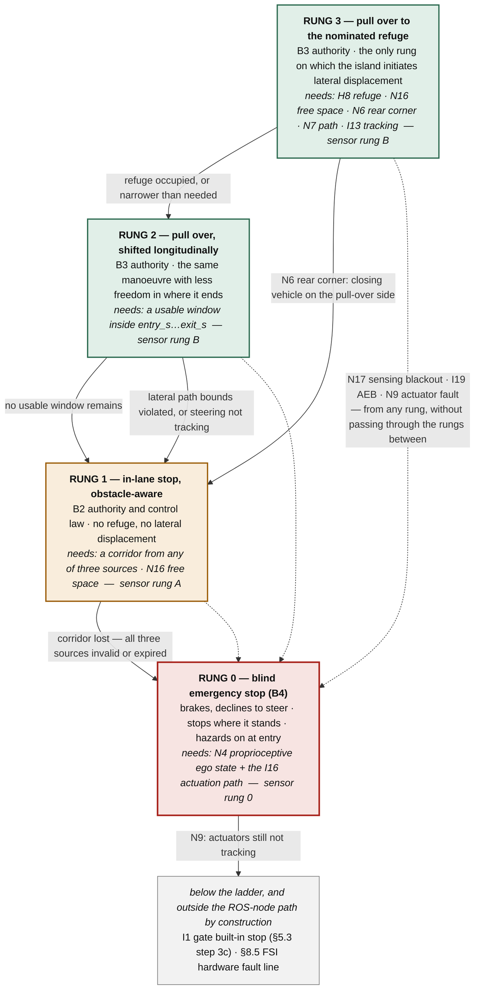

Three things are worth reading off the drawing rather than the table.

**The solid edges only ever go down, and each one is a *loss*.** Rung 3 → 2 gives up the chosen
stopping place but keeps the manoeuvre; 2 → 1 gives up leaving the running lane; 1 → 0 gives up
knowing what is ahead. Nothing in the ladder moves upward, and no rung requires anything the rung
above it did not already have. That is what makes attempting rung 3 acceptable: the cost of failing
at it is bounded by what is underneath, and what is underneath is always strictly simpler.

**The dashed edges are the ones that do not walk down the ladder.** A sensing blackout, an
[`I19`](#41-migration-list) AEB event or an [`N9`](#61-supervision-state-and-fallback) actuator fault reaches rung 0 *from wherever the vehicle is*, without
passing through the rungs in between — because each of them removes the precondition of every rung
above the floor at once. An implementation that walks the ladder one rung at a time under those
conditions is wrong, and §5.3 makes the same point about step 3b from the other direction.

**The floor is shared with a different ladder.** Rung 0 is [B4](#b4--emergency-stop-when-the-island-is-blind), and it is also rung 0 of the
*sensor* ladder in [§9.4](#94-minimal-deployable-configurations) — the configuration with no exteroceptive sensor at all. The two ladders measure
different things, the manoeuvre and the sensor set, and they meet at exactly one place. That
coincidence is not accidental: the floor of the manoeuvre ladder is defined as the manoeuvre that
survives the floor of the sensor ladder.

### 6.4 ODD degradation on weather and visibility

This is a **different trigger class** from everything above, and the difference drives the design.

| | HPC failure (§6.3) | ODD exit — weather / visibility |
| :-- | :-- | :-- |
| Standard | ISO 26262 — something malfunctioned | **ISO 21448 / SOTIF** — nothing malfunctioned |
| HPC state | Dead, hung, or lying | **Healthy and correct by its own lights** |
| Time constant | Milliseconds | Seconds to minutes |
| Correct first response | Seize authority | **Constrain, and let the HPC act** |
| Who should pull over | The island, because the HPC cannot | **The HPC, because it has the map** |

The last row is the important inversion. When visibility collapses, the *best* outcome is that the HPC
executes a planned, comfortable, legal pull-over while it still can. The island's job is to **demand
that, then verify compliance within a deadline**, and to fall back to its own cruder manoeuvre only if
the HPC does not act. Seizing authority first would replace a good pull-over with a worse one.

#### Why the island must detect this independently

An island that only reads the HPC's self-reported perception confidence cannot detect the case that
matters: **the HPC is confidently wrong.** That is the central SOTIF failure mode, and no amount of
health monitoring reaches it. The only thing that does is an independent sensing channel that degrades
*differently*. This is the strongest argument for the [D7](#1-inputs-already-fixed-by-the-wg) sensor set — stronger than the fallback
argument.

#### Detection: concrete signals, no learning required

| Signal | Sensor | Indicates |
| :-- | :-- | :-- |
| Max return range collapse; intensity drop; dense near-range returns | 2D lidar | Fog, heavy rain, spray, snow |
| Multi-echo / dual-return ratio rise | 2D lidar | Airborne particulates |
| **Radar-vs-lidar detection divergence** — radar reports targets lidar cannot confirm at the same range | radar + lidar | **Visibility collapse, measured by physical diversity rather than self-report** |
| Contrast / MTF collapse; sky-to-scene luminance ratio; flare area; drop and blur detection | camera | Fog, glare, low sun, dirty or wet lens |
| Lane-detection continuity and confidence | camera | Markings obscured by snow, water film, wear |
| Longitudinal slip ratio vs. commanded acceleration | wheel speed + IMU | **Low friction — ice, standing water** |
| Yaw-rate vs. steering-angle model residual | IMU + steering | Reduced lateral grip |
| Wiper state, exterior temperature, rain sensor | vehicle CAN | Cheap corroboration |

The radar-versus-lidar divergence test is the one to build first. It is a *physical* diversity
argument: radar penetrates what lidar does not, so a persistent disagreement between them at the same
range **is** reduced visibility. Nothing about it depends on a model of the weather.

Friction matters as much as visibility and is usually forgotten. It bounds achievable deceleration,
which sets stopping distance, which sets both the speed limit below and the refuge window in §6.3.

#### The node

| # | Node | Purpose | Tier | Rate |
| :-- | :-- | :-- | :-- | :-- |
| **N19** | `si_odd_monitor` | Environmental ODD verdict: visibility range estimate, precipitation class, surface-friction estimate, ambient-light class, and the resulting speed ceiling and ODD margin. Applies asymmetric hysteresis. Promoted from the phase-2 option noted in §6.1. | [T1s](#22-criticality-tiers-on-the-island) | 2–5 Hz |

[`N17`](#62-island-safety-sensing) and [`N19`](#64-odd-degradation-on-weather-and-visibility) answer different questions and must not be merged:

- **`N17 si_sensor_health` — "is my sensor working?"** A device question. Blockage, dirt, frame rate,
  internal fault. Its answer is a per-source validity flag, and its escalation path is the **fault
  manager**: a blinded sensor is a *fault*.
- **`N19 si_odd_monitor` — "is the world outside my operating envelope?"** An environment question.
  Its answer is an ODD verdict with a margin, and its escalation path is the **graded degradation
  ladder** below: reduced visibility is not a fault.

#### The speed law

The island's speed ceiling is closed-form, auditable, and derived from two measured quantities rather
than a lookup table:

```text
v_max = sqrt( 2 · a_brake · (d_visible − d_margin) )

  d_visible  measured sensing range, min over the active modalities    (N19)
  a_brake    achievable deceleration, bounded by the friction estimate (N19)
  d_margin   reaction and actuation margin at the current speed
```

*You may drive only as fast as you can stop within what you can see.* Worked example: `d_visible` 30 m
in fog, `a_brake` 3 m/s² on a wet surface, `d_margin` 5 m → `v_max` = 12.2 m/s ≈ 44 km/h. Both inputs
are measured on the island, so the limit is defensible without trusting the HPC.

#### The graded degradation ladder

| ODD margin | Island action | Mechanism | Deadline for HPC compliance |
| :-- | :-- | :-- | :-- |
| Nominal | none | — | — |
| **Marginal** | Notify. Publish the reduced verdict; the HPC re-plans conservatively | `OddVerdict` advisory + `SafetyEnvelopeCommand` mode `ALLOW` | — |
| **Degraded** | Restrict. Hard speed cap from the law above; enlarge margins | `SafetyEnvelopeCommand` mode `CONSTRAIN`, `speed_limit = v_max` | 3 s to reach compliance |
| **Beyond ODD, HPC compliant** | Request MRM. Ask the HPC to pull over *while it still can* | mode `MRM` + refuge request | 10 s to begin, 60 s to complete |
| **Beyond ODD, HPC non-compliant** | Take authority — island pull-over per §6.3 | [`I7`](#41-migration-list) → [`N18`](#63-pull-over-mrm-after-hpc-loss) | — |

**Compliance supervision is the load-bearing mechanism.** The island issues a constraint, then watches
whether actual speed and behaviour converge on it within the declared deadline. *Non-compliance is
itself a fault*, raised to [`N8`](#61-supervision-state-and-fallback) — and it is a fault the island can detect without any HPC cooperation,
using only vehicle status it already receives.

#### Hysteresis, and why it is asymmetric

Weather flickers; a vehicle that oscillates between speed limits is both uncomfortable and unsafe.
[`N19`](#64-odd-degradation-on-weather-and-visibility) degrades on ~2 s of consistent evidence and recovers only after ~30 s of clear evidence, with a
margin band between the thresholds. **Degrade fast, recover slowly.** Recovery must additionally
require that the HPC's own ODD verdict agrees.

#### Verdict arbitration

The HPC also publishes an ODD verdict ([`H4`](#7-new-nodes-to-add-on-the-hpc)). Two rules:

1. **The more restrictive verdict binds.** Either domain may restrict; neither may relax the other.
2. **Disagreement is itself a signal.** HPC says in-ODD, island says out-of-ODD → that is precisely the
   confidently-wrong case. It binds to the island's verdict, and it is recorded by [`N11`](#61-supervision-state-and-fallback) as a SOTIF
   event for field monitoring, because it is evidence about the HPC's perception that no other
   mechanism produces.

#### Where the two features meet

Fallback availability and environmental ODD are not independent. If [`N18`](#63-pull-over-mrm-after-hpc-loss) reports
`pull_over_available = false` — a tunnel, a barriered section, no shoulder — **and** [`N19`](#64-odd-degradation-on-weather-and-visibility) reports
falling visibility, then the vehicle is entering a stretch where the degraded fallback is *in-lane stop
on a road it cannot see*. Neither signal alone justifies much; together they justify a substantially
tighter speed ceiling, or declining to enter the section at all.

[`N19`](#64-odd-degradation-on-weather-and-visibility) therefore takes `pull_over_available` as an input and applies a reduction factor to `v_max` when
it is false. This is the concrete payoff of making fallback capability observable in §6.3.

---

## 7. New nodes to add on the HPC

The HPC side needs nodes whose only job is to make the interface narrow, typed and rate-limited ([R5](#21-partitioning-rules)).
Without them, "connect Autoware to the island" means publishing the full ROS graph over TSN.

| # | Node | Purpose | Rate |
| :-- | :-- | :-- | :-- |
| **H1** | `si_bridge_hpc` | In-house E2E egress/ingress counterpart of [N1](#61-supervision-state-and-fallback) (§8.4). Wraps each safety payload with Data ID, sequence counter, CRC, length and gPTP timestamp; enforces the publication rate; is the *only* HPC node permitted to write to the island link. | per-interface |
| **H2** | `hpc_capability_reporter` | Condenses `diagnostic_graph_aggregator` / `hazard_status_converter` / `pipeline_latency_monitor` output into a **fixed-size capability vector** (perception OK, localization OK, planning OK, per-pipeline latency margin, confidence floor) plus a self-test summary. Replaces free-form diagnostics on the link. | 10 Hz |
| **H3** | `hpc_corridor_publisher` | Emits a compact drivable-corridor strip (left/right boundary polylines, fixed point count) around the current trajectory, derived from the Lanelet2 map. This is the map, reduced to what the island can hold — enabling [N5](#61-supervision-state-and-fallback) and [N7](#61-supervision-state-and-fallback) without shipping the map. | 10 Hz |
| **H4** | `hpc_odd_reporter` | ODD and geofence validity, weather/visibility class, unmapped-area and roadworks flags — as a small enumerated status, not raw sensor data. | 10 Hz |
| **H5** | `hpc_trajectory_conditioner` | Resamples and bounds the planned trajectory to the island's fixed-capacity message (**250 points**, as already enforced in the nano-ros port), guarantees monotonic timestamps, fills per-point velocity/acceleration, and rejects malformed trajectories *before* they are transmitted. | 10 Hz |
| **H6** | `hpc_island_state_client` | Subscribes to island state and MRM state; republishes into `/system/fail_safe/mrm_state` and the AD API so that operator UI, logging and `command_mode_decider` see the island's verdict. Closes the loop for graded reaction steps 1–2. | 10 Hz |
| **H7** | `hpc_heartbeat` | Deterministic, minimal heartbeat with a rolling self-test result. Kept separate from [H2](#7-new-nodes-to-add-on-the-hpc) so that it can be given the highest RT priority and the shortest code path. | 50–100 Hz |
| **H8** | `hpc_refuge_publisher` | Streams the rolling, map-validated and law-checked **pull-over refuge** defined in §6.3, plus the explicit "no refuge available" declaration when it cannot honour the coverage guarantee. This is the node that makes an island pull-over possible at all. | 2 Hz |
| **H9** | `hpc_shadow_control_monitor` *(optional)* | Runs the same controller configuration on the HPC and compares against the island's echoed command; flags divergence. **Field-monitoring and validation only — no safety authority.** | 50 Hz |

---

## 8. The interface contract

Deliberately narrow: 11 signals in — ten required and one optional — and 9 out. Every row is
end-to-end protected (§8.4) and rate-declared.

### 8.1 HPC → Island (TSN/Ethernet, DDS or SOME/IP binding under nano-ros)

| Signal | Topic | Type | Rate | Age limit | Protection |
| :-- | :-- | :-- | :-- | :-- | :-- |
| Trajectory (≤250 pts) | `/planning/scenario_planning/trajectory` | `autoware_planning_msgs/Trajectory` | 10 Hz | 300 ms | SI-E2E/A |
| Drivable corridor *(preferred source)* | `/si/in/corridor` | *new* `SafetyCorridor` | 10 Hz | 300 ms | SI-E2E/A |
| Kinematic state (reference) | `/localization/kinematic_state` | `nav_msgs/Odometry` | 50 Hz | 60 ms | SI-E2E/A |
| Acceleration (reference) | `/localization/acceleration` | `geometry_msgs/AccelWithCovarianceStamped` | 50 Hz | 60 ms | SI-E2E/A |
| Operation mode state | `/api/operation_mode/state` | `autoware_adapi_v1_msgs/OperationModeState` | 10 Hz + on change | 300 ms | SI-E2E/A |
| Capability vector | `/si/in/capability` | *new* `HpcCapability` | 10 Hz | 300 ms | SI-E2E/B |
| ODD status | `/si/in/odd_status` | *new* `OddStatus` | 10 Hz | 300 ms | SI-E2E/B |
| Heartbeat + self-test | `/si/in/heartbeat` | *new* `HpcHeartbeat` | 100 Hz | **20 ms** | SI-E2E/B |
| **Pull-over refuge** | `/si/in/refuge` | *new* `PullOverRefuge` | 2 Hz | 2 s | SI-E2E/A |
| Auxiliary commands | `/control/command/{gear,turn_indicators,hazard_lights}_cmd` | `autoware_vehicle_msgs/*` | 10 Hz | 300 ms | SI-E2E/A |
| **Object list** *(optional — [§3.5](#35-optional-enrichment-the-hpc-object-list))* | `/perception/object_recognition/objects` | `autoware_perception_msgs/PredictedObjects`, truncated to a bounded digest at [`N20`](#62-island-safety-sensing) | 10 Hz | 300 ms | SI-E2E/B |

Under [D7](#1-inputs-already-fixed-by-the-wg), **every input on this table is now degradable.** Each has an island-local substitute:

| HPC input | Island substitute when it is stale or absent |
| :-- | :-- |
| Kinematic state, acceleration | [`N4`](#61-supervision-state-and-fallback) dead reckoning — the island cross-checks the HPC estimate against it and, on divergence or loss, uses [N4](#61-supervision-state-and-fallback) alone |
| Drivable corridor | [`N14`](#62-island-safety-sensing) perceived lane boundaries, then a heading/yaw-rate tube |
| Pull-over refuge | The last refuge whose `validity_distance_m` still covers the stopping distance; then in-lane stop |
| Trajectory | The buffered last-valid trajectory, then [`N7`](#61-supervision-state-and-fallback)'s generated MRM profile |
| Capability vector, ODD status | [`N2`](#61-supervision-state-and-fallback) liveness verdict and [`N17`](#62-island-safety-sensing) island sensor health |
| Object list *(optional)* | [`N16`](#62-island-safety-sensing)'s own perceived obstacles; then nothing at all. It is the one row whose substitute is *absence* — [§3.5](#35-optional-enrichment-the-hpc-object-list) is written so that losing it costs information, not capability |

That is the mechanism that lets [I9](#41-migration-list)–[I13](#41-migration-list), [I19](#41-migration-list) and [I20](#41-migration-list) keep running after HPC loss. **No row on this table
is a hard dependency of the safety core** — and the last row is not a dependency of anything at all.

### 8.2 Island → HPC

| Signal | Topic | Type | Rate |
| :-- | :-- | :-- | :-- |
| Island safety state | `/si/out/state` | *new* `IslandState` (mode — including `LANE_KEEP_HOLD` for [B2](#b2--keep-the-vehicle-in-its-lane-after-loss-of-the-hpc) <mark>and `EMERGENCY_STOP` for [B4](#b4--emergency-stop-when-the-island-is-blind)</mark> — fault code, authority holder, corridor source in use <mark>*or the blackout flag when there is none*</mark>, lateral deviation, remaining hold budget `T_hold`) | 50 Hz |
| Safety world state | `/si/out/safety_world` | *new* `SafetyWorldState` (nearest in-path obstacle range and range-rate, TTC, free-space distance, perceived corridor, per-sensor validity) | 20 Hz |
| Island sensor health | `/si/out/sensor_health` | *new* `IslandSensorHealth` (per-sensor availability, blockage, degradation cause) | 5 Hz |
| **Island ODD verdict** | `/si/out/odd_verdict` | *new* `OddVerdict` (visibility range, precipitation class, friction estimate, ambient light, derived `v_max`, ODD margin) | 2–5 Hz |
| **Fallback availability** | `/si/out/fallback_availability` | *new* `FallbackAvailability` (`pull_over_available`, reason, distance to next refuge) | 2 Hz |
| MRM state | `/system/fail_safe/mrm_state` | `autoware_adapi_v1_msgs/MrmState` | 10 Hz + on change |
| Constraint / veto vector | `/si/out/constraints` | *new* `SafetyEnvelopeCommand` (accel limit, curvature limit, speed limit, mode: ALLOW / CONSTRAIN / MRM) | 50 Hz |
| Executed control command (echo) | `/control/command/control_cmd` | `autoware_control_msgs/Control` | 50 Hz |
| Vehicle status | `/vehicle/status/{velocity,steering,gear,control_mode}_status` | `autoware_vehicle_msgs/*` | 50–100 Hz |

`SafetyEnvelopeCommand` is the mechanism for graded-reaction steps 1 and 2: the island constrains the
HPC rather than seizing control, and only escalates when the HPC fails to comply within a declared
number of cycles.

`SafetyWorldState` is **advisory in this direction**. The HPC may use it to cross-validate its own
perception — a radar track the island sees and the HPC does not is a strong SOTIF signal — and [`H9`](#7-new-nodes-to-add-on-the-hpc) is
the natural consumer. It must never become an input the HPC's nominal pipeline depends on, or the
independence argument runs backwards.

### 8.3 Island → actuator gateway

CAN FD (or deterministic Ethernet) at **100 Hz**, protection profile **SI-E2E/B**, carrying steering, acceleration
/ braking, gear, hazard lamps and the MRM flag, with actuator feedback returned on the same bus for
[N9](#61-supervision-state-and-fallback). This path shares nothing with the HPC link ([R6](#21-partitioning-rules), and RFC design principle 3).

### 8.4 In-house safety-message protection

[D6](#1-inputs-already-fixed-by-the-wg) originally named AUTOSAR E2E. The WG has since scoped this design as **Autoware in-house**, so
AUTOSAR is out. The *obligation* does not go with it: it comes from the communication threat analysis
in EN 50159 and ISO 26262-6, and it is unchanged by the choice of implementation.

**What every safety-relevant message must still let the receiver detect:**

| Threat | Detected by |
| :-- | :-- |
| Corruption | CRC over header and payload |
| Unintended repetition | Sequence counter |
| Incorrect sequence, reordering | Sequence counter |
| Loss | Sequence counter gap |
| Unacceptable delay, staleness | gPTP timestamp against a per-signal age limit |
| Insertion, masquerade | Data ID bound to the interface |
| Addressing error, wrong interface | Data ID |
| Truncation, malformed payload | Length field |

**Two profiles are enough for the whole interface:**

| | **SI-E2E/A** — Ethernet, variable length | **SI-E2E/B** — compact status and CAN FD |
| :-- | :-- | :-- |
| Used for | Trajectory, corridor, refuge, odometry, acceleration, mode, auxiliary commands | Heartbeat, capability vector, ODD status, actuator commands and feedback |
| Data ID | 16-bit | 8-bit |
| Sequence counter | 8-bit | 4-bit |
| Length | 16-bit | implicit (fixed) |
| Timestamp | 64-bit gPTP | 32-bit ms |
| CRC | CRC-32 over header + payload | CRC-8 |
| Overhead | 17 bytes | 6 bytes |

[`N1`](#61-supervision-state-and-fallback) verifies on ingress, [`H1`](#7-new-nodes-to-add-on-the-hpc) applies on egress, and **a verification failure is a safety event
raised to [`N8`](#61-supervision-state-and-fallback), never a middleware exception**. That rule is what actually matters, and it is
independent of which profile carries it.

nano-ros already lists an E2E safety protocol with CRC and an EN 50159 mapping in its evaluation
checklist. **The first task in Part 3 is to determine whether that covers SI-E2E/A and /B outright**,
in which case the island inherits it rather than implementing it — the preferable outcome, since it
comes with the middleware's own verification evidence.

### 8.5 On-SoC FSI → Island

SPI plus a discrete `SOC_ERROR` GPIO carrying hardware faults, watchdog expiry and failover triggers,
bypassing Linux and the TSN switch entirely. Consumed by [N8](#61-supervision-state-and-fallback) as a highest-priority fault source. When
the HPC is an Orin/Thor-class part, this is the sub-millisecond detection path; the TSN heartbeat
(20 ms age limit) is the vehicle-level-independent one.

---

## 9. Execution partitions, timing, and middleware realisation

### 9.1 Execution partitions

Thirty-odd nodes do not mean thirty-odd threads. Following the declarative RT-configuration approach
already demonstrated (contract facts → priority bands, `chain_aware` mapper), the island is organised
as five executors with fixed priority bands:

| Partition | Nodes | Period | Priority band |
| :-- | :-- | :-- | :-- |
| **P0 — Safety core** | [I1](#41-migration-list), [I2](#41-migration-list), [I3](#41-migration-list), [I5](#41-migration-list), [I6](#41-migration-list), [I7](#41-migration-list), [I16](#41-migration-list), [N1](#61-supervision-state-and-fallback), [N2](#61-supervision-state-and-fallback), [N3](#61-supervision-state-and-fallback), [N4](#61-supervision-state-and-fallback), [N8](#61-supervision-state-and-fallback) | 10 ms (100 Hz) | 1 — highest |
| **P1 — Supervision + fallback control** | [I8](#41-migration-list), [I13](#41-migration-list), [N5](#61-supervision-state-and-fallback), [N7](#61-supervision-state-and-fallback), [N9](#61-supervision-state-and-fallback), [N10](#61-supervision-state-and-fallback), [N12](#61-supervision-state-and-fallback), [N18](#63-pull-over-mrm-after-hpc-loss) | 20 ms (50 Hz) | 2 |
| **P2 — Safety sensing** | [I19](#41-migration-list), [I20](#41-migration-list), [N6](#61-supervision-state-and-fallback), [N13](#62-island-safety-sensing), [N14](#62-island-safety-sensing), [N15](#62-island-safety-sensing), [N16](#62-island-safety-sensing), [N17](#62-island-safety-sensing), [N19](#64-odd-degradation-on-weather-and-visibility), [N20](#62-island-safety-sensing) *(optional)* | 20–50 ms (20–50 Hz) | 3 |
| **P3 — Nominal control** | [I9](#41-migration-list), [I10](#41-migration-list), [I11](#41-migration-list), [I12](#41-migration-list), [I14](#41-migration-list), [I15](#41-migration-list) | 20–30 ms (33–50 Hz) | 4 |
| **P4 — Non-real-time** | [N11](#61-supervision-state-and-fallback), telemetry egress | 100–1000 ms | 5 — lowest |

The priority order encodes the degradation strategy, and it is deliberate that **the QM nominal
controller sits below ASIL-B sensing.** Under overload the island sheds the expensive MPC first: the
cheap ASIL-B fallback controller in P1 takes over within one cycle, which is exactly what the two-tier
design in §4.2 exists to make possible. Shedding sensing instead would silently downgrade an
obstacle-aware MRM to a blind one — the worse outcome. P4 is shed before anything else.

**P0 must complete without P2 or P3.** This is the property the measured failover already exhibits —
control cadence held at a 9.96 ms mean period through a full Linux outage — and it is the property the
timing analysis in Part 2 must *prove* rather than observe. The corollary from §2.2 is that P0 reads
P2's output only through an age-checked snapshot, and never blocks on it.

**Sizing note.** P2 is the new load introduced by [D7](#1-inputs-already-fixed-by-the-wg), and it is the partition most likely to force a
larger MCU than the current S32Z-class target. 2D-lidar occupancy and classical lane extraction are
bounded, but not free. If open decision 8 resolves toward a certified smart camera that emits lane and
object lists directly, [N14](#62-island-safety-sensing) collapses to a bus parser and P2's worst case drops sharply — an argument
for that option beyond the certification one.

### 9.2 Preliminary fault-reaction budget

To be reconciled with the FTTI in Part 2.

| Stage | Budget |
| :-- | :-- |
| Detection — heartbeat/deadline miss ([N2](#61-supervision-state-and-fallback)) | ≤ 30 ms (3 missed 100 Hz heartbeats) |
| Detection — FSI hardware fault line | ≤ 1 ms |
| Decision — [N8](#61-supervision-state-and-fallback) → [N3](#61-supervision-state-and-fallback) → [I2](#41-migration-list)/[I3](#41-migration-list) | ≤ 20 ms (2 cycles) |
| Command — [I1](#41-migration-list) → [I16](#41-migration-list) → CAN FD | ≤ 20 ms |
| **Island reaction total** | **≤ 70 ms** |
| Actuator response | vehicle-specific |

The 500 ms watchdog used in the current evaluation island is a coarse outer bound; the 30 ms
heartbeat detection above is the target for the production interface, with the 500 ms watchdog
retained as the independent backstop.

### 9.3 Middleware realisation on nano-ros

nano-ros is a `no_std` **Rust** ROS 2 client library for bare-metal and RTOS targets, with zenoh-pico,
XRCE-DDS and Cyclone DDS as selectable RMW backends. Four of its properties do real work for this
allocation, and one is a live design decision.

| nano-ros property | What it buys the allocation |
| :-- | :-- |
| `no_std` Rust; `alloc`/`std` are opt-in features | Satisfies [D5](#1-inputs-already-fixed-by-the-wg)'s "memory safe" requirement **at the language level**, not by coding convention. |
| **148 Kani** bounded-model-checking harnesses + **83 Verus** deductive proofs over CDR serialization, scheduling and protocol correctness | Reusable verification evidence for the *middleware element* of the ISO 26262 argument — normally the hardest part of a ROS-based safety case to construct. |
| Cyclone DDS backend **wire-compatible with stock ROS 2 RTPS** | The HPC↔island link needs no bridge and no type adaptation. Already demonstrated against unmodified Humble Autoware. |
| Declarative RMW / domain / topology selection (`system.toml` + launch XML → generated entry) | RMW and topology are **configuration, not code**. The decision below can be revisited without touching node source. |
| Verified targets: Zephyr, FreeRTOS, NuttX, ThreadX, bare-metal Cortex-M3 / ESP32-C3 | Covers the S32Z-class production target and the FVP/QEMU evaluation path already in use. |
| Pub/sub, **services**, actions and parameters all complete | `mrm_handler` → MRM operators uses `tier4_system_msgs/srv/OperateMrm`. The service path exists — but see risk 1 below. |

#### The allocation-policy decision

Per-RMW allocation behaviour differs, and it lands directly on [**R4**](#21-partitioning-rules):

| RMW backend | Allocation behaviour | Fit for the [T0](#22-criticality-tiers-on-the-island) partition |
| :-- | :-- | :-- |
| **XRCE-DDS** | Allocates **only at entity setup** | Best — fully static after init |
| **Zenoh / zenoh-pico** | Requires an allocator; a bump allocator suffices on bare metal | Acceptable with a pre-sized bump arena |
| **Cyclone DDS** | Allocates **per message** | Admissible only with a pre-sized pool and bounded queue depth |

The existing port uses Cyclone DDS for wire compatibility, and bounds that per-message allocation with
`KEEP_LAST` depth 1 on every controller input plus fixed-capacity sequences (the 250-point trajectory
bound). nano-ros ships `scripts/rmw-alloc-sites.py`, which reports **every allocation site** — that makes
the bound *auditable rather than asserted*, and its report should become a standing review artefact for
the [T0](#22-criticality-tiers-on-the-island) partition.

**Recommendation:** keep Cyclone DDS on the [`N1`](#61-supervision-state-and-fallback)/[`H1`](#7-new-nodes-to-add-on-the-hpc) boundary, where wire compatibility with stock
Autoware is the entire point, and treat the intra-island transport for P0 as open decision 7 (§11).

#### Integration risks carried from the middleware

1. **The service path is not yet exercised in the ASI port.** `mrm_handler` ↔ MRM operators
   (`OperateMrm`) and the rejected-command reporting path both use services. Complete in nano-ros,
   listed as remaining validation work in the port. **Make this a phase-1 exit criterion.**
2. **Some Cyclone DDS embedded action paths are still in progress.** No node in this allocation uses
   ROS actions — keep it that way for the island, and prefer services or state topics if a future
   node is tempted.
3. **Execution-model exceptions.** Bare-metal deferred dispatch and Zephyr's component shape are
   flagged as exceptions in the nano-ros scheduling wiring matrix. The P0/P1/P2 priority bands in §9.1
   must be checked against that matrix for the chosen target *before* Part 2's timing analysis.
4. **E2E.** nano-ros lists an E2E safety protocol (E2E CRC, EN 50159 mapping) in its evaluation
   checklist. With AUTOSAR now out of scope (§8.4), the question is simply whether that built-in
   protocol satisfies `SI-E2E/A` and `/B` directly. If it does, [`N1`](#61-supervision-state-and-fallback)/[`H1`](#7-new-nodes-to-add-on-the-hpc) become thin adapters rather
   than protocol implementations, and the island inherits the middleware's own verification evidence
   — **the outcome to aim for.**


### 9.4 Minimal deployable configurations

The full allocation is 18 migrated Autoware nodes plus 19 new ones. That is the *target*. This section
answers a narrower question: **what is the smallest island that can pull the vehicle over after the
HPC dies?**

#### Minimal sensor set

The set is a ladder, not a single answer, because it depends on the declared ODD. It has a floor —
rung 0 — which is not a deployable configuration but the state the island degrades *into* when its
<mark>sensors are lost. Listing it makes the point that [B4](#b4--emergency-stop-when-the-island-is-blind) exists precisely so that the ladder cannot
run out from under the design.</mark>

| Rung | Sensors | Sufficient for |
| :-- | :-- | :-- |
| <mark>**0 — the floor**</mark> | <mark>island IMU + wheel speed + steering report only; **no exteroceptive sensor**</mark> | <mark>[B4](#b4--emergency-stop-when-the-island-is-blind) and nothing else: a blind emergency stop in the running lane. Not a configuration anyone deploys — it is what rungs A–C degrade to, and the reason [B4](#b4--emergency-stop-when-the-island-is-blind) carries no precondition</mark> |
| **A — irreducible** | 2D lidar (forward, ≥180°) · island IMU + wheel speed | Fair-weather, low-speed pull-over on a road with a continuous physical edge. **This is what the NTU golf-cart prototype can start with.** |
| **B — design point** | + forward radar · rear-corner radar on the pull-over side | A credible L4 ODD: weather robustness, closing-speed on traffic ahead, and awareness of the lateral space the manoeuvre crosses |
| **C — full** | + forward camera · ultrasonic array | Roads without a continuous physical edge; tight-to-kerb termination; and §6.4 |

Reasoning behind each:

| Sensor | Verdict | Why |
| :-- | :-- | :-- |
| **2D lidar** | **Mandatory, and the one that cannot be dropped** | Pull-over is a question about *space*: is the shoulder there, and is it free over the target window? Lidar measures free space and the physical edge directly. Radar's azimuth resolution and stationary-target rejection make it a poor substitute. |
| **Island IMU + wheel speed** | **Mandatory** | Without [`N4`](#61-supervision-state-and-fallback) there is no ego state after HPC loss and nothing to track a path against. Also supplies AEB's IMU path. |
| **Rear-corner radar, pull-over side** | **Mandatory above ~30 km/h** | The manoeuvre crosses lateral traffic space. This is the gap the previous revision did not cover. Cheap, weather-robust, CAN FD — the same part production blind-spot systems use. Below ~30 km/h it can be traded for a long indicator dwell and a very low lateral rate. |
| **Forward radar** | **Mandatory once weather is in the ODD** | The only forward channel that survives fog, heavy rain and darkness — exactly the conditions in which the MRM is most likely to be needed. §6.4 also makes it half of the visibility test. |
| **Forward camera** | **Conditional — but §6.4 makes it mandatory** | Needed for lateral containment where there is no continuous physical edge. On the pull-over question alone it is droppable; **add the ODD-degradation feature and it is not**, because contrast and lane-continuity collapse are the primary visibility evidence. |
| **Ultrasonic array** | **Conditional** | Required if the manoeuvre must terminate tight to a kerb, or if standstill-release safety is claimed. Droppable if "stop within the shoulder" is the accepted terminal condition. |

> **The two features together settle the sensor set.** Pull-over alone permits rung B — four sensors.
> Pull-over *plus* ODD degradation requires rung C, because visibility estimation needs both the
> radar-versus-lidar divergence test and the camera contrast test. **Answer the WG's two questions
> together and the camera stops being optional.**

#### Minimal node set — 21 mandatory

| Group | Nodes | Count |
| :-- | :-- | :-- |
| **Authority and state** | [`I1`](#41-migration-list) gate · [`I2`](#41-migration-list) decider · [`I3`](#41-migration-list) switcher · [`I7`](#41-migration-list) mrm_handler · [`N2`](#61-supervision-state-and-fallback) hpc_supervisor · [`N3`](#61-supervision-state-and-fallback) state_machine · [`N8`](#61-supervision-state-and-fallback) fault_manager | 7 |
| **Ingress, ego state, actuation** | [`N1`](#61-supervision-state-and-fallback) gateway · [`N4`](#61-supervision-state-and-fallback) vehicle_state_estimator · [`I16`](#41-migration-list) vehicle interface | 3 |
| **MRM behaviours** | [`N18`](#63-pull-over-mrm-after-hpc-loss) pull_over_manager · [`I6`](#41-migration-list) mrm_emergency_stop_operator *(abort)* · [`I5`](#41-migration-list) stop_mode_operator *(terminal stop + auto-park)* | 3 |
| **Fallback control** | [`N7`](#61-supervision-state-and-fallback) mrm_planner *(bounded Trajectory)* · [`I13`](#41-migration-list) pure_pursuit | 2 |
| **Sensing** | [`N13`](#62-island-safety-sensing) scan_guard · [`N6`](#61-supervision-state-and-fallback) radar_guard · [`N16`](#62-island-safety-sensing) safety_world_model · [`N17`](#62-island-safety-sensing) sensor_health · [`I19`](#41-migration-list) autonomous_emergency_braking | 5 |
| **Execution assurance** | [`N9`](#61-supervision-state-and-fallback) actuator_supervisor | 1 |

<mark>Of those 21, the subset that [B4](#b4--emergency-stop-when-the-island-is-blind) alone requires is small and worth naming, because it is the part
of the island that must keep working when everything else has stopped being trustworthy:
[`N4`](#61-supervision-state-and-fallback) ego state · [`N3`](#61-supervision-state-and-fallback) state machine ·
[`N8`](#61-supervision-state-and-fallback) fault manager · [`N17`](#62-island-safety-sensing) sensor health (to *declare* the blackout) ·
[`I7`](#41-migration-list) mrm_handler · [`I6`](#41-migration-list) emergency-stop operator ·
[`I1`](#41-migration-list) gate · [`I16`](#41-migration-list) vehicle interface · [`I5`](#41-migration-list) to secure at standstill —
**nine nodes, none of which consume an exteroceptive topic.** That is the property to hold on to: the
[B4](#b4--emergency-stop-when-the-island-is-blind) path shares no input with the sensing chain whose failure triggers it.</mark>

**Recommended additions (+3): [`I9`](#41-migration-list) + [`I12`](#41-migration-list) + [`I11`](#41-migration-list).** The MRM needs a longitudinal law. Reusing
Autoware's PID longitudinal controller — which means keeping the follower node and its plugin base —
is preferable to writing one, for the same provenance reason the whole design rests on. **Note that
`I10 mpc_lateral_controller` is *not* in this set:** the pull-over MRM does not need the MPC. That is
the two-tier argument of §4.2 arriving at its conclusion.

So: **21 mandatory, 24 as recommended, against 37 in the full design.**

The [§3.5](#35-optional-enrichment-the-hpc-object-list) object option adds **one node and zero mandatory ones**: [`N20`](#62-island-safety-sensing) sits outside all three
counts, and the nine-node [B4](#b4--emergency-stop-when-the-island-is-blind) path above is unchanged by it. That is the arithmetic test the
option was designed to pass.

#### What is deliberately excluded, and the risk accepted

A minimal set is only useful if the omissions are argued rather than overlooked.

| Excluded | Why it is safe to omit *for MRM execution* | Risk accepted |
| :-- | :-- | :-- |
| [`I10`](#41-migration-list) mpc_lateral_controller | Nominal comfort controller. The MRM tracks a bounded path with pure pursuit. | Ride quality during the manoeuvre. Irrelevant. |
| [`I8`](#41-migration-list) control_validator, [`N10`](#61-supervision-state-and-fallback) envelope_monitor | [`N7`](#61-supervision-state-and-fallback) applies hard lateral-acceleration, steering-rate and jerk bounds at generation time. | Loss of the **guardian** role — the island can still fall back, but can no longer veto a *healthy* HPC. Restores in phase 2. |
| [`N5`](#61-supervision-state-and-fallback) corridor_monitor | Pull-over deliberately leaves the lane; lane-departure checking must be suppressed during the manoeuvre in any case. | No lateral containment check during nominal driving. |
| [`N12`](#61-supervision-state-and-fallback) time_quality_monitor | After HPC loss the gPTP master may be gone. The island runs on its local clock and age checks become local. | Cross-domain freshness claims are unavailable. Acceptable, since by then there is no cross-domain traffic. |
| [`N11`](#61-supervision-state-and-fallback) event_recorder | Not needed to *execute*. | **Graded-reaction step 4 (audit) is unmet.** Required before any pilot, not before a bench demo. |
| [`I14`](#41-migration-list) shift_decider | [`I5`](#41-migration-list)'s `enable_auto_parking` covers the gear-P transition. | none |
| [`I15`](#41-migration-list) raw_vehicle_cmd_converter | Only needed for vehicles with pedal/torque interfaces. **Not needed on the NTU golf cart**, whose interface is steering angle + velocity. | Vehicle-specific; re-add per platform. |
| [`I20`](#41-migration-list) collision_detector, [`N15`](#62-island-safety-sensing) proximity_guard | Rung A and B have no ultrasonic. | No near-field guard for the final metres and standstill release. Pair with the "stop within the shoulder" terminal condition. |
| [`N14`](#62-island-safety-sensing) vision_guard | Rung A and B have no camera. | **Only valid where a continuous physical edge exists** — and invalid the moment §6.4 is in scope. |
| <mark>— *(no exclusion)*</mark> | <mark>[B4](#b4--emergency-stop-when-the-island-is-blind) is unaffected by every row above: it consumes no exteroceptive topic.</mark> | <mark>none — which is the point of declaring it. Each omission narrows what the island can *do*, never what it can *stop doing*.</mark> |
| [`N20`](#62-island-safety-sensing) object_digest | Optional by construction ([§3.5](#35-optional-enrichment-the-hpc-object-list)). It enriches [B1](#b1--degrade-the-ads-when-the-odd-cannot-be-held)–[B4](#b4--emergency-stop-when-the-island-is-blind) and gates none of them. | The island loses the HPC self-consistency veto and the conservative object term. **No capability is lost** — which is the test the option was designed to pass. |
| [`N19`](#64-odd-degradation-on-weather-and-visibility) odd_monitor | Not required to execute an MRM. | The §6.4 feature is simply absent. |

---

## 10. Diagrams

### 10.1 Node allocation across the two domains

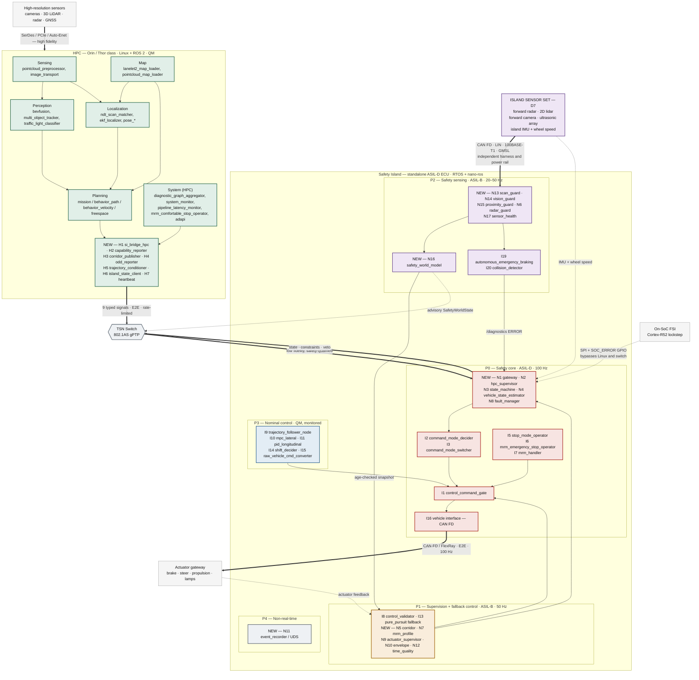

Purple is the sensing chain added by [D7](#1-inputs-already-fixed-by-the-wg). Two sensor sets, two harnesses, two power rails: the vehicle
is perceived twice, at very different resolutions, by two domains that share no failure mode. The only
paths that survive HPC loss are those originating inside the island boundary — and after [D7](#1-inputs-already-fixed-by-the-wg) that now
includes a view of the road ahead.

### 10.2 The island sensing chain

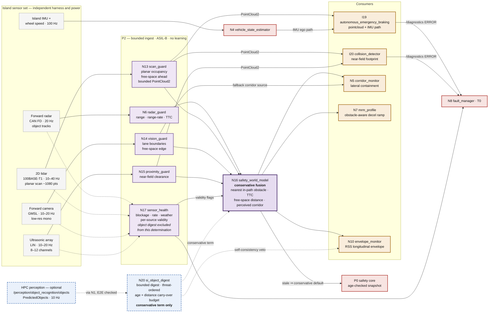

Note the two paths out of [`N13`](#62-island-safety-sensing). It publishes a bounded `PointCloud2` directly to the two migrated
Autoware nodes — which is what lets `autoware_autonomous_emergency_braking` and
`autoware_collision_detector` run unmodified — *and* it feeds [`N16`](#62-island-safety-sensing) for the fused world state that the
supervision tier consumes. The safety core reads [`N16`](#62-island-safety-sensing) only through an age-checked snapshot, so a stall
anywhere in this diagram degrades the MRM to blind deceleration rather than blocking it.

The two blue dash-outlined boxes are [§3.5](#35-optional-enrichment-the-hpc-object-list)'s option, drawn that way because they may simply not be there.
Note what is **absent**: there is no edge from the digest to [`N17`](#62-island-safety-sensing), and its box says so. The digest
is excluded by construction from the blackout determination, so a live HPC publishing objects can never
hide the fact that the island itself has gone blind. Note also which consumers it *does* reach —
[`N16`](#62-island-safety-sensing), where it can only add a hazard, and `N10`, where it powers the self-consistency veto.
It reaches no node on the P0 path at all.

### 10.3 Failover sequence — HPC loss during autonomous driving

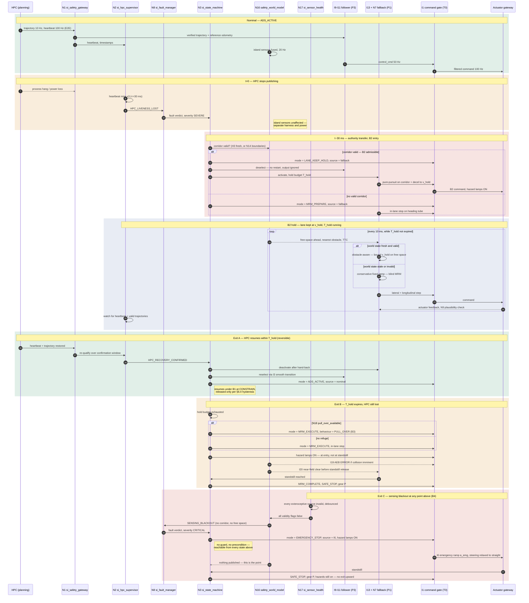

<mark>Exit C is drawn last but is not last in precedence: it can preempt Exits A and B at any moment,
including mid-hand-back. Note what is *absent* from it — no [`N16`](#62-island-safety-sensing) query, no corridor
lookup, no [`N18`](#63-pull-over-mrm-after-hpc-loss) refuge check. [B4](#b4--emergency-stop-when-the-island-is-blind) is the only path in this diagram that
completes without consulting a sensing node, which is what allows it to run when the sensing nodes
are the thing that failed.</mark>

The critical span is detection to authority transfer: three missed heartbeats at 100 Hz, then two
decision cycles. **Nothing in the shaded transfer band reads a topic the HPC produces** — and the
`alt` branch on world-state validity is the §2.2 staleness rule made explicit. Island perception
improves the outcome; its absence never blocks the transfer.

The exits are the point of the diagram. HPC loss does not commit the vehicle to a terminal
manoeuvre: it commits it to [**B2**](#b2--keep-the-vehicle-in-its-lane-after-loss-of-the-hpc), a bounded lane-keeping hold, from which Exit A returns authority to
a re-qualified HPC and Exit B escalates to [B3](#b3--pull-over-if-the-odd-continues-to-fail). Note what Exit A does *not* do — it does not accept the
first heartbeat that reappears, and it does not return to `ALLOW`. Note also that the corridor check
sits at [B2](#b2--keep-the-vehicle-in-its-lane-after-loss-of-the-hpc)'s entry, not inside it: an island that cannot see the lane never enters the hold at all —
<mark>it goes to Exit C, which is [B4](#b4--emergency-stop-when-the-island-is-blind), directly.</mark>

### 10.4 Command-source arbitration inside the island

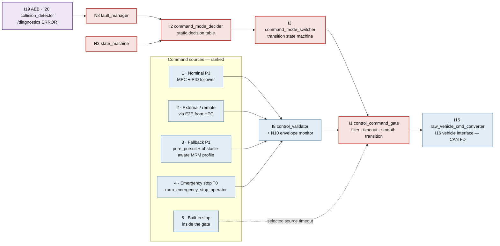

Rank order is fixed at build time. Every source except the gate's own built-in stop passes through
validation; the built-in stop exists precisely because it must work when validation's inputs are gone.
[`I19`](#41-migration-list) and [`I20`](#41-migration-list) do **not** appear as command sources — they are fault sources. Island perception
escalates through the fault manager and the state machine, never straight to the actuators.

### 10.5 Pull-over decision and abort ladder

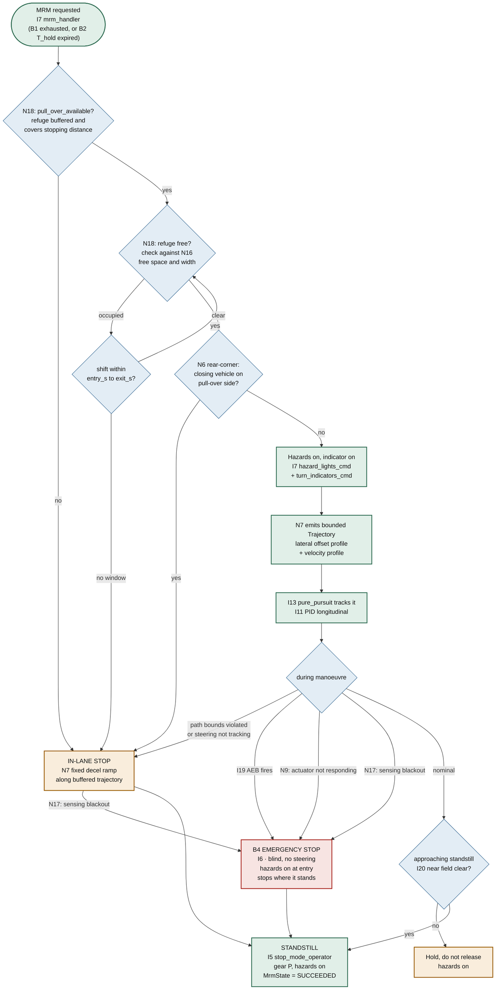

Every branch out of the happy path lands on a *simpler* manoeuvre. Pull-over degrades to in-lane stop,
<mark>in-lane stop degrades to [B4](#b4--emergency-stop-when-the-island-is-blind) emergency stop</mark>, emergency stop degrades to the gate's built-in stop.
The manoeuvre never escalates in complexity under fault — which is what makes attempting the harder
<mark>one acceptable. Note the two edges into [B4](#b4--emergency-stop-when-the-island-is-blind) that do not pass through the pull-over logic at all: a
sensing blackout removes the *precondition* of every box above it at once, so it short-circuits the
ladder rather than descending it.</mark>

### 10.6 ODD degradation ladder

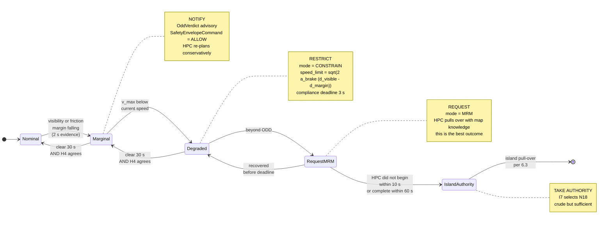

Time runs in seconds here, not milliseconds. The escalation is **deliberately reluctant**: the island
gives the HPC three chances to handle its own ODD exit, because a planned pull-over with map knowledge
beats the island's geometric one every time. Only non-compliance — which the island detects from
vehicle status alone, needing no HPC cooperation — moves authority.


---

## 11. Open decisions for the WG

These change the allocation and should be settled before Part 2.

1. **Target or legacy command architecture (§4.3).** The recommendation is the target set
   (`control_command_gate` + `command_mode_decider/switcher` + `stop_mode_operator`). This must be
   pinned to a specific Autoware release, because the existing ASI port targets Humble-era interfaces.
2. **Two-tier controller (§4.2).** Does the WG accept a QM-rated MPC bounded by an ASIL-D gate, or
   must the entire control module reach ASIL-B/D? The answer determines whether `autoware_pure_pursuit`
   ([I13](#41-migration-list)) is in scope for phase 1.
3. **Island sensor set ([D7](#1-inputs-already-fixed-by-the-wg), §6.2).** Settled in principle. What remains is the concrete list and its
   mounting: is the forward camera in, or is radar + 2D lidar + ultrasonic sufficient? Each sensor
   added costs P2 budget and a safety manual.
4. **Corridor abstraction ([H3](#7-new-nodes-to-add-on-the-hpc)/[N5](#61-supervision-state-and-fallback)).** With [N14](#62-island-safety-sensing) available the map corridor is no longer the only source,
   so this is now a question of *preference order* rather than necessity: map corridor first, perceived
   lanes second, heading tube last. Confirm that ordering, and the age at which each source expires.
5. **Message set ownership.** `SafetyCorridor`, `HpcCapability`, `OddStatus`, `HpcHeartbeat`,
   `IslandState`, `SafetyEnvelopeCommand`, `SafetyWorldState`, `IslandSensorHealth`, `PullOverRefuge`,
   `OddVerdict`, `FallbackAvailability` are new. Proposal:
   a single `autoware_safety_island_msgs` package, contributed upstream so both domains generate from
   the same `.msg` sources — as the nano-ros port already does for wire compatibility.
6. **In-house protection profiles (§8.4).** AUTOSAR is out of scope by WG decision, so `SI-E2E/A`
   and `SI-E2E/B` are proposed in its place. Confirm the field widths and the CRC polynomials — and,
   first, whether nano-ros's built-in E2E already covers them, in which case the island inherits the
   middleware's verification evidence instead of writing its own.
7. **Intra-island RMW backend (§9.3).** Cyclone DDS on the HPC boundary is settled by wire
   compatibility. For the [T0](#22-criticality-tiers-on-the-island) partition, XRCE-DDS gives static-after-init allocation, zenoh-pico gives a
   bounded bump arena, Cyclone DDS needs a pre-sized pool. Whether the island runs one backend or two
   is the open question, and it is a `system.toml` decision rather than a code decision.
8. **Camera processing on the island ([N14](#62-island-safety-sensing)).** Two routes. *(a)* Classical CV — inverse perspective
   mapping plus line fitting — which is bounded, auditable, and cheap to certify, but fragile in poor
   lane marking and adverse light. *(b)* A certified automotive smart camera that emits lane and object
   lists over CAN/Ethernet, moving the perception burden and its ASIL evidence to the supplier. **(b) is
   recommended**: it collapses [N14](#62-island-safety-sensing) to a parser, removes learning-based code from the island entirely,
   and buys supplier safety evidence. It costs BOM and vendor lock-in. If the WG prefers (a), the
   island's ODD must be narrowed accordingly.
9. **Do island sensors also feed the HPC?** The design says no — one-way, sensors to island only, with
   the island forwarding an advisory `SafetyWorldState` upward. Confirm, because the alternative (a tap
   into the HPC's sensing) is tempting for cross-validation and would quietly create the reverse
   dependency the independence argument forbids.
10. **`MrmState` has no pull-over value (§6.3).** `autoware_adapi_v1_msgs/MrmState.behavior` carries
   only `NONE`, `EMERGENCY_STOP` and `COMFORTABLE_STOP`, yet `mrm_handler` already defines a
   `pull_over_manager` slot. Proposal: contribute a `PULL_OVER` value upstream rather than overloading
   `COMFORTABLE_STOP`, which would make the AD API and the operator UI report the wrong manoeuvre.
11. **Can the HPC honour the refuge coverage guarantee (§6.3)?** It must guarantee that the buffered
   refuge set always covers the current worst-case stopping distance, and declare explicitly when it
   cannot. This is a real constraint on the planner, and it should be confirmed with the planning
   maintainers before the interface is fixed.
12. **ODD verdict arbitration (§6.4).** The proposal is that the more restrictive of the HPC's and the
   island's verdict binds, and that disagreement is recorded as a SOTIF event. Confirm — the
   alternative, HPC-wins, removes the only mechanism that catches a confidently-wrong HPC.
13. **Island ODD declaration (§6.4).** The MRM's claimed operating domain — speed ceiling, road
   geometry, weather — is narrower than the vehicle's ODD and must be stated as a first-class
   requirement, not discovered during validation.
14. **[B2](#b2--keep-the-vehicle-in-its-lane-after-loss-of-the-hpc)'s hold window and the hand-back criteria (§3.1, §3.2).** Three numbers and one policy question,
   and they are the most consequential open items in the behaviour set.
   *(a)* `T_hold` — how long the island may hold the lane awaiting HPC recovery. Too short and every
   transient HPC hiccup becomes a pull-over on a live carriageway; too long and the vehicle loiters
   under a fallback controller with a narrow ODD. The starting proposal is **2–5 s**, scaled down when
   the corridor comes from [`N14`](#62-island-safety-sensing) rather than [`H3`](#7-new-nodes-to-add-on-the-hpc) and set to zero on the heading tube.
   *(b)* `v_hold` — the constrained speed held during [B2](#b2--keep-the-vehicle-in-its-lane-after-loss-of-the-hpc), from the §6.4 speed law evaluated against the
   *island's* ODD, not the vehicle's.
   *(c)* The **recovery confirmation window** — how long a returned HPC must publish valid, in-envelope
   trajectories before [`N2`](#61-supervision-state-and-fallback) will qualify it. It must be long enough that a crashed-and-restarted HPC
   cannot re-acquire authority on its first plausible message.
   *(d)* The policy question: **may a recovered HPC be trusted at all within the same drive cycle?** The
   design says yes, under confirmation and re-entering [B1](#b1--degrade-the-ads-when-the-odd-cannot-be-held) at `CONSTRAIN`, because the alternative —
   treating every transient loss as terminal — makes the vehicle brittle in exactly the scenarios the
   island exists to survive. The conservative alternative (hold, then always pull over) is defensible
   and cheaper to argue for in the safety case. This is a WG decision, not a design one.
15. <mark>**[B4](#b4--emergency-stop-when-the-island-is-blind)'s blackout declaration and stop rate (§3.1, §6.2).** [B4](#b4--emergency-stop-when-the-island-is-blind) is new in version
   20260903 and its parameters are unset. Three numbers and one policy question.
   *(a)* The **blackout debounce** — how long every exteroceptive source must be simultaneously
   invalid before [`N17`](#62-island-safety-sensing) declares it. Too short and a tunnel mouth, a spray burst
   from an overtaking truck, or a low-sun frame triggers an emergency stop on a live carriageway; too
   long and the vehicle travels blind. The starting proposal is **3 consecutive [`N16`](#62-island-safety-sensing) cycles**
   (≈ 60–150 ms), bounded additionally by a hard **distance-travelled-blind** cap, because at speed the
   time budget and the distance budget are not the same constraint.
   *(b)* `a_emg` — the emergency deceleration rate. It is **not** AEB's rate: AEB brakes to avoid a
   detected obstacle, whereas [B4](#b4--emergency-stop-when-the-island-is-blind) has no obstacle to stop short of, so following-vehicle risk
   rather than stopping distance is the dominant term.
   *(c)* The **steering-relaxation rate** — how fast the held steering angle is allowed to return
   toward straight while the vehicle decelerates. Zero means the vehicle continues its current arc;
   too fast is a lateral disturbance of its own.
   *(d)* The policy question: **must [B4](#b4--emergency-stop-when-the-island-is-blind) also alert?** Hazard lamps are in the design already.
   Whether a blind stop additionally raises a remote-assistance request, a V2X hazard message, or the
   horn is an operational-concept decision the WG owns, and it interacts with whether the deployment
   assumes a remote operator at all.</mark>
16. **The optional HPC object list ([§3.5](#35-optional-enrichment-the-hpc-object-list), §6.2, §8.1).** New in version 20260903, and the first
   question is whether to take it at all.
   *(a)* **Adopt, or not.** For: the self-consistency veto is the cheapest guardian function in the
   whole design — it needs no island sensor, only [`N10`](#61-supervision-state-and-fallback)/[`I8`](#41-migration-list) and the digest, and it catches the failure
   mode island perception is worst at catching, namely a *healthy* HPC planning through an object it
   has itself just published. Against: it is the first HPC-produced topic the island consumes for
   anything other than supervising the HPC, and every such input is one more argument to make in the
   safety case. **Recommendation: adopt at phase 2, behind the monotone-conservatism rule**, which is
   what makes the argument short.
   *(b)* **The digest bounds** — maximum object count `K_obj`, prediction horizon `H_obj`, and the field
   set. These fix the worst-case message size, and therefore the [R4](#21-partitioning-rules)/[R5](#21-partitioning-rules) argument. Starting proposal:
   the **16 highest-threat objects**, **3 s** of predicted path, and pose, extent, velocity and class
   only.
   *(c)* **The carry-over budget** — how long, and how far, the last valid digest survives HPC silence.
   Two bounds rather than one, for the reason decision 15 gives. Starting proposal: **500 ms or 10 m,
   whichever comes first.**
   *(d)* **The E2E profile.** SI-E2E/B is proposed on the ground that corruption can only cause
   *nuisance* braking, never a missed hazard. If the WG judges nuisance braking at speed to be a hazard
   in its own right, the row moves to SI-E2E/A. This is the sharpest of the four questions, and it is
   the one that tests whether the monotone-conservatism argument is believed.

---

## 12. Next steps

| Part | Content |
| :-- | :-- |
| **2** | Timing and FTTI: worst-case chain latency per interface, fault-reaction budget derivation, RT contract files (`*.contract.yaml` + platform files) for both domains, checked against the nano-ros scheduling wiring matrix for the chosen target. |
| **3** | Interaction specification: full message definitions for `autoware_safety_island_msgs`, per-signal E2E configuration, QoS table, and the complete island state machine with transition guards. |
| **4** | Safety case skeleton: HARA extract, safety goals, ASIL allocation and decomposition argument, independence analysis, and the fault-injection test matrix (HPC hang, link flood, stale trajectory, E2E corruption, actuator non-response, power loss, <mark>**simultaneous blindness of every island sensor — the [B4](#b4--emergency-stop-when-the-island-is-blind) case**</mark> — and, if [§3.5](#35-optional-enrichment-the-hpc-object-list) is adopted, a corrupted or phantom-object digest and a digest that goes silent mid-manoeuvre). |

Implementation sequencing follows the existing port. The current `autoware-safety-island` on nano-ros
already covers [I9](#41-migration-list)–[I12](#41-migration-list).

| Phase | Adds | Capability reached |
| :-- | :-- | :-- |
| **0** — done | [I9](#41-migration-list)–[I12](#41-migration-list) | Trajectory following on the island, closed loop against unmodified Autoware |
| **1** | P0: [I1](#41-migration-list)–[I3](#41-migration-list), [I5](#41-migration-list)–[I7](#41-migration-list), [I16](#41-migration-list), [N1](#61-supervision-state-and-fallback)–[N4](#61-supervision-state-and-fallback), [N8](#61-supervision-state-and-fallback) | **Autonomous fallback.** Authority transfer on HPC loss; blind but bounded MRM |
| **2** | P1: [I8](#41-migration-list), [I13](#41-migration-list), [N5](#61-supervision-state-and-fallback), [N7](#61-supervision-state-and-fallback), [N9](#61-supervision-state-and-fallback), [N10](#61-supervision-state-and-fallback), [N12](#61-supervision-state-and-fallback) | **Guardian role.** Command validation, safety envelope, veto, two-tier control |
| **3** | P2: [I19](#41-migration-list), [I20](#41-migration-list), [N6](#61-supervision-state-and-fallback), [N13](#62-island-safety-sensing)–[N17](#62-island-safety-sensing) + the island sensor harness | **Obstacle-aware MRM** per [D7](#1-inputs-already-fixed-by-the-wg). The island stops for what it can see. |
| **4** | [N18](#63-pull-over-mrm-after-hpc-loss) + [H8](#7-new-nodes-to-add-on-the-hpc) | **Pull-over MRM** (§6.3). The island moves the vehicle out of the running lane. |
| **5** | [N19](#64-odd-degradation-on-weather-and-visibility) | **ODD degradation** (§6.4). Independent visibility and friction verdict, graded restriction of a healthy HPC. |

The minimal configuration in §9.4 cuts across this: **phases 1, 3 and 4 reduced to their mandatory
nodes deliver a pull-over-capable island in 21 nodes**, deferring the phase-2 guardian role. That is
the shortest credible path to a demonstrable L4 fallback, and it is the sequence recommended for the
golf-cart prototype.

The optional [§3.5](#35-optional-enrichment-the-hpc-object-list) object digest ([N20](#62-island-safety-sensing)) can be added at **phase 2**, where it serves [B1](#b1--degrade-the-ads-when-the-odd-cannot-be-held)'s
self-consistency veto with no island sensing at all, or deferred to phase 3 with the rest of the
sensing chain. It is on no phase's critical path, by construction.

Phases 1 and 2 are unchanged by [D7](#1-inputs-already-fixed-by-the-wg) and remain the critical path — [D7](#1-inputs-already-fixed-by-the-wg) improves the *quality* of the
fallback, it does not create it. Phase 3 can proceed in parallel on the sensing side, since [N13](#62-island-safety-sensing)–[N17](#62-island-safety-sensing)
have no dependency on P0 beyond the world-state contract in §2.2.

---

*Sources: `SafetyIsland_RefDesignWG.pdf` (Reference Design WG, 2026-08-14); `SaftyIsland_ReferenceDesign.md`;
`This project researches the design of safety islan.md`; `AutowareSW.md`; `autoware_universe` package
inventory, `main` branch, retrieved 2026-08-27; `autoware-safety-island` (branch `nano-ros`, NEWSLab NTU);
AWF progress update 2026-08-20, "Porting the Autoware Safety Island onto nano-ros";
`github.com/NEWSLabNTU/nano-ros`; the nano-ros book, `newslabntu.github.io/nano-ros-book`.*
