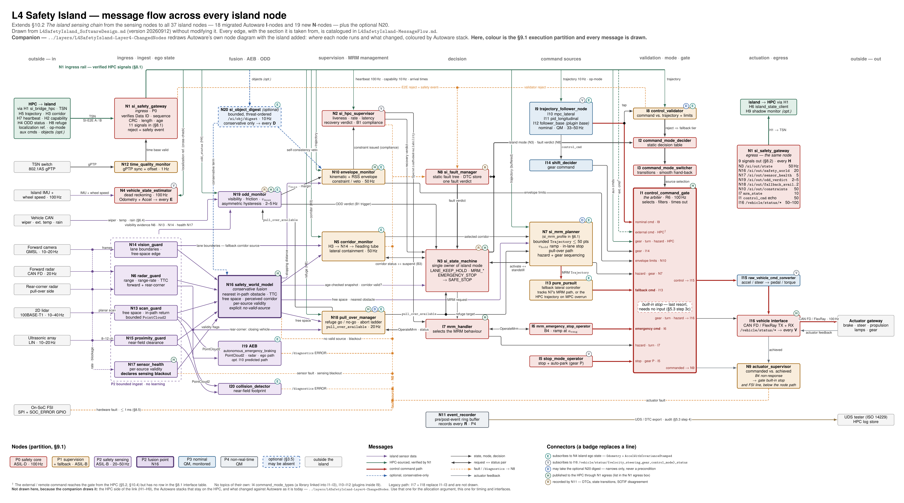

# L4 Safety Island — Island Message Flow, Every Node

**Companion to §10.2 of [L4SafetyIsland_SoftwareDesign.md](../L4SafetyIsland_SoftwareDesign_GitHub.md).** Derived from design version 20260918.
This file and its diagram add to the design document; they do not modify it.

§10.2 *The island sensing chain* draws only the nodes that consume island sensor data: the five
ingest nodes, the fusion point, the optional digest and their immediate consumers. This diagram
extends it to **every node on the island** — the 18 migrated Autoware nodes (§4.1, target path), the
19 new nodes (§6) and the optional N20 (§3.5) — and to every message that crosses between them, with
the two gateways (N1, I16) at the island boundary.

| File | What it is |
| :-- | :-- |
| [L4SafetyIsland-MessageFlow.pdf](L4SafetyIsland-MessageFlow.pdf) | The diagram, vector, one page. Zoom in; it is drawn for A2 or screen |
| [L4SafetyIsland-MessageFlow.png](L4SafetyIsland-MessageFlow.png) | The same, rasterised, for embedding |
| `L4SafetyIsland-MessageFlow.tex` | TikZ source. `latexmk -pdf L4SafetyIsland-MessageFlow.tex` |
| this file | The edge catalogue: every arrow and badge on the diagram, with the section it comes from |
| [../nodediagram/](../nodediagram/) | **Companion.** Autoware's own node diagram, redrawn with the island added: allocation and change, not edges |

**Two diagrams, two questions.** This one and [../nodediagram/](../nodediagram/) are a pair, and they deliberately
encode different things in colour. Neither modifies the design document.

| | [../nodediagram/](../nodediagram/) | this diagram |
| :-- | :-- | :-- |
| Answers | *Where does each node run, and what changed?* | *What does each node send to which other node?* |
| Colour is | the Autoware stack, as in [ArchitectureMain.pdf](../ArchitectureMain.pdf) | the §9.1 execution partition, P0–P4 |
| Scope | both ECUs, the HPC side included; principal edges only | the island only; **every** edge, catalogued below |
| Per-box marks | `MOVED` / `NEW` / `RE-SOURCED`, and the §9.4 minimal sets | the E / V / D / H / R connector badges |
| Use it for | the allocation and certification argument | the timing, priority and interface argument |

The division is deliberate: recolouring this diagram by Autoware stack would lose the P0–P4 reading
that §9.1's priority argument depends on, and drawing every edge on the companion would bury the one
thing it exists to show — that the control stack moved, and that the HPC can no longer reach the
actuators.

---

## 1. How to read the diagram

**Columns follow the flow, colours follow the partition.** Left to right: inputs from outside the
island → ingress and bounded ingest → fusion, AEB and ODD → supervision and MRM management → decision →
command sources → validation, mode and the gate → actuation and egress → outputs. Box colour is the
§9.1 execution partition (P0 red, P1 amber, P2 purple, P3 blue, P4 grey), so a reader can check the
priority argument of §9.1 against the flow: every arrow into the P0 gate from a lower partition is a
*command candidate*, never a dependency.

**Edge styles.**

| Style | Meaning |
| :-- | :-- |
| purple | island sensor data (the §10.2 chain) |
| green | HPC-sourced, and only after N1 has verified it (§8.4) |
| thick red | the control command path into and out of the gate |
| black | state, mode, decision |
| black, two heads | a request paired with its status (service, or activate / done) |
| orange dashed | fault or `/diagnostics` — all collected on one bus into N8 |
| blue dashed | optional (§3.5); remove it and nothing else changes |
| grey | actuator feedback |

**Three drawing conventions keep the page readable.**

1. **The N1 ingress rail.** Everything the HPC sends enters at N1 and is distributed along one
   green rail across the top; each drop is labelled with its topic. The rail *is* the §8.1 table.
2. **N1 is drawn twice.** Ingress on the left, egress on the right, so that no island→HPC arrow has to
   run backwards across the page. It is one node.
3. **Badges replace broadcast lines.** Five topics have so many subscribers that lines would bury the
   rest. A lettered badge on a box's top edge means it subscribes to (or, for **H**, publishes
   through) that topic. The subscriber lists are in §4 below.

**The gate is drawn as a chip.** I1 has ten inputs and three outputs; each is a labelled port on its
edge, so the input list can be read straight off the box. The dashed inset is the built-in stop,
which has no input at all — that is the point of it.

---

## 2. Node coverage

Every node the design places on the island appears once (N1 twice, by convention 2).

| Partition (§9.1) | Nodes drawn | Count |
| :-- | :-- | --: |
| **P0** safety core | I1 · I2 · I3 · I5 · I6 · I7 · I16 · N1 · N2 · N3 · N4 · N8 | 12 |
| **P1** supervision + fallback | I8 · I13 · N5 · N7 · N9 · N10 · N12 · N18 | 8 |
| **P2** safety sensing | I19 · I20 · N6 · N13 · N14 · N15 · N16 · N17 · N19 | 9 |
| **P3** nominal control | I9 (hosting I10 · I11 · I12) · I14 · I15 | 6 |
| **P4** non-real-time | N11 | 1 |
| — library, no topics | I4 `command_mode_types` (linked into I1–I3) | 1 |
| **Total, §9.4** | 18 migrated + 19 new | **37** |
| optional (§3.5) | N20 | +1 |

Not drawn: **I17 + I18**, the legacy alternative to I1–I3 (§4.3 — "do not deploy both"), and the
unnumbered P4 "telemetry egress" of §9.1, whose content is the §8.2 egress that N1 already carries.

---

## 3. Message catalogue

Every arrow on the diagram, grouped as in the TikZ source. **Basis** is the design-document section
the edge is taken from. *inferred* marks an edge the design implies but does not state — usually
because it names the message and one end but not the other. Those are exactly the edges a reviewer
should confirm.

### A. Inputs into the island

| # | From → To | Message | Rate | Basis |
| :-- | :-- | :-- | :-- | :-- |
| A1 | HPC (H1) → N1 | the 11 §8.1 signals, TSN, SI-E2E/A and /B | per signal | §8.1, §8.4 |
| A2 | TSN switch → N12 | 802.1AS gPTP sync | — | §6.1 N12, §10.1 |
| A3 | N12 → N1 | time-base valid / invalid — a lost time base invalidates every age check | 1 Hz | §6.1 N12 |
| A4 | island IMU + wheel speed → N4 | vehicle dynamics | 100 Hz | §6.1 N4, §6.2 |
| A5 | forward camera → N14 | low-resolution frames (or a smart camera's lane / object list) | 10–20 Hz | §6.2, open decision 8 |
| A6 | forward radar → N6 | object tracks: range, range-rate, azimuth | 20 Hz | §6.2 |
| A7 | rear-corner radar → N6 | tracks on the pull-over side | — | §9.4, §6.3; *N6 as its ingest: inferred* |
| A8 | 2D lidar → N13 | planar scan, ~1080 points | 10–40 Hz | §6.2 |
| A9 | ultrasonic array → N15 | near-field distances, 8–12 channels | 10–20 Hz | §6.2 |
| A10 | every exteroceptive sensor → N17 | raw stream: frame rate, blockage, degradation | — | §6.2 N17, §10.2 |
| A11 | vehicle CAN → N19 | wiper state, exterior temperature, rain sensor | — | §6.4 detection table; *consumer inferred* |
| A12 | on-SoC FSI → N8 | SPI + `SOC_ERROR` GPIO — hardware fault, watchdog, failover | ≤ 1 ms | §8.5, §9.2 |
| A13 | actuator gateway → I16 | actuator feedback | 100 Hz | §8.3 |

### B. N1 ingress rail — the verified HPC signals

Every row passes N1's E2E check and age limit first (§8.4); the age limits are those of §8.1.

| # | From → To | Topic · type | Rate | Basis |
| :-- | :-- | :-- | :-- | :-- |
| B1 | N1 → I9 | `/planning/scenario_planning/trajectory` · `Trajectory` ≤ 250 pts | 10 Hz | §1, §8.1 |
| B2 | N1 → I9 | `/api/operation_mode/state` · `OperationModeState` | 10 Hz + on change | §1, §8.1 |
| B3 | N1 → I8 | trajectory — the reference the command is checked against | 10 Hz | §4.1 I8 |
| B4 | N1 → N10 | trajectory — envelope, and the §3.5 self-consistency veto | 10 Hz | §3.5, §6.1 N10 |
| B5 | N1 → N7 | trajectory, buffered as the last valid one | 10 Hz | §8.1 substitutes, §10.5 |
| B6 | N1 → I13 | trajectory — tracked when the MPC overruns *(in I13's box, not a line)* | 10 Hz | §4.1 I13, §4.2 |
| B7 | N1 → N2 | `/si/in/heartbeat` · `HpcHeartbeat` (20 ms age), `/si/in/capability` · `HpcCapability`, per-topic arrival times | 100 / 10 Hz | §6.1 N2, §8.1, §10.3 |
| B8 | N1 → N19 | `/si/in/odd_status` · `OddStatus` (H4) | 10 Hz | §6.4 arbitration and hysteresis |
| B9 | N1 → N4 | `/localization/kinematic_state` · `Odometry`, `/localization/acceleration` — reference only, cross-checked | 50 Hz | §5.1, §8.1 substitutes; *N4 as the cross-checker: inferred* |
| B10 | N1 → N5 | `/si/in/corridor` · `SafetyCorridor` (H3), preferred corridor source | 10 Hz | §6.1 N5, §7 H3 |
| B11 | N1 → N18 | `/si/in/refuge` · `PullOverRefuge` (H8), 2 s age | 2 Hz | §6.3 |
| B12 | N1 → N20 | `/perception/object_recognition/objects` · `PredictedObjects` — *optional* | 10 Hz | §3.5, §6.2 |
| B13 | N1 → I1 | `/control/command/{gear,turn_indicators,hazard_lights}_cmd` | 10 Hz | §8.1; *consumer inferred* |
| B14 | N1 → I1 | external / remote command source | — | §5.2, §10.4; **no §8.1 row — see §5, finding 1** |
| B15 | N1 → N8 | E2E verification failure, raised as a safety event | per message | §8.4 |

### C. The sensing chain, fusion and ODD

| # | From → To | Message | Rate | Basis |
| :-- | :-- | :-- | :-- | :-- |
| C1 | N14 → N16 | lane boundaries, free-space edge | 10–20 Hz | §6.2 N16 |
| C2 | N6 → N16 | nearest target: range, range-rate, TTC | 20–50 Hz | §6.2 N16 |
| C3 | N13 → N16 | free-space distance ahead, nearest in-path return | 10–40 Hz | §6.2 N16 |
| C4 | N15 → N16 | near-field clearance per sector | 10–20 Hz | §6.2 N16 |
| C5 | N17 → N16 | per-source validity flags | 5–10 Hz | §6.2, §10.2 |
| C6 | N13 → I19 | bounded `PointCloud2` | 10–40 Hz | §4.4, §6.2 N13 |
| C7 | N13 → I20 | bounded `PointCloud2` | 10–40 Hz | §4.4 |
| C8 | N15 → I20 | ultrasonic returns as `PointCloud2` | 10–20 Hz | §4.4, §6.2 N15 |
| C9 | N6 → I19 | radar tracks | 20 Hz | §4.4 table |
| C10 | N6 → N18 | rear-corner radar: vehicle closing on the pull-over side | 20 Hz | §3.3 B3, §6.3 abort ladder, §10.5 |
| C11 | N14 → N5 | perceived lane boundaries — the fallback corridor source | 10–20 Hz | §6.1 N5, §10.2 |
| C12 | N6 · N13 · N14 → N19 | visibility evidence: lidar return range, intensity, multi-echo; radar-vs-lidar divergence; camera contrast, lane continuity | — | §6.4 detection table; *routing through the ingest nodes inferred* |
| C13 | N17 → N19 | per-source degradation cause | 5–10 Hz | §6.2 N17 ("drives the island's own ODD verdict") |
| C14 | N16 → N10 | stopping-distance input to the RSS longitudinal envelope | 20–50 Hz | §6.1 N10 |
| C15 | N16 → N5 | perceived corridor | 20–50 Hz | §10.2 |
| C16 | N16 → N3 | age-checked world-state snapshot; is a corridor valid? | 20–50 Hz | §2.2 staleness rule, §10.3 |
| C17 | N16 → N7 | free-space distance, nearest-obstacle range | 20–50 Hz | §6.1 N7 |
| C18 | N16 → N18 | live free space, for refuge verification | 20–50 Hz | §6.3 N18 |
| C19 | N16 → N8 | no-valid-source / `SENSING_BLACKOUT` | on event | §6.2 N16, §10.3 Exit C |
| C20 | N17 → N8 | sensor faults; the sensing-blackout declaration | on event | §6.1 N8, §6.2 N17, §10.2 |
| C21 | I19 → N8 | `/diagnostics` ERROR | on event | §4.4 |
| C22 | I20 → N8 | `/diagnostics` ERROR | on event | §4.4 |
| C23 | N19 → N10 | speed ceiling `v_max`, ODD margin | 2–5 Hz | §6.4 speed law and ladder |
| C24 | N19 → N3 | environmental ODD verdict — the B1 trigger | 2–5 Hz | §3.1 B1, §3.2 |
| C25 | N18 → N19 | `pull_over_available` | 20 Hz | §6.4 "Where the two features meet" |
| C26 | N20 → N16 | conservative object term — *optional* | 10 Hz | §3.5, §6.2 N16, §10.2 |
| C27 | N20 → N10 | self-consistency veto — *optional* | 10 Hz | §3.5, §10.2 |

Not drawn as lines: **N16 → N20** plausibility cross-check where the fields of view overlap, and
**N4 → N20** distance travelled since receipt (§6.2 N20; the second is N20's **E** badge).

### D. Supervision and decision

| # | From → To | Message | Rate | Basis |
| :-- | :-- | :-- | :-- | :-- |
| D1 | N2 → I7 | island-local `OperationModeAvailability` | 100 Hz | §6.1 N2 |
| D2 | N2 → N3 | recovery verdict, `HPC_RECOVERY_CONFIRMED` | on event | §6.1 N2, §10.3 Exit A |
| D3 | N2 → N8 | `HPC_LIVENESS_LOST`, `HPC_COMMAND_INVALID`, B1 non-compliance | on event | §3.1 B2, §6.4, §10.3 |
| D4 | N10 → N2 | the constraint issued, for compliance supervision | 50 Hz | §3.3 B1, §6.4; *inferred* |
| D5 | N10 → I1 | envelope limits: acceleration, jerk, curvature, speed | 50 Hz | §10.4, §2.2 |
| D6 | N5 → N8 | lateral-containment fault | on event | §6.1 N8 |
| D7 | N5 ⇄ N3 | corridor source in use, validity, lateral deviation ⇄ containment suspension during B3 | 50 Hz | §3.1 B2, §3.2, §8.2 `IslandState`; *N5 as producer inferred* |
| D8 | N5 → N7 | the selected corridor (H3, N14 or heading tube) | 50 Hz | §7 H3 ("enabling N5 and N7"); *routing through N5 inferred* |
| D9 | N18 → N3 | `pull_over_available` | 20 Hz | §10.3 Exit B |
| D10 | N18 → N7 | refuge target: side, window, lateral offset | 20 Hz | §6.3 split; *inferred* |
| D11 | I7 ⇄ N18 | `OperateMrm` on `/system/mrm/pull_over_manager/operate` ⇄ `MrmBehaviorStatus` on `.../status` | on request / 20 Hz | §6.3 |
| D12 | I7 ⇄ I6 | `tier4_system_msgs/srv/OperateMrm` ⇄ `MrmBehaviorStatus` | on request | §9.3 |
| D13 | N8 → N3 | the single fault verdict | 100 Hz | §6.1 N8, §9.2 |
| D14 | N8 → I2 | fault verdict | 100 Hz | §10.4 |
| D15 | N3 → I2 | island mode | 100 Hz | §9.2, §10.4 |
| D16 | N3 → I7 | MRM request: `T_hold` expired, B1 exhausted, blackout | on event | §10.5; *inferred* |
| D17 | N3 ⇄ N7 | activate, `T_hold`, `v_hold` ⇄ standstill reached | on event | §10.3 |
| D18 | I8 → N8 | validation reject | on event | §6.1 N8 |
| D19 | I8 → I2 | reject ⇒ switch to the fallback tier | on event | §4.2 |
| D20 | I2 → I3 | decided command mode | 100 Hz | §4.3, §10.4 |
| D21 | I3 → I1 | source selection, smooth transition | 100 Hz | §3.2, §10.4 |
| D22 | N9 → N8 | actuator fault, non-response | on event | §6.1 N8 and N9 |

### E. Command sources into the gate

These are I1's ten input ports, top to bottom.

| # | From → To | Message | Rate | Basis |
| :-- | :-- | :-- | :-- | :-- |
| E1 | I9 → I1 | nominal `/control/command/control_cmd` · `Control` | 33–50 Hz | §1, §10.3, §10.4 source 1 |
| E2 | N1 → I1 | external / remote command — see B14 | — | §5.2, §10.4 source 2 |
| E3 | N1 → I1 | gear, turn-indicator, hazard commands from the HPC — see B13 | 10 Hz | §8.1 |
| E4 | I14 → I1 | gear command | 33–50 Hz | §4.1 I14 |
| E5 | N10 → I1 | envelope limits — see D5 | 50 Hz | §10.4 |
| E6 | N7 → I1 | hazard-lamp and gear sequencing | 50 Hz | §6.1 N7 |
| E7 | I13 → I1 | fallback command | 50 Hz | §4.2, §10.4 source 3 |
| E8 | I6 → I1 | emergency-stop command | 100 Hz | §3.1 B4, §4.1 I6, §10.4 source 4 |
| E9 | I7 → I1 | `hazard_lights_cmd`, `turn_indicators_cmd` | on change | §10.5 |
| E10 | I5 → I1 | stop command; gear P at standstill (auto-park) | 100 Hz | §4.1 I5 |
| E11 | I9 → I14 | `control_cmd` | 33–50 Hz | *inferred from the Autoware `shift_decider` interface* |
| E12 | I9 → I8 | `control_cmd`, tapped for validation | 33–50 Hz | §4.1 I8, §10.4 |
| E13 | N7 → I13 | bounded MRM `Trajectory`, ≤ 50 points | 50 Hz | §6.3 |

I10 → I19, the MPC predicted trajectory (AEB's optional `use_predicted_trajectory`, §4.1, §4.4), is
written into I19's box rather than drawn: it would be the only line crossing the page right to left.

### F. Actuation, egress and audit

| # | From → To | Message | Rate | Basis |
| :-- | :-- | :-- | :-- | :-- |
| F1 | I1 → I15 | the selected, filtered control command | 100 Hz | §4.1 I15 |
| F2 | I15 → I16 | vehicle-specific pedal / torque / steer | 100 Hz | §4.1 I15 |
| F3 | I1 → I16 | gear, turn, hazard | on change | *inferred — I15 converts control only* |
| F4 | I16 → actuator gateway | steering, acceleration / braking, gear, hazard lamps, MRM flag · CAN FD / FlexRay · SI-E2E/B | 100 Hz | §8.3 |
| F5 | I16 → N9 | achieved steering, brake, torque; brake pressure; EPS availability | 100 Hz | §6.1 N9, §8.3 |
| F6 | I1 → N9 | the commanded values | 100 Hz | §6.1 N9; *producer inferred* |
| F7 | N1 → HPC (H1 → H6, H9) | the 9 §8.2 signals — see the **H** list below | per signal | §7, §8.2 |
| F8 | N11 → UDS tester, HPC log store | DTC export (ISO 14229), audit | 1–10 Hz | §5.3 step 4, §6.1 N11 |

---

## 4. Connector badges — who subscribes

| Badge | Topic | Nodes carrying it | Basis |
| :-- | :-- | :-- | :-- |
| **E** | N4 island ego state: `Odometry` + `AccelWithCovarianceStamped` | I9 (I10, I11) · I13 · I19 · N20 · N19 · I8 · I20 · N5 · N7 · N10 · N18 | I9–I13: §5.1, §6.1 N4 · I19 IMU path: §4.4 · N20 distance travelled: §6.2 · N19 slip ratio and yaw residual: §6.4 · the remaining six: *inferred from their function* |
| **V** | I16 `/vehicle/status/{velocity,steering,gear,control_mode}_status` | N4 · I5 · I9 · N2 · I15 | N4 steering angle: §6.1, §3.1 B4 · I5: §4.1 · I9 steering report: §1 · N2 compliance: §6.4 · I15: *inferred* |
| **D** | N20 `/si/obj/digest` — *optional, conservative only* | I8 · N7 · N18 (plus the drawn N16 and N10) | §3.5 behaviour table: B1 veto (I8), B2 ramp (N7), B3 disqualify refuge (N18) |
| **H** | published to the HPC through N1 egress | N3 `/si/out/state` 50 Hz · N16 `/si/out/safety_world` 20 Hz · N17 `/si/out/sensor_health` 5 Hz · N19 `/si/out/odd_verdict` 2–5 Hz · N18 `/si/out/fallback_availability` 2 Hz · N10 `/si/out/constraints` 50 Hz · I7 `/system/fail_safe/mrm_state` 10 Hz · I1 `/control/command/control_cmd` echo 50 Hz · I16 `/vehicle/status/*` 50–100 Hz | §8.2, all nine rows |
| **R** | recorded by N11 | N8 DTCs · N3 state transitions and containment-suspension grants · N19 HPC-vs-island ODD disagreement | §6.1 N8, §3.2, §6.4 |

---

## 5. What drawing every edge exposed in the design

Drawing the complete graph forces every message to have exactly one producer and at least one
consumer. The items below are places where the design document, as of 20260918, does not yet say
which. **None is changed here.** Each is drawn as the most literal reading of the text, and each is a
candidate for the next revision or the open-decision list.

1. **The external / remote command has no interface row.** §5.2 and §10.4 route external, remote
   and joystick commands into the gate "as one E2E-protected command source", but §8.1 lists 11
   inbound signals and none of them is it. Either it becomes the twelfth row, or §5.2 and §10.4
   should drop it. Drawn dashed with a dagger.
2. **The digest reaches a P0 node, and §10.2 says it does not.** §3.5 lets the digest shape B4's
   ramp "up to the upper bound of `a_emg`". B4's ramp belongs to I6, which is P0. §10.2 says of N20:
   "It reaches no node on the P0 path at all." Both cannot hold. The same §3.5 table also gives the
   digest to I8 (B1), N7 (B2) and N18 (B3), none of which §10.2 draws; they are badged **D** here. No
   N20 → I6 edge is drawn.
3. **Two producers for the hazard lamps.** §6.1 gives N7 "hazard-lamp and gear sequencing"; §10.5
   has I7 emit `hazard_lights_cmd` and `turn_indicators_cmd`. Both are drawn as gate inputs (ports
   E6 and E9). One of them should own the lamp, not both. This sits next to the B3
   hazard-versus-indicator conflict already recorded in §3.1.
4. **Who closes the longitudinal loop during an MRM.** §4.2 makes the fallback longitudinal law N7's
   fixed profile. §9.4 and §10.5 have I11 PID track N7's path. §3.1 B2 says I9–I11 are deselected
   during the hold. The diagram draws the fallback command as I13's output and leaves the
   longitudinal owner to the design.
5. **N7 has two names.** It is `si_mrm_profile` in §4.2, §6.1 and §10.1, and `si_mrm_planner` in §6.3
   and §9.4. The diagram uses the §6.3 name and notes the other.
6. **Two nodes declare the blackout.** §6.2 has N17 declare sensing blackout; §10.3 Exit C has N16
   raise `SENSING_BLACKOUT` to N8. Both edges are drawn (C19, C20), as the text gives them. If they
   are one event, the design should say which node owns the declaration and which only reports it —
   it matters for the open-decision-15 debounce.
7. **Nobody is named as the odometry arbiter.** §8.1 says the island cross-checks the HPC's
   kinematic state against N4 and, on divergence, uses N4 alone. It does not say which node does the
   cross-check or which odometry the controllers subscribe to in the nominal case — §10.3 shows the
   HPC reference going to the controllers. Drawn as N4 taking the reference and publishing the one
   ego state every **E** node reads.
8. **The rear-corner radar is missing from two places.** It is mandatory above ~30 km/h (§9.4) and
   appears in B3's traceability row. It is absent from the §6.2 sensor table and from the §10.2
   diagram. Here it enters through N6.
9. **N17 → N19 is in the text but not in §10.2.** §6.2 says N17 "drives the island's own ODD
   verdict"; §10.2 draws N17 only to N16 and N8. Drawn here (C13).

Items 1, 2 and 6 bear on the safety argument; the others are completeness and naming.

---

## 6. Integrating it later

The diagram is a standalone TikZ picture using the review edition's palette. If the WG decides to
fold it into the design document, the `tikzpicture` body can go into `review/figures/` as a new
figure, and a matching Mermaid block into §10 of the Markdown. That changes the design document, so
it waits for a request.

The same applies to the companion, and **they should be folded in together if at all**: this one
belongs with §10.2, which it extends, and [../nodediagram/](../nodediagram/) belongs with §10.1, which already makes
the allocation argument in Mermaid at far lower resolution. Folding in one without the other would
leave §10 making half the argument twice.
