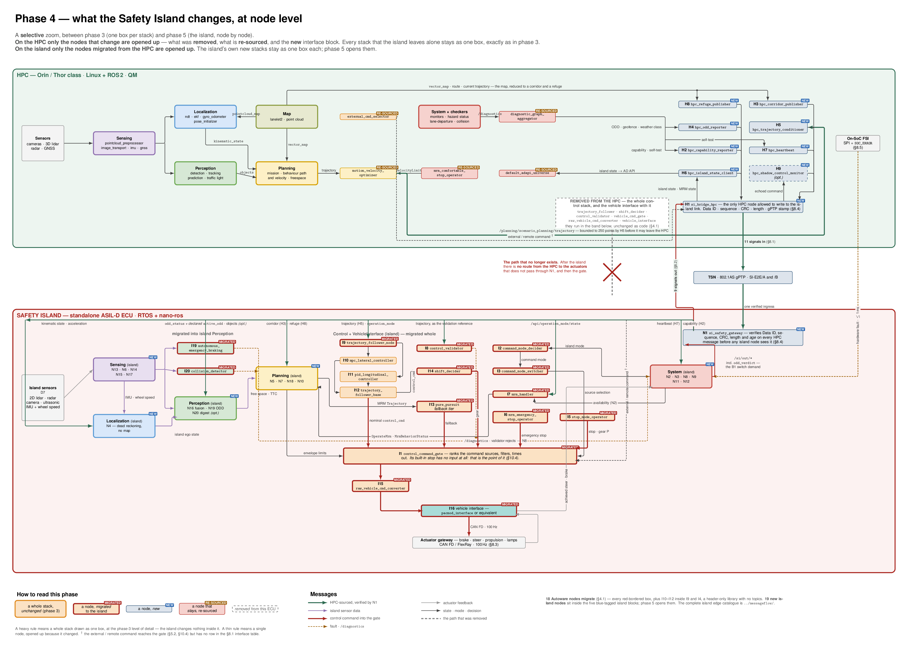

# L4 Safety Island — the Autoware Node Diagram, Redrawn

**Companion to [ArchitectureMain.pdf](../ArchitectureMain.pdf), the Autoware node diagram.** Derived from design version 20260918.
This file and its diagram add to the design document; they do not modify it.

[ArchitectureMain.pdf](../ArchitectureMain.pdf) is the picture the WG already has in its head: every Autoware node, coloured by
stack, wired by topic. This diagram is **that picture with only the changed parts opened up**, drawn in
the same visual language, so that the change can be read off rather than reconstructed.

It is **phase 4** of the five-phase series in [../layers/](../layers/): phase 3 draws both ECUs with one box per
stack, phase 5 draws the whole island node by node, and this one sits between them — node level for
what the island changes, phase-3 level for everything it leaves alone.

| File | What it is |
| :-- | :-- |
| [L4SafetyIsland-NodeDiagram.pdf](L4SafetyIsland-NodeDiagram.pdf) | The diagram, vector, one page. Zoom in; it is drawn for A2 or screen |
| [L4SafetyIsland-NodeDiagram.png](L4SafetyIsland-NodeDiagram.png) | The same, rasterised, for embedding |
| `L4SafetyIsland-NodeDiagram.tex` | TikZ source. `latexmk -pdf L4SafetyIsland-NodeDiagram.tex` |
| this file | What changed, node by node, with the section each row comes from |
| [../messageflow/](../messageflow/) | **Companion.** The same 37 island nodes coloured by execution partition, with every edge catalogued |

---

## 1. How to read it

Four things are encoded, and they are deliberately independent of each other.

| Encoding | Means |
| :-- | :-- |
| **Colour** | the Autoware **stack** — exactly the palette of [ArchitectureMain.pdf](../ArchitectureMain.pdf)'s own legend |
| **Band** | the **ECU** it executes on — HPC above, Safety Island below |
| **Tag** | what **happened** to it — `MIGRATED`, `NEW`, `RE-SOURCED`, or the grey ghost for what left |
| **Box rule** | **heavy** = a whole stack, unchanged, drawn at phase-3 level; **thin** = a single node, opened up because it changed |

The box rule is what makes this phase readable: an untagged heavy box is a promise that the island
changes nothing inside it, so a reviewer can skip it and spend attention on the thin-ruled boxes,
which are exactly the delta.

Keeping colour on the stack — rather than recolouring by ASIL or by execution partition — is the whole
point of drawing it this way. A migrated node keeps the colour it has in the Autoware diagram, so a
reader who knows the original can see at a glance that **the orange Control stack has moved bodily into
the lower band**, and that the island has grown small versions of the purple, blue, green and yellow
stacks alongside it.

Two additions to the original palette are flagged with `*` in the legend: **Map**, because
[ArchitectureMain.pdf](../ArchitectureMain.pdf) does not draw the map stack at all, and **Safety link**, because there was no
link to draw.

**Colour by execution partition is the other diagram.** [../messageflow/](../messageflow/) draws the same 37 island
nodes coloured P0–P4 with every edge catalogued. Use that one for the timing and priority argument;
use this one for the allocation argument.

### The three things the layout is arranged to show

1. **The island is a reduced Autoware, not a monitor.** Read the lower band left to right and the
   stacks appear in the same order as the upper band: sensing, localization, perception, planning,
   control, vehicle interface, system. Five of those are single blocks — the island's own new nodes,
   nineteen of them, and phase 5 opens them. The one stack drawn node by node is **Control**, because
   that is the one the island did not invent: it is Autoware's, migrated whole.
2. **Everything the HPC sends leaves on one lane, through one door.** All HPC egress is routed onto a
   single horizontal lane at the bottom of the upper band and into `H1`, then the switch, then `N1`.
   That lane *is* the §8.1 interface table. Eleven signals in, nine out, and §8.1 records an island-local
   substitute for every inbound row.

   **One pair of those signals is a round trip, and it is the only one.** `/si/out/odd_verdict` carries
   the island's ODD switch *demand* — `odd_satisfiable = false`, the dimension that failed, and the
   `T_odd` budget — and `/si/in/odd_status` carries the HPC's *answer*: the operating domain it has
   declared active, with the bounds the island then verifies against its own measurements. Every other
   row on the lane is one-way telemetry. This one is B1's negotiation (§3.1, §6.4), and it is drawn on
   both lane labels because reading either half alone makes it look like telemetry too.
3. **The edge that no longer exists.** In the original, `vehicle_cmd_gate → raw_vehicle_cmd_converter →
   vehicle_interface →` the vehicle is a short chain inside one ECU. It is drawn here as a grey ghost
   with a cross through it. After the island there is no path from the HPC to the actuators that does
   not pass through `N1` and then the gate.

---

## 2. A note on names: the original diagram is an older snapshot

[ArchitectureMain.pdf](../ArchitectureMain.pdf) shows the pre-`autoware_universe` control and system nodes. The design document
targets current `main` (August 2026). The nodes are the same functions under different names, and the
diagram uses the **current** names. The mapping a reader of the original will need:

| In [ArchitectureMain.pdf](../ArchitectureMain.pdf) | In this diagram / the design document | Basis |
| :-- | :-- | :-- |
| `mpc_follower` | `autoware_mpc_lateral_controller` — **I10**, a plugin hosted by **I9** | §4.1 |
| `velocity_controller` | `autoware_pid_longitudinal_controller` — **I11** | §4.1 |
| `latlon_muxer` | folded into `autoware_trajectory_follower_node` — **I9** | §4.1 |
| `shift_decider` | `autoware_shift_decider` — **I14** | §4.1 |
| `vehicle_cmd_gate` | **I18** on the legacy path; replaced by `autoware_control_command_gate` **I1** + decider **I2** + switcher **I3** on the target path | §4.3 |
| `raw_vehicle_cmd_converter` | **I15** | §4.1 |
| `vehicle_interface` / `pacmod_interface` | **I16** | §4.1 |
| `autoware_emergency_handler` | `autoware_mrm_handler` — **I7** | §4.1 |
| `lane_departure_checker` | stays on the HPC; the island equivalent is **N5** `si_corridor_monitor` | §5.2, §6.1 |
| `external_cmd_selector`, `remote_cmd_converter`, `joy_controller` | stay on the HPC; they reach the gate as **one** E2E-protected command source | §5.2, §10.4 |
| `autoware_state_monitor`, `state_timeout_checker`, `system_monitors` | stay on the HPC as evidence sources; their verdict is condensed by **H2** | §5.2 |
| — *(no counterpart in the original)* | **I2**, **I3**, **I5**, **I6**, **I8**, **I13**, **I19**, **I20** | §4.1 |

§4.3 is the decision that makes half this table live: the island picks the **target** set
(decide / switch / gate as three nodes) over the legacy `vehicle_cmd_gate` that fuses all three, because
that separation is the decomposition a safety argument needs. `I17`+`I18` are the legacy alternative
and are **not drawn** — "do not deploy both".

---

## 3. What changed, by category

### A. Moved from the HPC to the island — 18 nodes, unchanged as code (§4.1)

The tag is `MOVED`, and the rule is that these are **the same Autoware packages**, with the same
parameters and the same validation history. That is the load-bearing claim of §4.4: the island's
emergency braking is not a bespoke reimplementation, it is
`autoware_autonomous_emergency_braking` on a diverse sensor channel.

| Node | Package | Tier | Why it must be island-side |
| :-- | :-- | :-- | :-- |
| I1 | `autoware_control_command_gate` | T0 | The arbiter. Its built-in stop is the last-resort MRM |
| I2 | `autoware_command_mode_decider` | T0 | Decides which source has authority |
| I3 | `autoware_command_mode_switcher` | T0 | Applies the decided mode |
| I4 | `autoware_command_mode_types` | — | Header-only library, linked into I1–I3 — **no topics, not drawn** |
| I5 | `autoware_stop_mode_operator` | T0 | Does not depend on localization at all |
| I6 | `autoware_mrm_emergency_stop_operator` | T0 | B4's actuator. Independent of planning |
| I7 | `autoware_mrm_handler` | T0 | Its *reason to act* is HPC loss (R1/R3) |
| I8 | `autoware_control_validator` | T1 | Small, deterministic, no map |
| I9 | `autoware_trajectory_follower_node` | T2 | Already ported and closed-loop-validated on nano-ros |
| I10 | `autoware_mpc_lateral_controller` | T2 | Nominal lateral. OSQP iteration cap required |
| I11 | `autoware_pid_longitudinal_controller` | T2 | Nominal longitudinal |
| I12 | `autoware_trajectory_follower_base` | T2 | Plugin base |
| I13 | `autoware_pure_pursuit` | T1 | **New to the island.** The bounded-time fallback tier |
| I14 | `autoware_shift_decider` | T2 | Keeps gear in the island's command set |
| I15 | `autoware_raw_vehicle_cmd_converter` | T2 | Must be downstream of the gate |
| I16 | *vehicle interface* | T0 | CAN FD / FlexRay to the actuator gateway |
| I19 | `autoware_autonomous_emergency_braking` | T1s | Moved by D7. Point-cloud path, no perception objects needed |
| I20 | `autoware_collision_detector` | T1s | Moved by D7. Near-field guard, point-cloud only |

### B. New on the island — 19 nodes, plus the optional N20 (§6)

Tagged `NEW`. These do not exist in Autoware today; they are what turns a ported trajectory follower
into a safety island.

| Stack it is drawn in | Nodes |
| :-- | :-- |
| Sensing | N13 `si_scan_guard` · N6 `si_radar_guard` · N14 `si_vision_guard` · N15 `si_proximity_guard` · N17 `si_sensor_health` |
| Localization | N4 `si_vehicle_state_estimator` — **the island's entire localization stack** |
| Perception | N16 `si_safety_world_model` (the fusion point) · N19 `si_odd_monitor` · N20 `si_object_digest` *(optional)* |
| Planning | N5 `si_corridor_monitor` · N7 `si_mrm_planner` · N18 `si_pull_over_manager` · N10 `si_envelope_monitor` |
| System | N2 `si_hpc_supervisor` · N3 `si_state_machine` · N8 `si_fault_manager` · N9 `si_actuator_supervisor` · N11 `si_event_recorder` · N12 `si_time_quality_monitor` |
| Safety link | N1 `si_safety_gateway` |

N7 carries two names in the design document — `si_mrm_profile` in §4.2, §6.1 and §10.1,
`si_mrm_planner` in §6.3 and §9.4. The diagram uses the §6.3 name, as [../messageflow/](../messageflow/) does.

### C. New on the HPC — 9 nodes (§7)

Also tagged `NEW`. Their only job is to make the interface narrow, typed and rate-limited; without them
"connect Autoware to the island" means publishing the full ROS graph over TSN.

H1 `si_bridge_hpc` · H2 `hpc_capability_reporter` · H3 `hpc_corridor_publisher` ·
H4 `hpc_odd_reporter` · H5 `hpc_trajectory_conditioner` · H6 `hpc_island_state_client` ·
H7 `hpc_heartbeat` · H8 `hpc_refuge_publisher` · H9 `hpc_shadow_control_monitor` *(optional)*.

H3 is worth pointing at: it is **the map, reduced to what the island can hold**. It is the reason N5 and
N7 can exist without shipping Lanelet2 across the link.

### D. Stays on the HPC, but not unchanged — tagged `RE-SOURCED`

Five nodes are marked. Each keeps its package and its place, and each has something different about it
after the island exists.

| Node | What changes | Basis |
| :-- | :-- | :-- |
| `motion_velocity_optimizer` | Its trajectory no longer goes straight to a local controller. It goes to H5, which resamples and bounds it to 250 points and rejects malformed trajectories *before* transmission | §7 H5, §8.1 |
| `external_cmd_selector` | Remote, manual and joystick commands no longer reach a local gate. They cross the link as one E2E-protected command source | §5.2, §10.4 |
| `mrm_comfortable_stop_operator` | Reclassified. It publishes a `VelocityLimit` to the planner, so it cannot function without planning: it is an **HPC-dependent MRM**, valid only while the HPC is degraded-but-alive | §5.2, §5.3 |
| `default_adapi_universe` | Now sees the island's verdict, republished by H6 into `/system/fail_safe/mrm_state` and the AD API | §7 H6 |
| `diagnostic_graph_aggregator` *(and the monitors behind it)* | Demoted from safety monitor to **evidence source**. Its output is condensed by H2 into a fixed-size capability vector, and the island never relies on it being alive | §5.2, §7 H2 |

### E. Removed from the HPC path

Drawn as the grey ghost box in the upper band. Nothing is deleted from Autoware — it changes ECU — but
from the HPC's point of view the whole control stack and the vehicle interface are gone, and with them
the HPC's ability to reach the actuators.

---

## 4. Deliberate simplifications

Worth stating, because a reader comparing the two diagrams side by side will notice.

1. **This phase is a selective zoom, not a complete node diagram.** [ArchitectureMain.pdf](../ArchitectureMain.pdf) draws
   roughly ninety nodes, most of them in sensing and perception, and those pipelines are *unchanged*
   by this design — §5.1 puts `sensing`, `perception`, `localization`, `map` and `planning` entirely
   on the HPC. Drawing them node by node would spend the page on the part that does not change. So
   only what the island changes is opened up:

   - **On the HPC**, node level for the nodes that changed — what was **removed** (the control stack
     that left), what is **re-sourced** (the five of §D above) and what is **new** (the H1–H9
     interface block). Every stack the island leaves alone is a single box, at the same level of
     detail as phase 3.
   - **On the island**, node level for the nodes **migrated from the HPC** (the I-nodes). The island's
     own nineteen new nodes sit inside five blocks — sensing, localization, perception, planning,
     system — again at phase-3 level. [../layers/](../layers/) opens them completely as phase 5.

   A **heavy box rule** means a whole stack, unchanged; a **thin rule** means a single node, opened up
   because it changed.
2. **Every box that is drawn carries its real links.** A box earns its place by having at least one
   operational edge to another box on the page — no arrow terminates on a dashed group boundary, and
   nothing sits unconnected. Two packages named in §5.2 are therefore named here rather than drawn,
   because neither has an operational edge to show: `pose_instability_detector` (a QM monitor that
   publishes only `/diagnostics`) and `control_performance_analysis` (development and analysis only,
   explicitly *not in the operational path*); `smart_mpc_trajectory_follower` is omitted likewise.
   Not drawn either: `I4`, a header-only library with no topics, and `I17`+`I18`, the legacy
   alternative of §4.3.
3. **Principal edges only.** The ingress rail, the sensing chain, the fault bus, the command sources
   into the gate, actuation and egress. The complete island edge catalogue — every arrow, with the
   section it is taken from and the inferred ones flagged — is [../messageflow/](../messageflow/).

   **I10** `mpc_lateral_controller` and **I11** `pid_longitudinal_controller` are *plugins loaded
   inside* I9 `trajectory_follower_node`, so they publish no topic of their own. The links among them
   are drawn as the host's internal flow, as in phase 5: I9 hands the HPC trajectory to I10 and I11,
   both run on I12 `trajectory_follower_base`, and the follower's output leaves from I12. **I7**
   `mrm_handler` takes `/api/operation_mode/state` from the HPC through N1 (§8.1) and the
   `OperationModeAvailability` it once read from the HPC's diagnostics from N2, inside System (island)
   (§4.1 I7, §6.1 N2). Everything else on the page has at least one link at both ends.
4. **The `†` on the external/remote command** is the same open item [../messageflow/](../messageflow/) records as
   finding 1: §5.2 and §10.4 route it into the gate, but §8.1 lists eleven inbound signals and none of
   them is it. It is drawn dashed, on both sides of the link, pending that decision.

---

## 5. What the diagram is arguing

Three claims that are easier to see than to state, which is the reason to draw it at all.

**The island is a second Autoware, not a watchdog.** The strongest objection to a safety island is that
it duplicates a stack nobody can afford to certify twice. The lower band answers it with proportion:
localization is one node, planning is four bounded ones, perception is a fusion point over five ingest
nodes — and control is not a reimplementation at all, it is the Autoware control stack relocated. The
duplication is in the small, cheap, bounded parts; the expensive parts are not duplicated at all.

**Nothing on the link is a hard dependency.** Every one of the eleven inbound rows has an island-local
substitute (§8.1), which is what lets I9–I13, I19 and I20 keep running after HPC loss. The link carries
*quality*, not *capability*.

**The floor does not depend on the ladder.** `◆` marks the 21 mandatory nodes of §9.4. Nine of them are
the B4 path — N4, N3, N8, N17, I7, I6, I1, I16, I5 — and **none of them consumes an exteroceptive
topic**. The emergency stop cannot fail for the reason that triggers it. Every omission in §9.4 narrows
what the island can *do*, never what it can *stop doing*.

---

## 6. Integrating it later

Like [../messageflow/](../messageflow/), this is a standalone TikZ picture using the review edition's palette. If the WG
wants it in the design document, the `tikzpicture` body can move to `review/figures/` as a new figure
under §10 — most naturally alongside §10.1, which makes the same allocation argument in Mermaid at much
lower resolution. That would change the design document, so it waits for a request.
